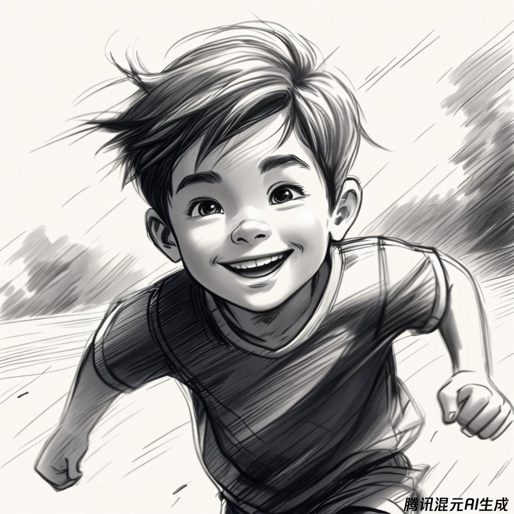
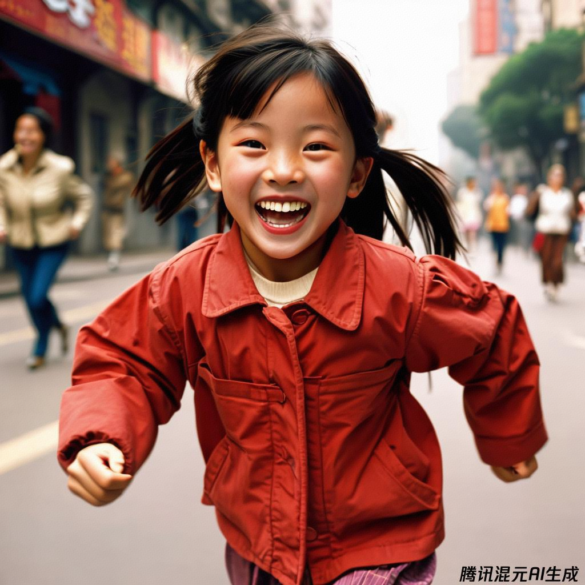
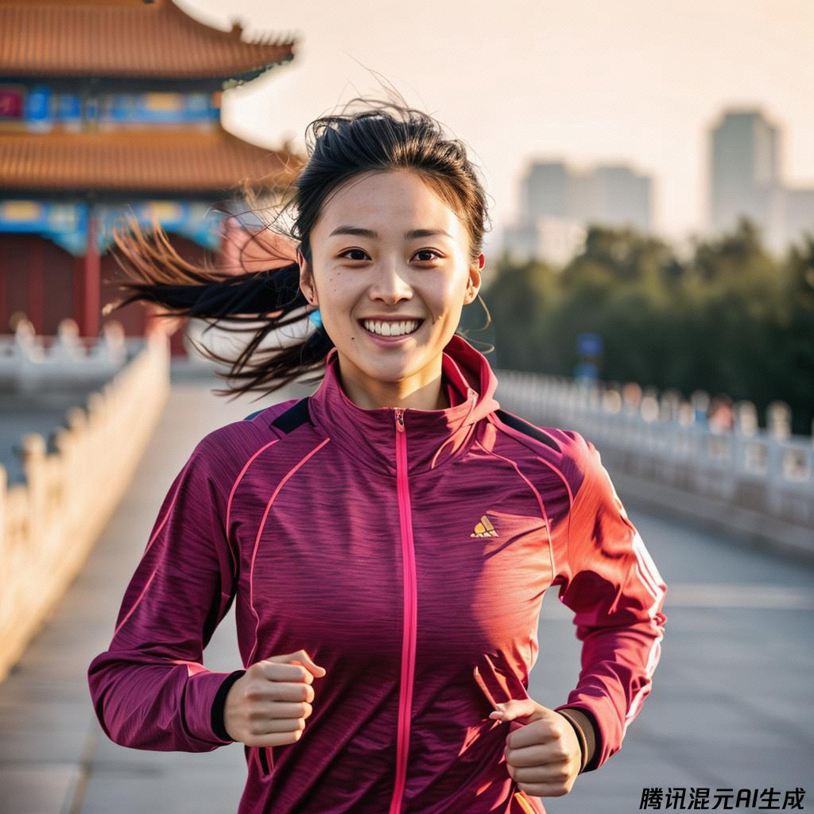
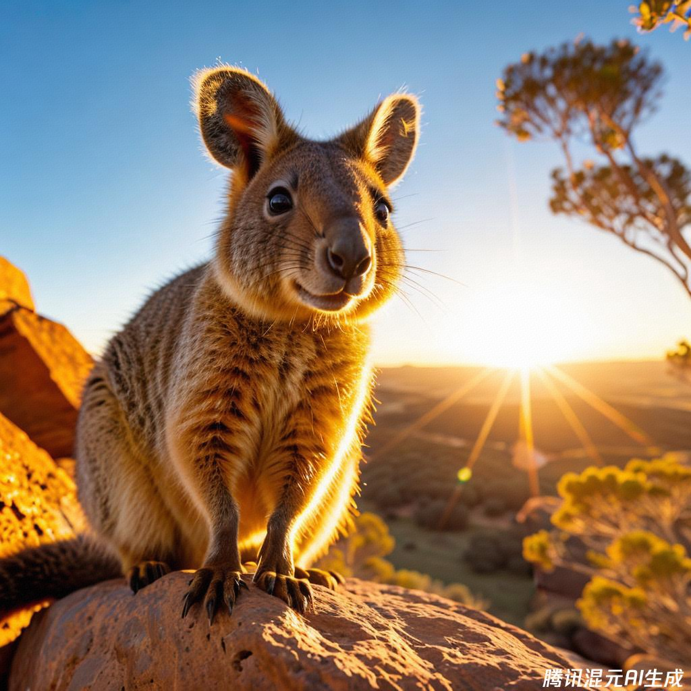
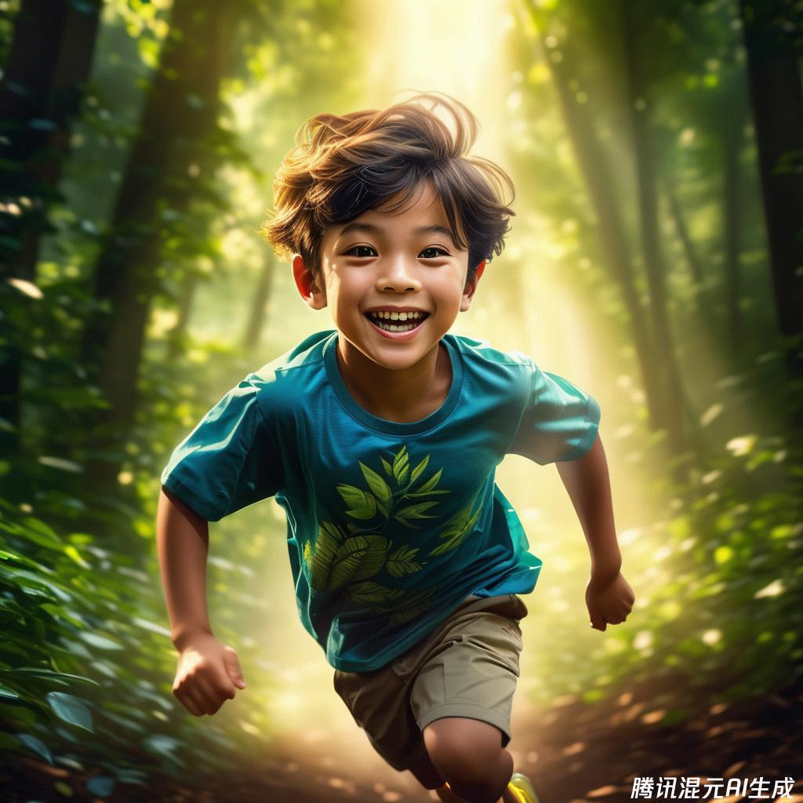
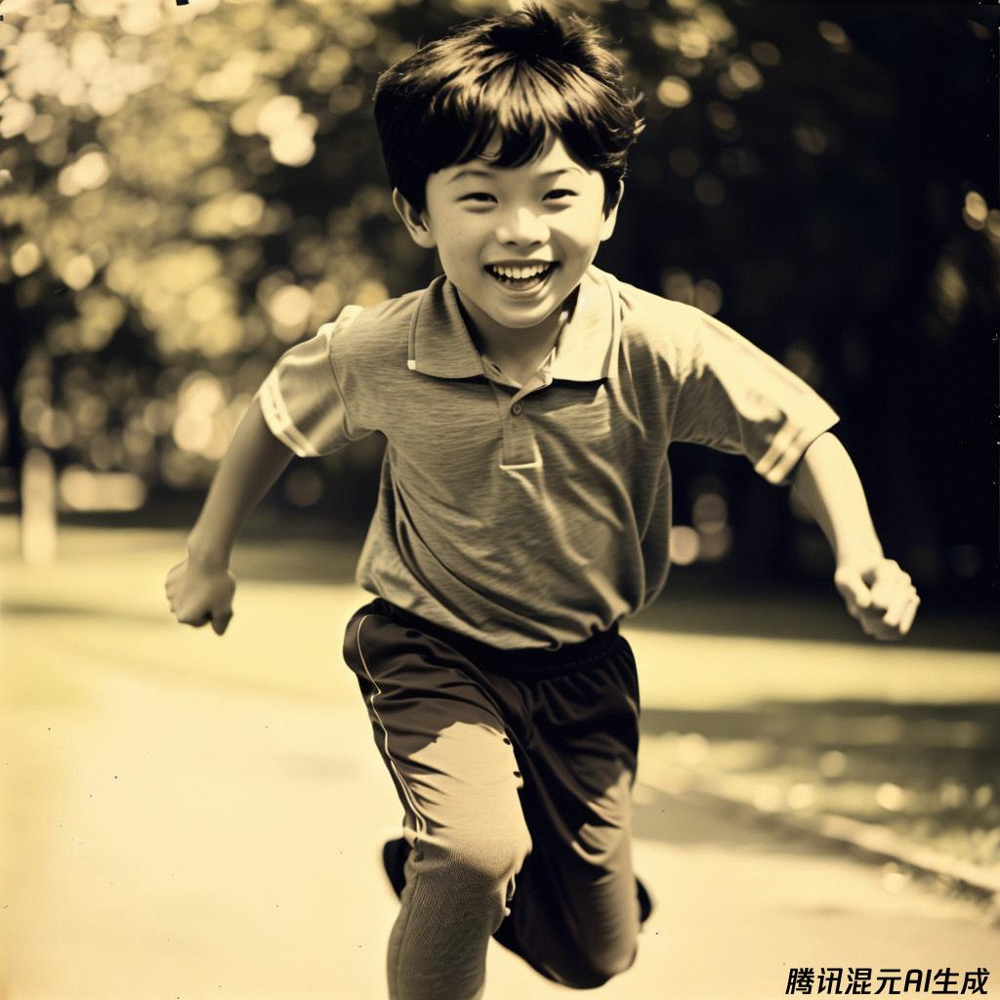
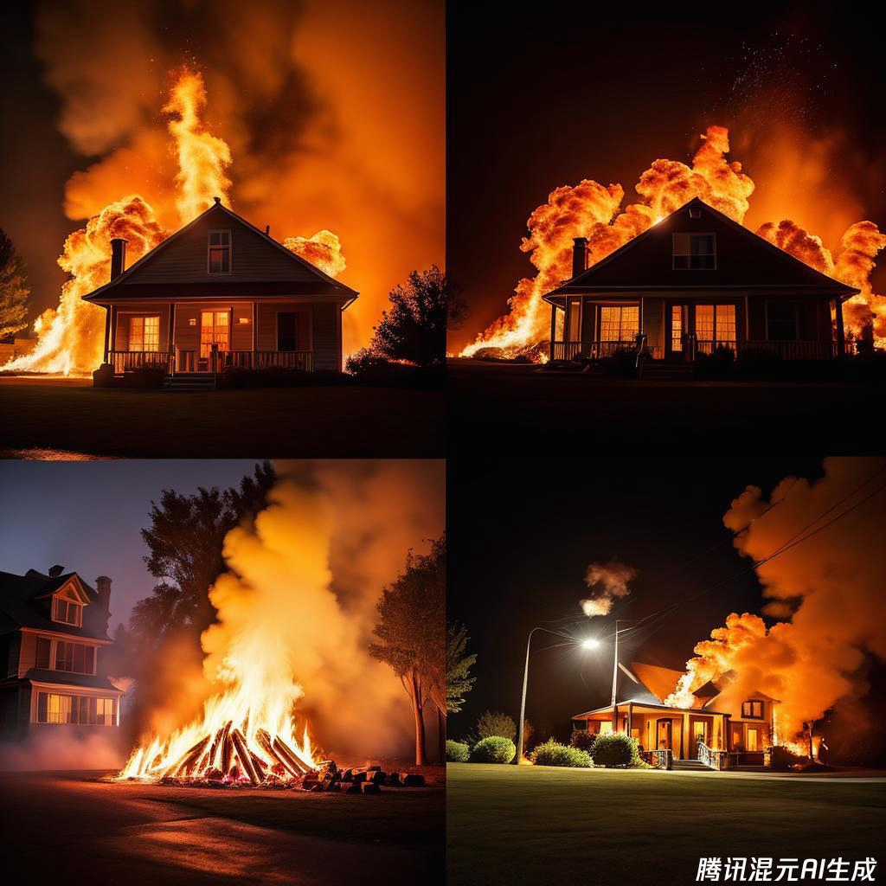

class: middle, center

<!-- AI 伴我行 -->

## AI 绘画 9：摄影

陈一帅，陈宇晗

<!-- [yschen@bjtu.edu.cn](mailto:yschen@bjtu.edu.cn) -->
<!-- 北京交通大学电子信息工程学院 -->
<!-- .footnote[网络智能实验室] -->

---
class: middle, center
## 摄影

更真实

---
class: middle, center
## 绘画：铅笔素描
画一个男孩，快跑，表情快乐，详细的，铅笔素描

.center[.width-60[]]

---
class: middle, center
## 摄影：黑白摄影
摄影，黑白摄影，一个男孩的照片，快跑，表情快乐，详细的

.center[.width-60[]]

---
## 摄影技术
- 如何构图？情感氛围是什么？
- 离主题多近？角度？微距、长焦、广角？景深？
- 主题如何照亮？从哪里来？多少光？
- 人造光还是自然光？什么颜色？一天中的时段？
- 哪里拍的？工作室还是户外？
- 在什么场景下发布或使用？哪一年拍摄？
- 使用什么薄膜或工艺？数字还是胶片？什么相机或镜头？

???
How is the photo composed?
What is the emotional vibe of the image?
How close are we to the subject? What angle?
How much depth of field?
How is the subject lit? Where from? How much light?
Artificial or natural light? What colour? What time of day?
What camera or lens? Macro, telephoto or wide angle?
Where is it shot? in the studio or out in the world?
What film or process is used? Digital or film?
What year was it taken?
In what context was this photo ultimately published or used?

class: middle, center
摄影技术

内容

技术

class: middle, center
内容

---
class: middle, center
## 年代

???
year & usage context
  shot on iPhone 6, on Flickr in 2007
  1973 photo from Life Magazine

---
class: middle, center
## 上世纪 70 年代《生活》杂志照片
摄影，画一个小女孩的特写、黑白、摄影级肖像，戏剧性的逆光，1973 年《生活》杂志的照片

.center[.width-60[]]

???
A close-up, black & white studio photographic portrait of SUBJECT, dramatic backlighting, 1973 photo from Life Magazine

---
class: middle, center
## 解放后
摄影，解放后，上海，一个女孩子的照片，快跑，表情快乐，详细的

.center[.width-60[]]

---
class: middle, center
## 今天
摄影，今天，北京，一个女孩子的照片，快跑，表情快乐，详细的

.center[.width-60[]]

---
class: middle, center
## 未来
摄影，一位跑步的女孩，神奇的跑鞋，未来派，令人惊叹的，摄影工作室作品，低调的灯光，散景，烟雾效果

.center[.width-60[]]

---
class: middle, center
# 类型

---
class: middle, center
## 新闻摄影照片
摄影，一位跑步的女孩，在一个很大的体育馆里，赛后胜利，骄傲的，后面红旗挥舞，面部细节，肖像，体育新闻摄影

.center[.width-60[]]

???
A vibrant photograph of SUBJECT, wide shot, outdoors, sunset photo at golden hour, wide-angle lens, soft focus, shot on iPhone 6, on Flickr in 2007

---
class: middle, center
## 抓拍照片
摄影，抓拍肖像，一个女孩子的照片，快跑，表情快乐，详细的

.center[.width-60[]]

???
class: middle, center
情感

充满活力的

???
vibe prompt
  vibrant

---
class: middle, center
## 地点

户外

工作室

???
shoot context
  outdoors
  studio photographic portrait

---
class: middle, center
## 户外
摄影，户外，一个女孩子的照片，表情快乐，详细的

.center[.width-60[]]

---
class: middle, center
## 工作室
摄影，工作室肖像摄影，一个女孩子的照片，表情快乐，详细的

.center[.width-60[]]

???
class: middle, center
照明

暖光

漏光

逆光

低调照明

戏剧性的背光

烛光、电影灯光、演播室灯光

???
lighting prompt
  dramatic backlighting
  sunset photo at golden hour

---
class: middle, center
## 时段

黄金时段（日出、日落）

蓝色时段（日出前、日落后）

---
class: middle, center
## 时段：黄金时段

画一张照片，短尾矮袋鼠的特写，国家地理风格摄影，令人惊叹的图像，黄金时段

.center[.width-50[]]

???
close up of a Quokka, national geographic style photography, stunning image, golden hour

---
class: middle, center
## 时段：蓝色时段
摄影，蓝色时段，一个男孩子的照片，快跑，表情快乐，详细的

.center[.width-60[]]

---
class: middle, center
## 技术

曝光

镜头

景深

胶片

???
相机
- 轨迹摄像机
- CCTV
- VHS
- 红外摄影
- 电影胶片
- 手机拍照

曝光
- 运动模糊
- 长时间曝光
- 高速快门
- 快速快门速度、高速、动作照片、1/1000 秒快门
- 慢快门速度、1秒快门、长时间曝光
---
class: middle, center
## 运动模糊
摄影，运动模糊，一个女孩子的照片，快跑，表情快乐，详细的

.center[.width-60[]]

---
class: middle, center
## 双重曝光
摄影，双重曝光，一个男孩子的照片，快跑，表情快乐，详细的

.center[.width-60[]]

???
class: middle, center
清晰

细节丰富、焦点清晰、4K、高清数字照相机

相机设置 + 镜头
- DSLR、35mm 镜头拍摄
- 深景深，f/22，35mm 使所有元素清晰
- 长焦镜头，Sigma 500mm f/5 从远处拍摄，感觉“偷窥”
- 散景、浅景深、模糊、失焦背景
- 微距镜头，微距照片，Sigma 105mm F2.8，适用于小场景
- 广角镜头，15 毫米，柔焦
- 移轴摄影，使窄条聚焦
- 鱼眼镜头：扭曲场景，广角，中心“凸起”

???
framing
  close-up
  wide shot

---
class: middle, center
## 鱼眼镜头
摄影，鱼眼镜头，一个男孩子的照片，快跑，表情快乐，详细的

.center[.width-60[]]

???
lens & camera prompt
  wide-angle lens, soft focus

???
Camera settings + lenses

Fast shutter speed, high speed, action photo, 1/1000 sec shutter
Slow shutter speed, 1 sec shutter, long exposure
Telephoto lens, Sigma 500mm f/5 Shot from afar, feels 'voyeuristic'
Bokeh, shallow depth of field, blur, out-of-focus background (via)
Macro lens, macro photo Sigma 105mm F2.8 - for small scenes
Wide angle lens, 15mm Fits more of the scene in the frame
Tilt shift photography (via) Makes a narrow strip in-focus
Fish-eye lens: distorts the scene, vv. wide angle, the centre 'bulges'
Motion blur
Deep depth of field, f/22, 35mm Make all elements sharp

class: middle, center
景深

浅景深

深景深

---
class: middle, center
## 浅景深

摄影，浅景深，一个女孩子的照片，快跑，表情快乐，详细的

.center[.width-60[]]

---
class: middle, center
## 深景深
摄影，深景深，一个女孩子的照片，快跑，表情快乐，详细的

.center[.width-60[]]

???
class: middle, center
胶片

达盖尔照相法

蓝晒法

暗箱

自动铬色

黑白

---
class: middle, center
## 胶片: 达盖尔照相法
摄影，达盖尔照相法，一个男孩子的照片，快跑，表情快乐，详细的

.center[.width-60[]]

---
class: middle, center
## 胶片: 自动铬色
摄影，自动铬色，一个男孩子的照片，快跑，表情快乐，详细的

.center[.width-60[]]

???
film type
  black & white

---
class: middle, center
## 示例

---
class: middle, center
## 人像
摄影，照片，20 岁机器人，LED 面罩头盔，侧面姿势，半身照，高细节，工作室灯光，黑色背景，烟雾，锐利，赛博朋克，85 毫米西格玛艺术镜头

.center[.width-50[]]

---
class: middle, center
## 自然
摄影，照片，相框中，烟雾缭绕的自然环境中，发光的蘑菇

.center[.width-60[]]

---
class: middle, center
## 新闻
摄影，照片，晚上房子着火，高细节，烟雾，锐利，雾气，黑暗

.center[.width-60[]]

---
class: middle, center
## 人物
摄影，女孩，20岁，特写，高细节，工作室，烟雾，锐利，粉红紫光，工作室，85毫米西格玛艺术镜头

.center[.width-60[]]

---
class: middle, center
## 室内
摄影，照片，黑暗寺庙，金宝藏，高细节，烟雾，锐利，雾的照片

.center[.width-60[]]

???
Smoke it up

Photo of robot with 20yo girl inside, LEDs visor helmet, profile pose, bust shot, high detail, studio, black background, smoke, sharp, cyberpunk, 85mm Sigma Art lens
Cyberpunk church, high detail, smoke, sharp, neon lights, neon cross
Glowing mushrooms in a natural environment with smoke in the frame
House on fire at night, high detail, smoke, sharp, fog, darkness
photo of slim girl, 20yo, close-up, high detail, studio, smoke, sharp, pink violet light, studio, 85mm sigma art lens
Photo of dark temple, golden treasure, high detail, smoke, sharp, fog

---
## 小结

- 内容
  - 年代、类型
  - 户外、工作室
  - 时段（黄金时段、蓝色时段）
- 技术
  - 曝光（运动模糊）、镜头（鱼眼镜头）、景深
  - 胶片：达盖尔照相法
- 示例
---
class: middle, center

实验和作品分享 1

## 我想拍的人？

---
class: middle, center

实验和作品分享 2

## 我想拍的年代？

上世纪、新时代、未来

---
class: middle, center

实验和作品分享 3

## 我想用的镜头？

相机、曝光、镜头、景深

---
class: middle, center

实验和作品分享 4

## 我想用的胶片？

黑白、胶片、达盖尔照相法

---
class: middle, center

实验和作品分享 5

## 我想拍的新闻？

身边的新闻