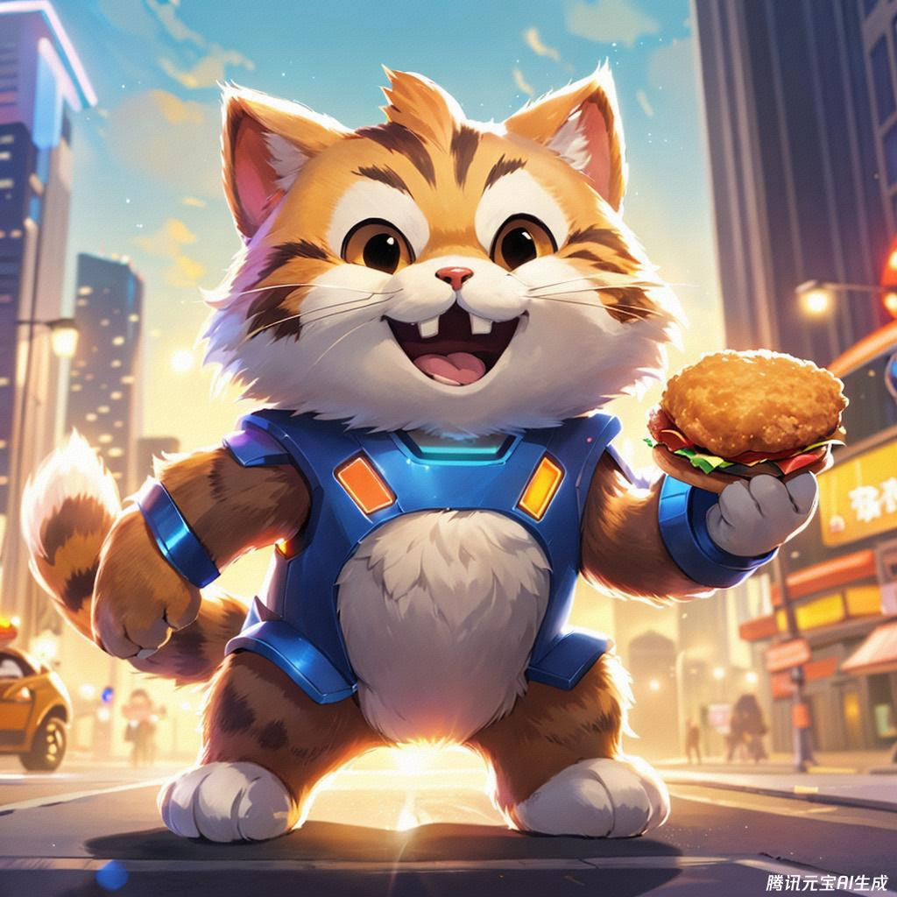
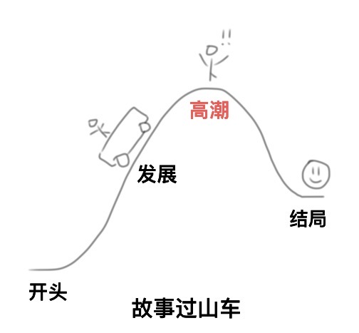
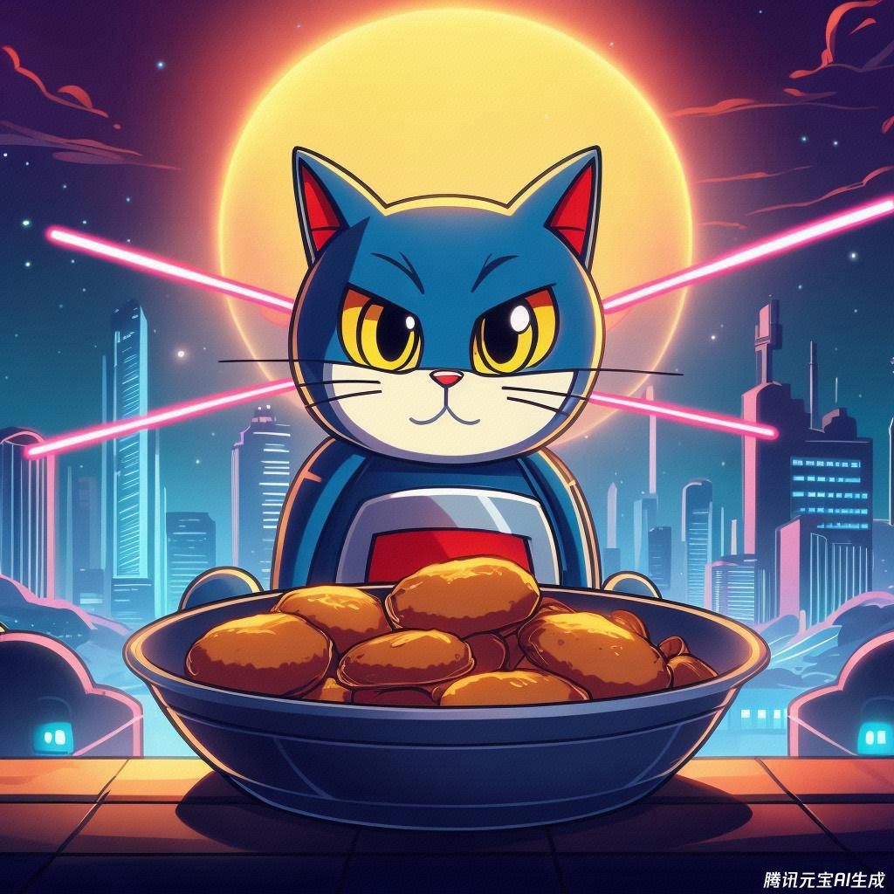
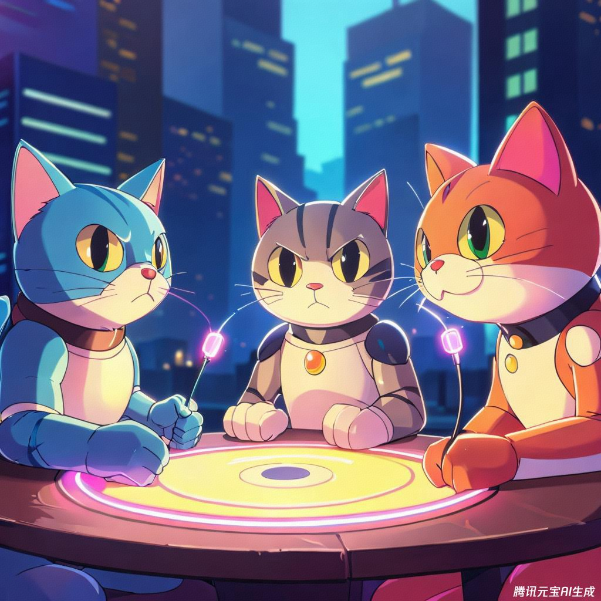
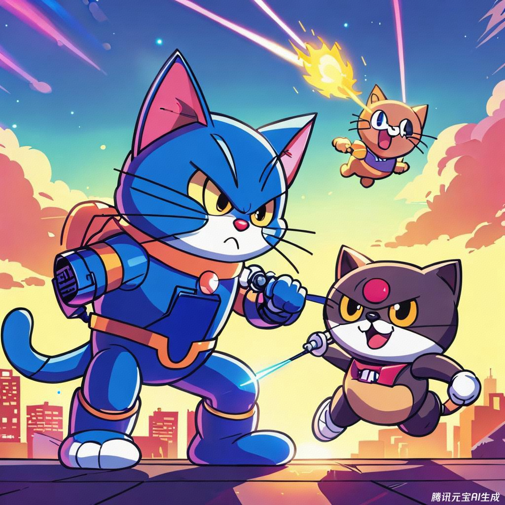
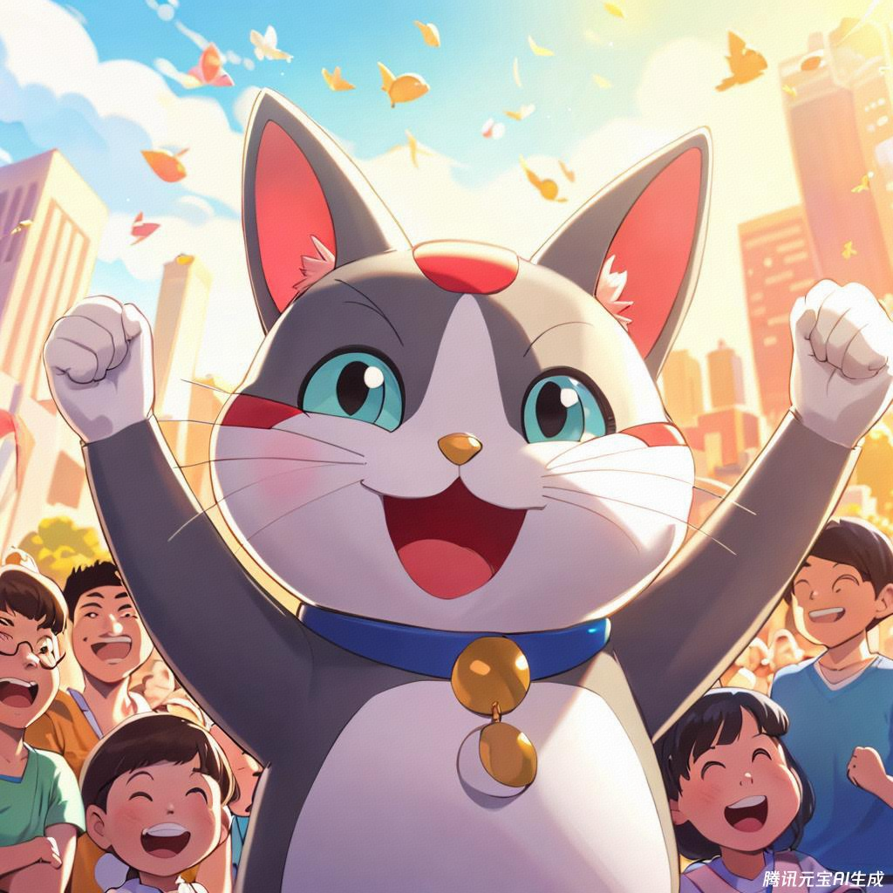

class: middle, center
## AI 帮我画 10：我的故事

陈一帅、陈宇晗

<!-- [yschen@bjtu.edu.cn](mailto:yschen@bjtu.edu.cn)

北京交通大学电子信息工程学院

.footnote[网络智能实验室] -->

---
# 内容

- 主题内容
- 背景
- 角色
- 情节

???
ChatGPT 结果 Prompts for Children’s Books

In this section, we'll go over a collection of ChatGPT 结果 prompts designed specifically for writing stories for children. From story ideas to memorable characters, these prompts will be your guide to creating a magical world that children will love to visit.

---
class: middle, center
# 主题内容

这个故事是关于什么的？

---
# 主题内容

- 正面的：友谊、冒险、拯救世界、未来城市、仙子、体育
- 让人思考的：世界末日、挫折、战争、怪兽
- 我们的故事主题？

---
class: middle, center
# 背景

故事需要有一个发生的地点和环境

---
# 背景

- 真实存在的：皮村、北京、大海、沼泽
- 虚拟的：太空城、仙女木屋
  
---
class: middle, center
# 背景

作家们经常会没有想法、堵住了不知道怎么写

我们可以把主题交给 AI，让他来给我们提供一些背景的建议

---
# AI 背景

- 告诉 AI：请扮演一位经验丰富的作家。你已经创作了数百本儿童读物
- 请根据“    ”的主题，给出三个可能的背景（地点、时间等）
- 我们的故事背景是？

???

1. To Brainstorm Book Themes

The first prompt is for brainstorming themes. You want it to be colorful, engaging, and meaningful. And that's exactly what you'll achieve by using the prompt below.

Act as an experienced writer who has authored hundreds of children's books. Your task is to brainstorm a captivating and educational theme for a book about [topic]. The theme should not only be engaging and suitable for children but also impart meaningful lessons or insights related to the [topic]. Consider incorporating elements that encourage imagination, curiosity, and a love for learning. The theme must be original and have the potential to be expanded into a series. Your brainstorming should include potential character arcs, settings, and plot twists that align with the theme, making the book an unforgettable experience for young readers.

???
To Suggest Book Title
Finding the perfect title for your children's book is tricky. It needs to be catchy, imaginative, and appealing to young readers. Fortunately, with the next prompt, AI will give you title ideas that will do exactly that.

Act as an experienced writer who has written hundreds of children's books. Your task is to suggest a title for a book about [topic] that will captivate and intrigue young readers. The title should be imaginative, memorable, and reflect the essence of the story or theme. It must also be appropriate for the target age group and stand out on the shelves amongst other children’s books. Consider the emotional and educational impact of the title, ensuring it resonates with both children and their caregivers. Your expertise in children's literature should guide you in crafting a title that promises adventure, learning, and fun.

---
class: middle, center
# 角色

故事需要主人公

创建有趣且独特的人物才能让故事吸引人

---
# 角色 - 主人公

1. 外貌：激光眼、高个子、穿毛茸茸的衣服
2. 性格：开朗、热情、很少生气
3. 特殊爱好：喜欢吃炸鸡
4. 想法💡：想要利用 AI 拯救世界

---
# 角色 - 其他角色

除了主人公以外，还需要和他交流的其他人
- 朋友、间谍、敌人、动物

???
1. To Create Character Profiles

Creating characters that kids will love and remember is super important. But sometimes, coming up with those characters can be tough. And that's where the next prompt will help! It will create fun and unique character profiles that will bring your story to life.

As an experienced writer with hundreds of children's books under your belt, your task is to create a detailed character profile for a key character in a new book centered around [topic]. This character should be relatable to children, embodying traits, challenges, and growth that will resonate with young readers. Your character profile should include the character's background, personality traits, physical appearance, motivations, and how they will evolve throughout the story. Additionally, consider how this character's journey can teach valuable lessons related to [topic], engaging children and sparking their curiosity. Ensure the character is unique and memorable, contributing to a story that stands out in children's literature.

---
## 绘制人物形象

.center[.width-70[]]

???

1. To Visualize Characters

Finding the right look for your characters can be tricky, but it's super important. That's exactly where the next prompt will come into play. It will help you draw characters that jump off the page and straight into the hearts of kids.

Act as a children's book illustrator, specializing in creating engaging, vibrant characters for young readers. Draw a character based on the given [description] that will fit seamlessly into a book about the specified topic. The character should be appealing to children, embodying characteristics that make them relatable or aspirational to the target age group. Use bold colors, expressive features, and dynamic poses to bring the character to life. Consider how the character's design can support the theme and message of the book, adding depth and interest to the story. Ensure the artwork is age-appropriate, culturally sensitive, and supports a positive message.

---
class: middle, center
# 情节

把所有结合到一起，讲出到底发生了什么？

---
# 情节

1. 开头：说明背景，介绍人物和他们的任务
2. 发展：开始旅程，遇到一些神奇的事情
3. 高潮：出现巨大的挑战！
    - 怪物攻击
    - 找到宝藏
    - 命悬一线
4. 结局：最后主角怎么样了？传达故事想说的道理
    - 解决问题
    - 悲剧结局

---
# 情节

.center[.width-80[]]

---
class: middle, center
# 情节

写一个关于（主题）的故事。在（背景）下，围绕（人物）。按照 开头、发展、高潮、结局 四个部分，每个 100 字左右。

---
# 情节

写一个关于利用 AI 拯救世界的故事。在未来的城市中，围绕一个有激光眼、爱吃炸鸡并且乐观开朗的机器猫。按照 开头、发展、高潮、结局 四个部分，每个 50 字左右。

???
1. To Structure a Basic Plot

With the next prompt, structuring a plot for your children's book becomes an exciting adventure, guiding you to tell tales that capture young hearts and minds.

Act as an experienced writer with a prolific background in crafting hundreds of children's books. Develop a basic plot structure for a book centered around [topic] that is aimed at captivating young readers. The plot should be simple yet engaging, incorporating elements that resonate with children, such as adventure, friendship, and discovery. Begin with an introduction that sets the scene and introduces the main character(s) and their world. Follow with a series of events that present challenges or mysteries for the characters to overcome, ideally incorporating educational elements subtly. Include a climactic moment where the characters must face their biggest challenge or make a significant decision. Conclude with a resolution that leaves the reader with a sense of satisfaction and a final message or moral. Ensure the story encourages imagination, teaches valuable life lessons, and is appropriate for the target age group.

---
# 故事 - 开头

在未来的城市里，有一只叫小光的机器猫。它有激光眼，爱吃炸鸡，并且乐观开朗。一天，城市突然被邪恶机器人军团入侵。
.center[.width-60[]]

---
# 故事 - 发展

小光发现邪恶机器人们通过黑客攻击控制了城市的网络。他决定利用自己的AI智能拯救城市，并找到了其他机器朋友们的帮助。
.center[.width-60[]]

---
# 故事 - 高潮

小光用激光眼切断了敌人的通信塔，使他们无法协调攻击。他的朋友们则用特制炸鸡炸弹瘫痪了敌人的主控制中心。城市终于得救了！
.center[.width-60[]]

---
# 故事 - 结局

城市恢复了和平，人们欢呼庆祝。小光和他的朋友们享受着炸鸡大餐，成为了大家心中的英雄。
.center[.width-60[]]

---
# 小结

- 主题
- 背景
- 角色
- 情节
