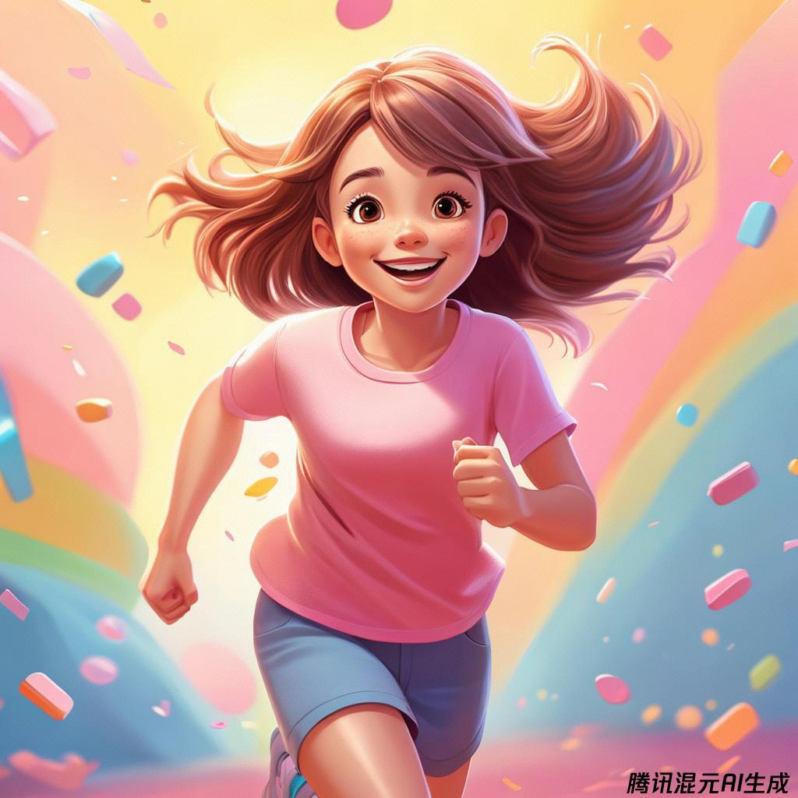
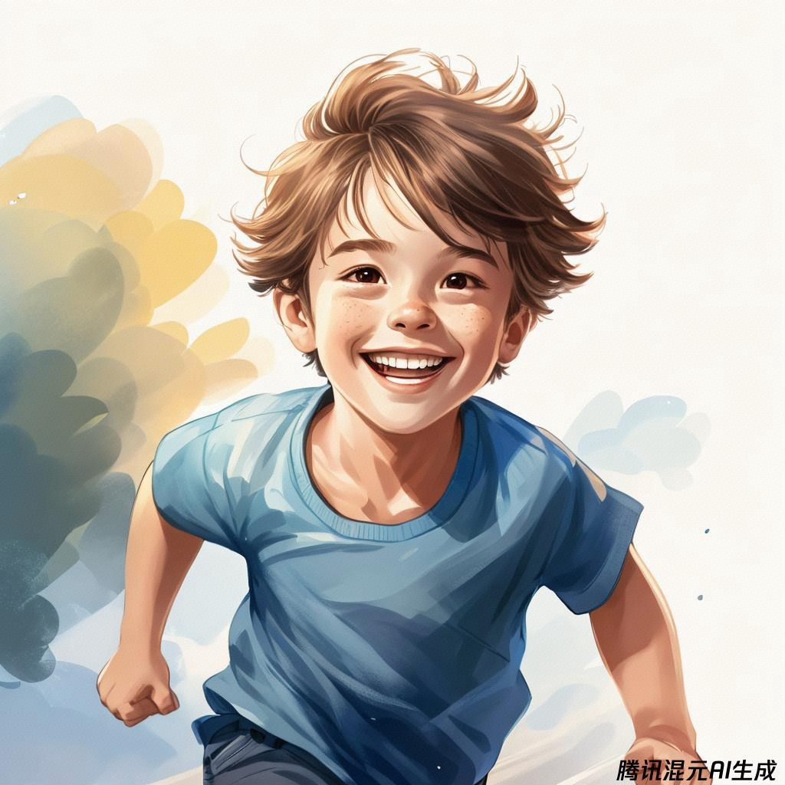
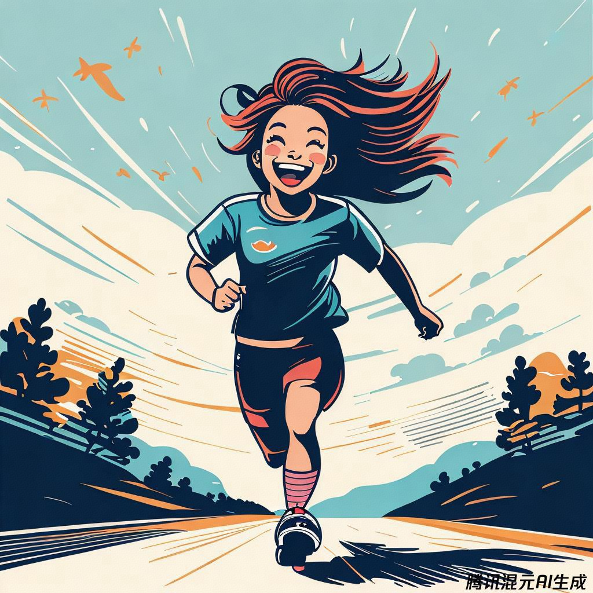
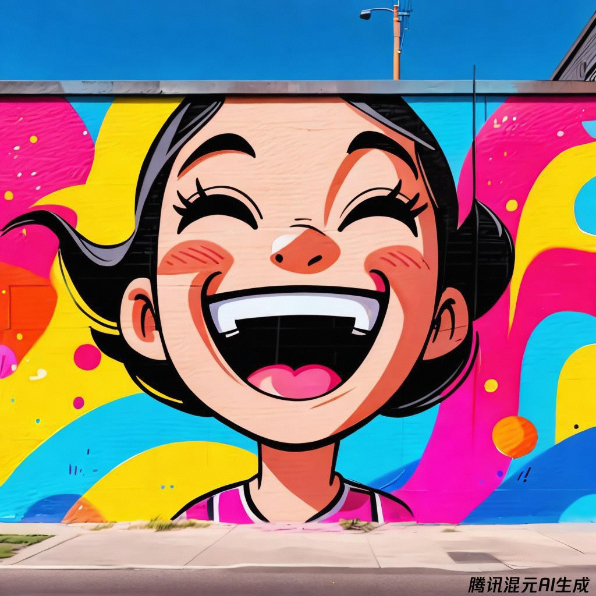
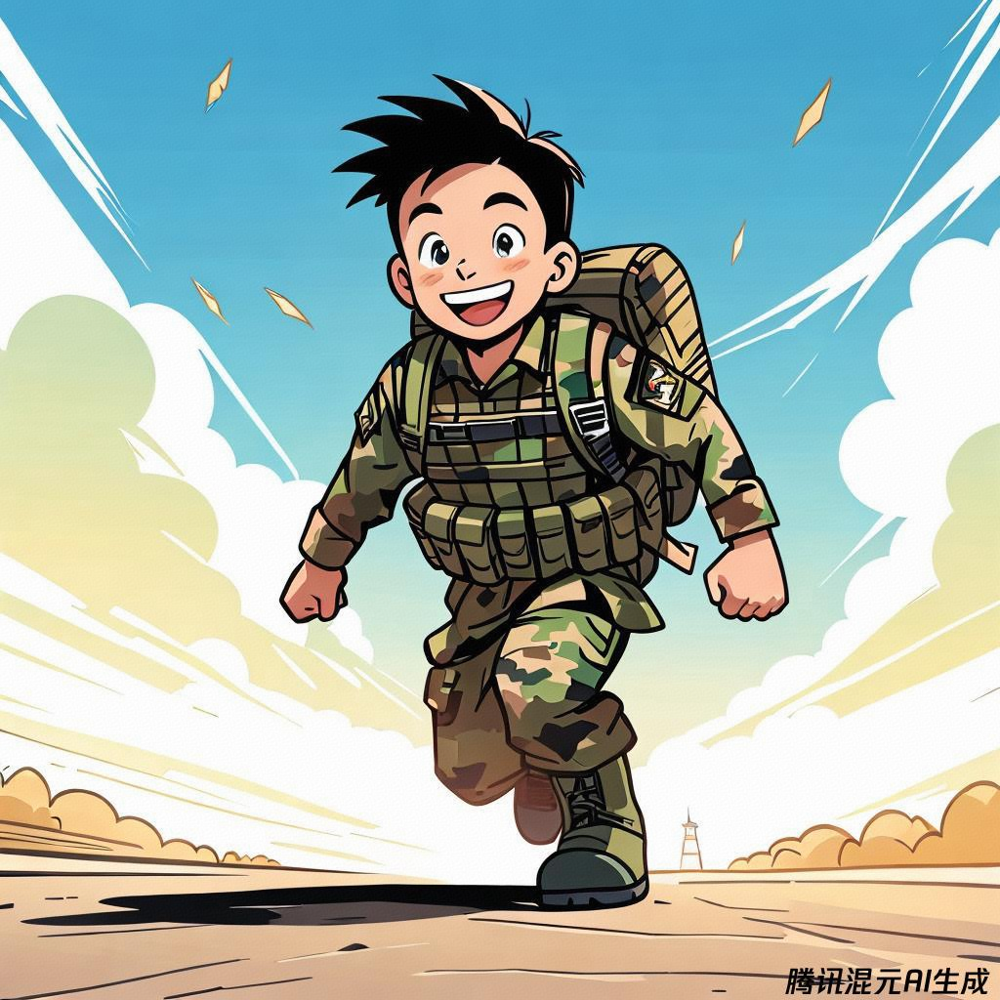
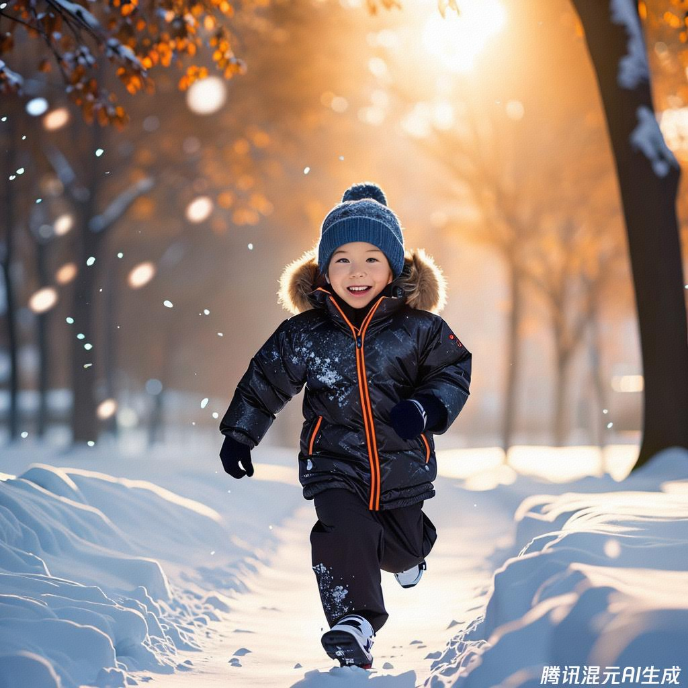
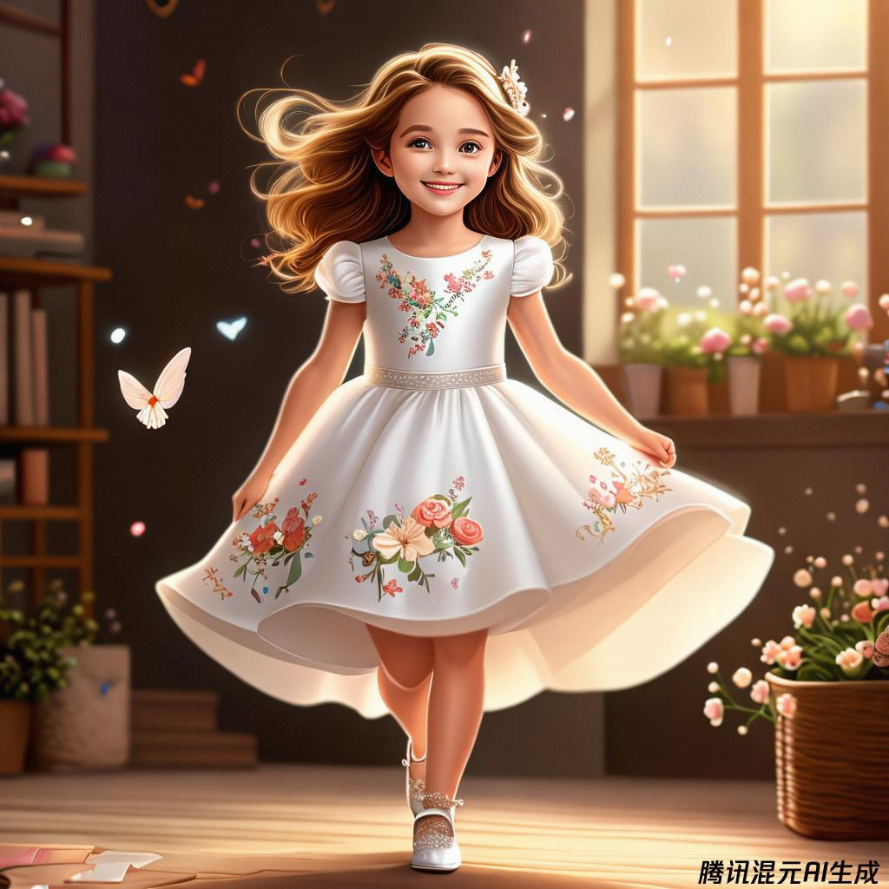
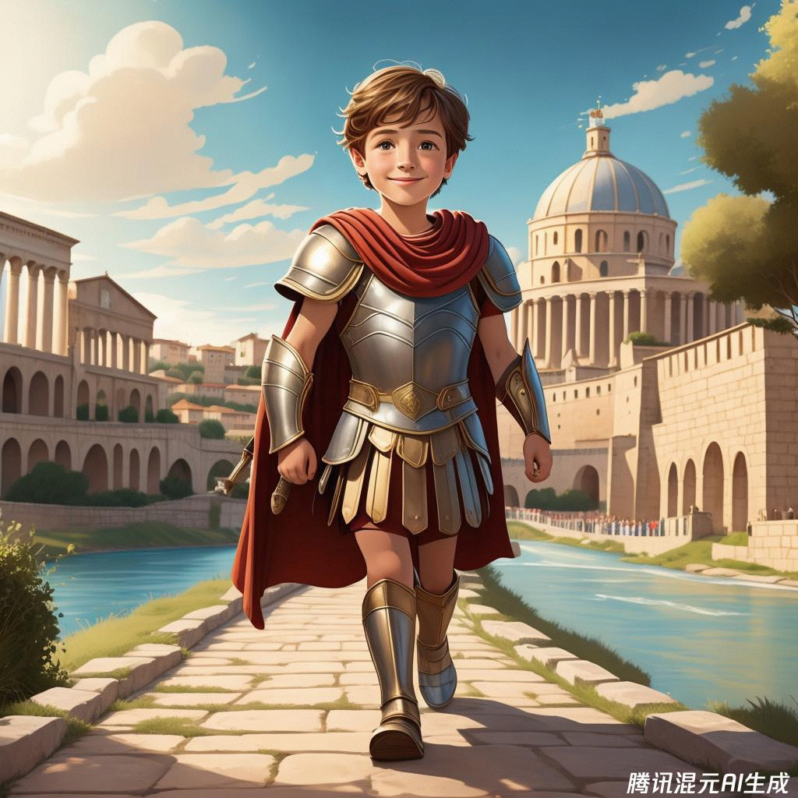
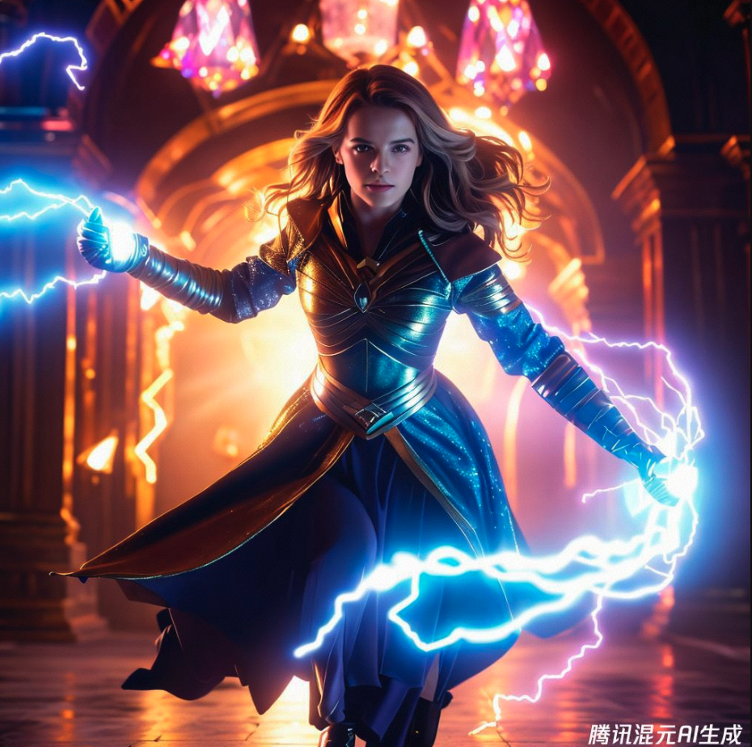
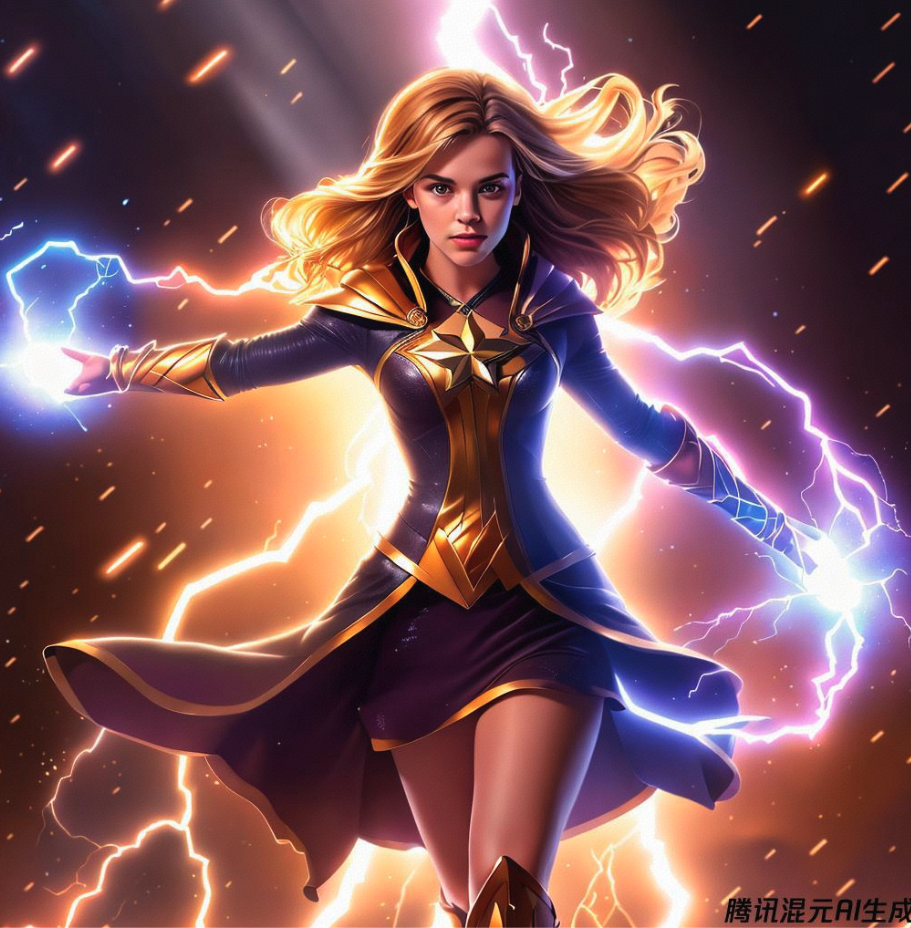

class: middle, center

<!-- AI 伴我行 -->

## AI 绘画 2：人物

陈一帅，陈宇晗

<!-- [yschen@bjtu.edu.cn](mailto:yschen@bjtu.edu.cn) -->
<!-- 北京交通大学电子信息工程学院 -->
<!-- .footnote[网络智能实验室] -->

???
手工风格

发现有趣的艺术风格的名称
画廊、网站、艺术教科书

---
## 内容
- 风格
  - 黑白：铅笔
  - 彩色：蜡笔、儿童画
  - 艺术：丝网印刷、街头艺术
- 外形
  - 服装/配饰：裙子、盔甲
  - 角色扮演
- 技巧
  - 光：烛光、演播室灯光、闪电
  - 画家：指定喜欢的画家

---
class: middle, center
## 风格

黑白风格

彩色风格

艺术风格
---
class: middle, center
## 黑白：铅笔素描
画一个男孩，快跑，表情快乐，详细的，铅笔素描

.center[.width-60[]]

???
- 一个男孩，跑着，跳过障碍，可爱、详细的，铅笔素描
- 一个男孩，跑过公园，白色背景，迷人、舒适的，水彩，插图
- 一个女孩，坚定的肖像，戏剧性，布面丙烯，杰作
水彩、喷枪、铅笔、丙烯

---
## 更多黑白风格

- 圆珠笔
- 炭笔素描
- 铅笔素描
- 铅笔画，详细/超详细，逼真
- 蚀刻
- 涂色
- 木刻

???
- 田野日记艺术线条
- 美国报纸的政治漫画
Stencil, street art, Banksy
Ballpoint pen art
Charcoal sketch
Pencil sketch
Pencil drawing, detailed, hyper-detailed, very realistic
Etching
Political cartoon from U.S. newspaper
Colouring-in sheet
Woodcut
Field journal line art

---
class: middle, center
## 彩色：蜡笔风格
画一个女孩，快跑，表情快乐，详细的，蜡笔风格

.center[.width-60[]]

---
class: middle, center
## 彩色：儿童画风格
画一个男孩，快跑，表情快乐，详细的，儿童画风格

.center[.width-60[]]

---
## 更多彩色风格

- 蜡笔
- 儿童画
- 中国水彩画
- 彩色铅笔
- 喷枪
- 油画
- 水彩
- 布面丙烯

???
Crayon
Child's drawing / children'
drawing
Oil painting
Ukiyo-e
Chinese watercolor
Coloured pencil, detailed
Airbrush
Pastels
Acrylic on canvas
Watercolor

---
class: middle, center
## 艺术风格：丝网印刷
画一个女孩，快跑，表情快乐，丝网印刷风格

.center[.width-60[]]

---
class: middle, center
## 艺术风格：街头艺术
画一个女孩，表情快乐，详细的，街头艺术风格

.center[.width-60[]]

---
## 更多艺术风格

- 粉笔
- 丝网印刷
- 照片拼贴
- 故事书插图
- 报纸卡通
- 十年的复古插图
- 街头艺术（班克斯）
- 粉彩
- 浮世绘

---
class: middle, center

## 外形

服装

角色

---
class: middle, center
## 外形：服装
画一个男孩，快乐地向我们走来，特种部队，野战迷彩服，儿童画风格

.center[.width-60[]]

---
## 各种服装
- 衣服
- 时装
- 盔甲
- 历史服装
- 未来服装
- 鞋子

---
class: middle, center
## 服装：黑天鹅绒质地

画一个快乐的孩子，慢跑，黑天鹅绒质地的服装

.center[.width-60[]]

---
class: middle, center
## 服装：白色连衣裙
画一个女孩，快乐地向我们走来，高级定制，白色连衣裙，上面有小花，儿童画风格

.center[.width-60[]]

---
class: middle, center
## 服装：古罗马军团盔甲
画一个男孩，骄傲地向我们走来，穿着古罗马军团的盔甲，儿童画风格

.center[.width-60[]]

---
class: middle, center

## 配饰
珠宝、项链、戒指

配饰

箱包

---
class: middle, center
## 光

烛光

电影灯光

演播室灯光

---
class: middle, center
## 光：电影灯光
画一幅画：艾玛·沃特森，饰演的强大神秘女巫，施展闪电魔法，细致服装，数字绘画，超现实主义，幻想，全身，高度细致，锐利聚焦，科幻，美得惊人，虹彩金色，电影灯光，黑暗

.center[.width-50[]]

???
例：Emma Watson as a powerful mysterious sorceress, casting lightning magic, detailed clothing, digital painting, hyperrealistic, fantasy, Surrealist, full body, by Stanley Artgerm Lau and Alphonse Mucha, artstation, highly detailed, sharp focus, sci-fi, stunningly beautiful, dystopian, iridescent gold, cinematic lighting, dark

---
class: middle, center
## 指定喜欢的画家

---
class: middle, center
## 指定喜欢的画家
作者：Stanley Artgerm Lau 和 Alphonse Mucha，artstation

.center[.width-60[]]

---
## 小结
- 风格
  - 黑白：铅笔
  - 彩色：蜡笔、儿童画
  - 艺术：丝网印刷、街头艺术
- 外形
  - 服装/配饰：裙子、盔甲
  - 角色扮演
- 技巧
  - 光：烛光、演播室灯光、闪电
  - 画家：指定喜欢的画家

---
class: middle, center

实验和作品分享 1

## 画出我自己

---
class: middle, center

实验和作品分享 2

## 画出我的家人

---
class: middle, center

实验和作品分享 3

## 画出我的朋友

---
class: middle, center

实验和作品分享 4

## 画出我的偶像
