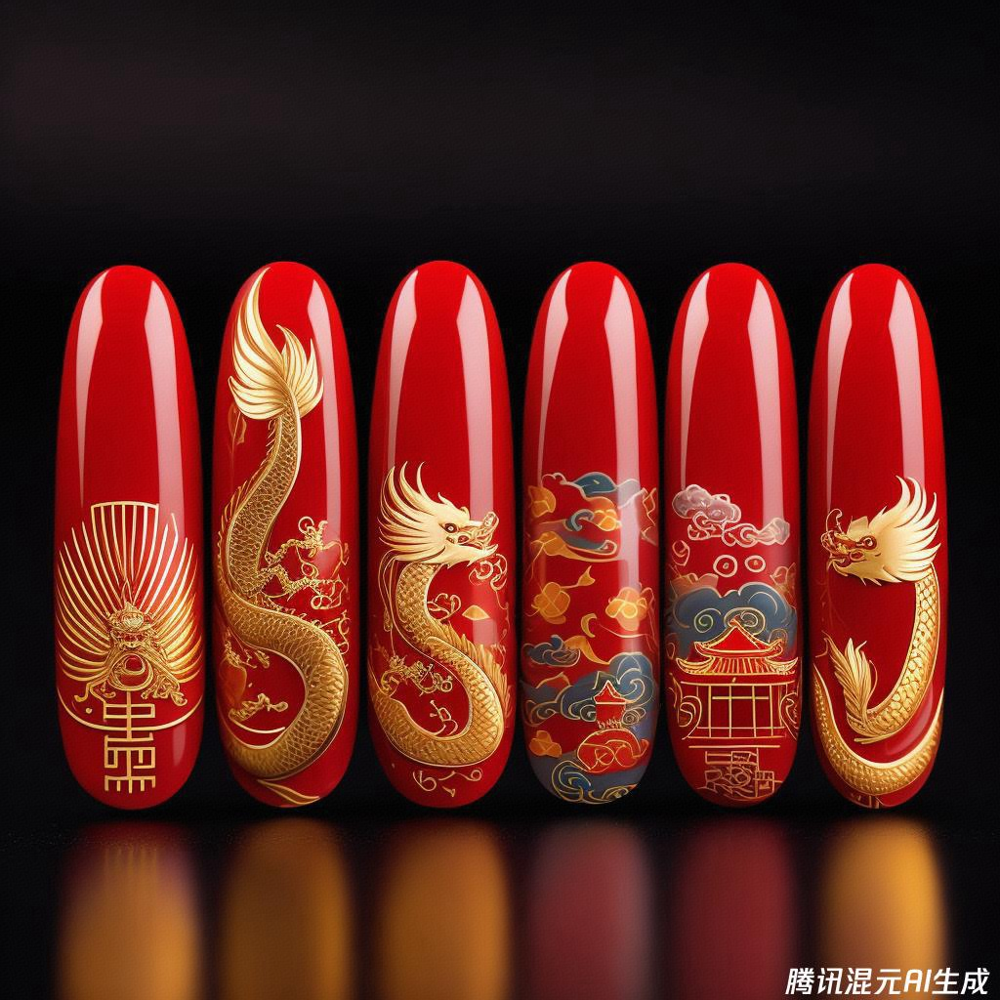
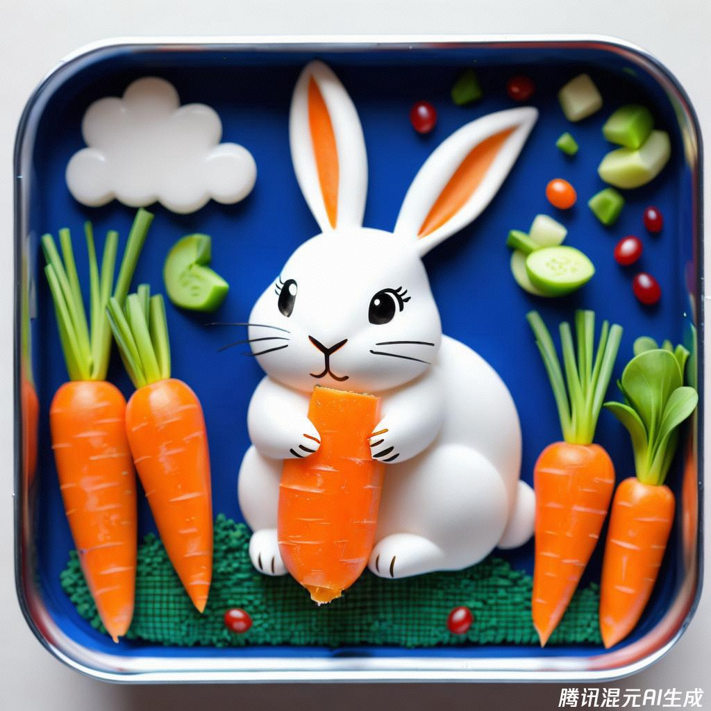
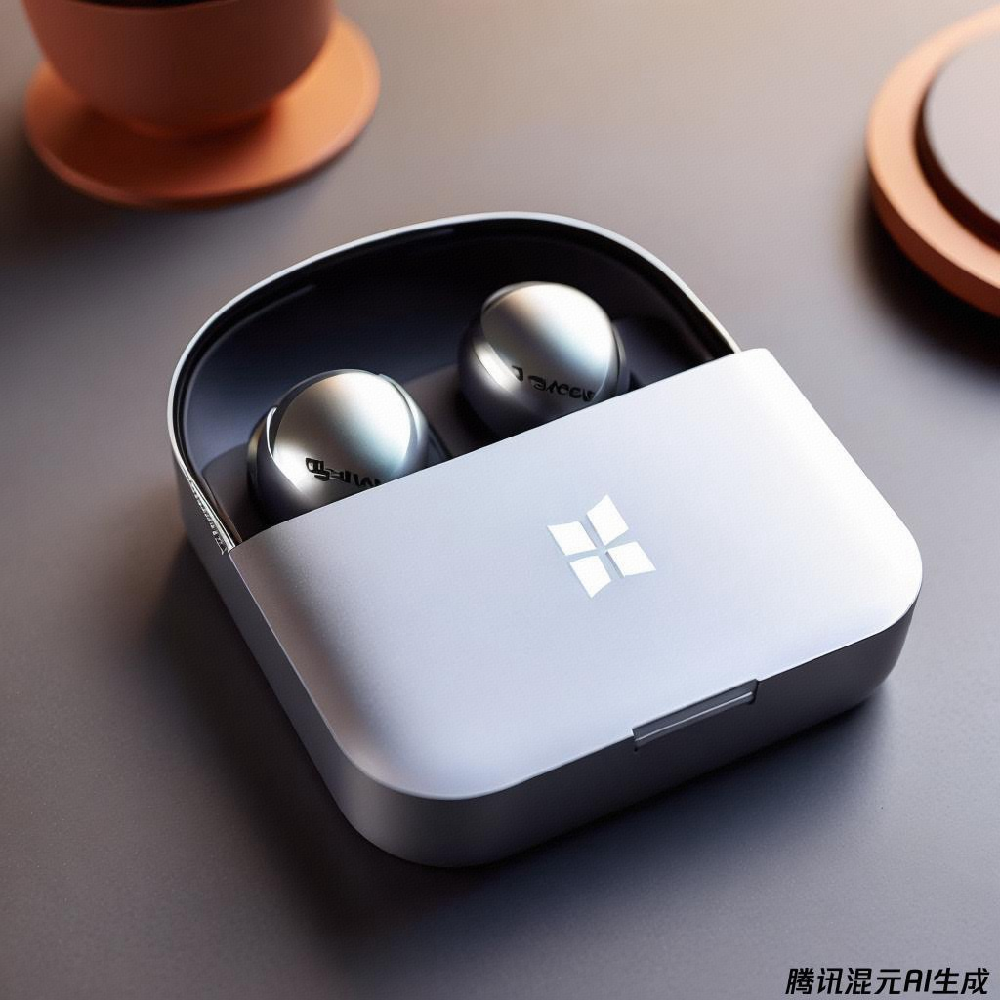
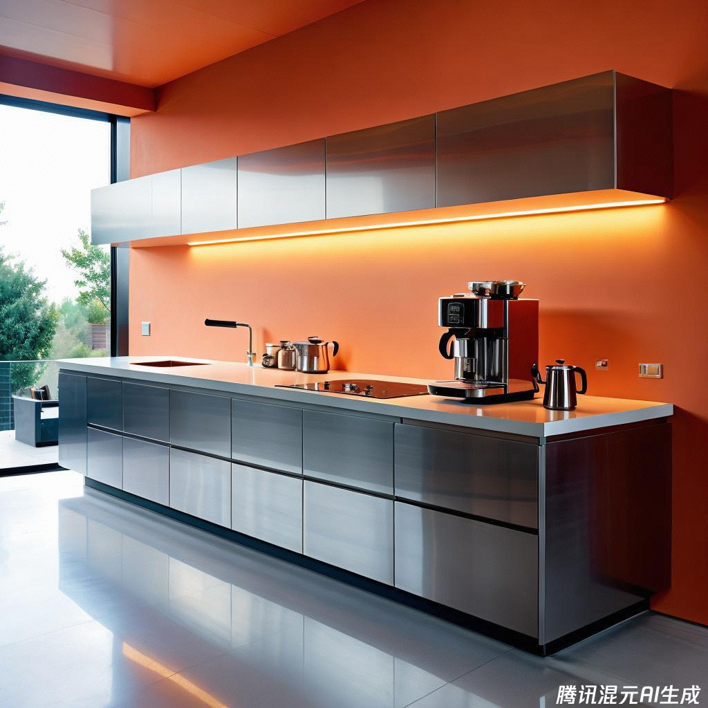
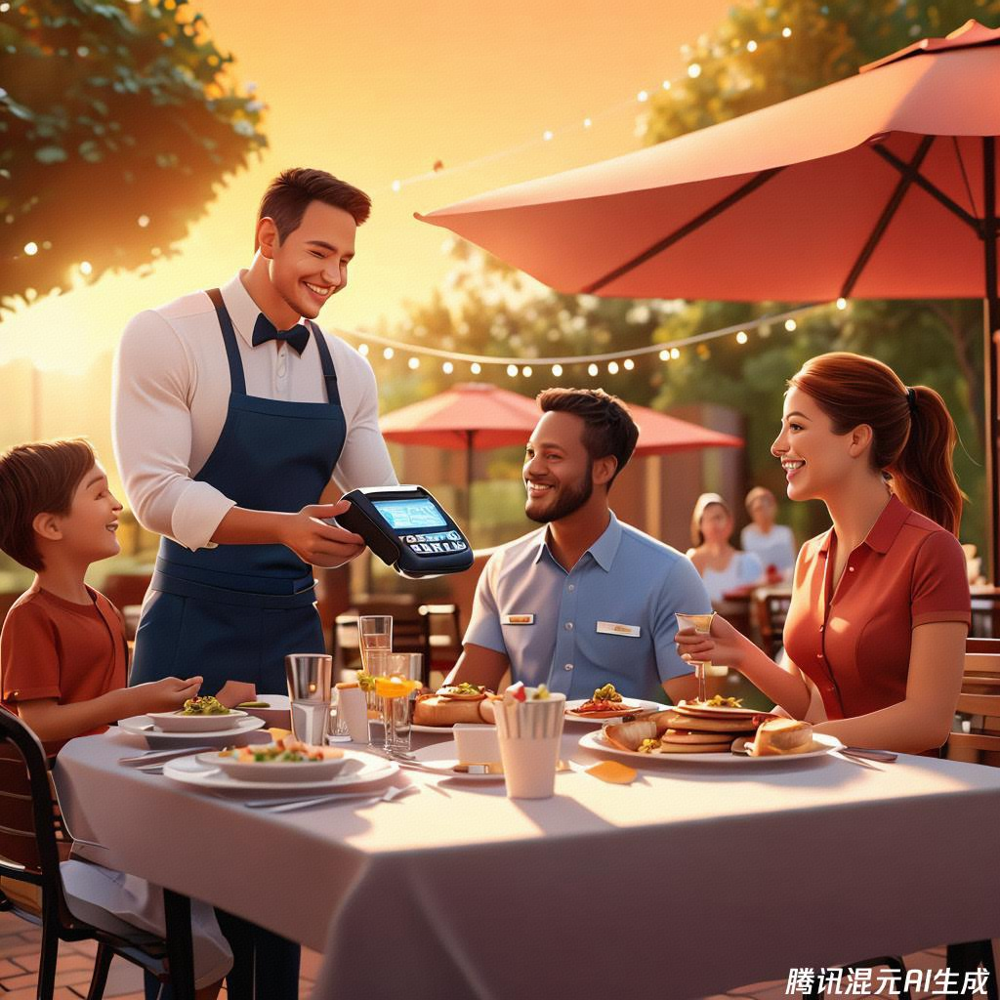
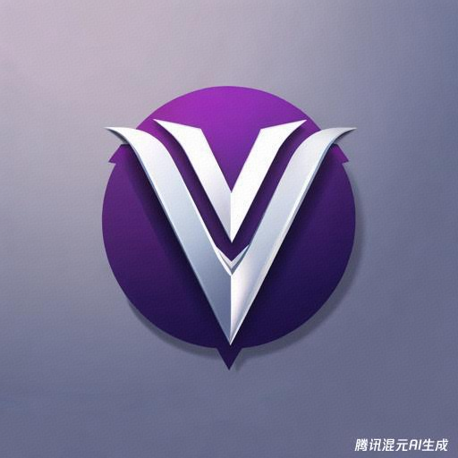
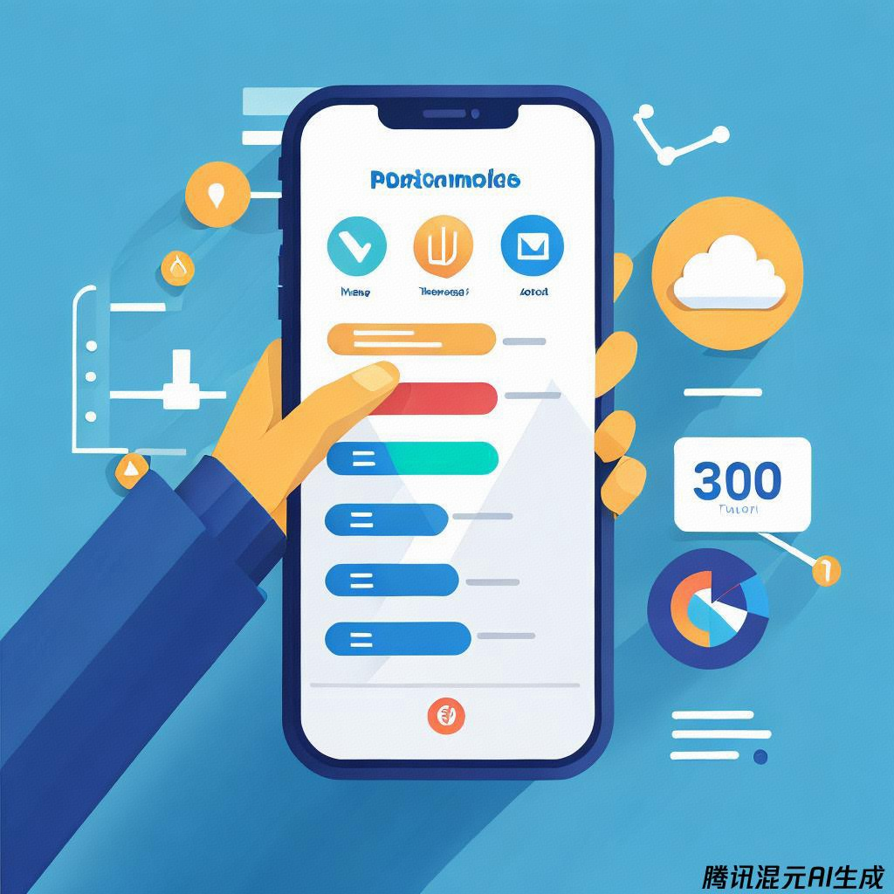
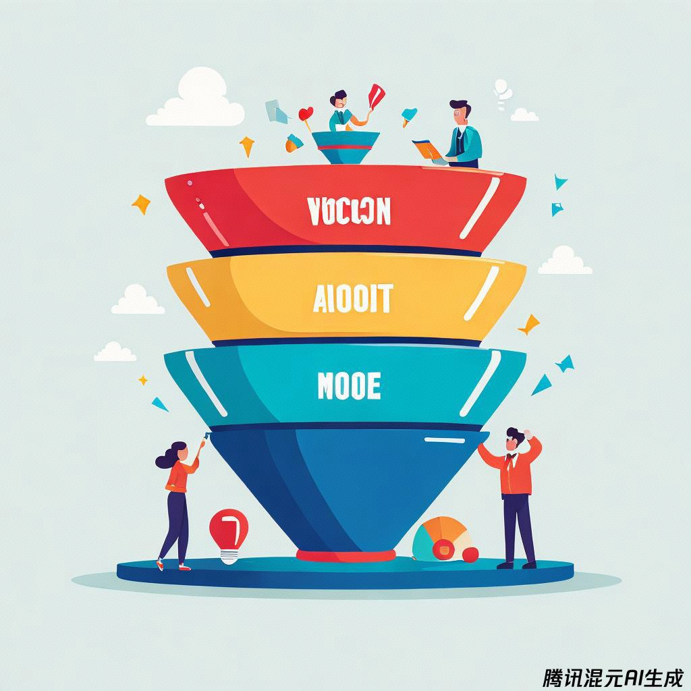
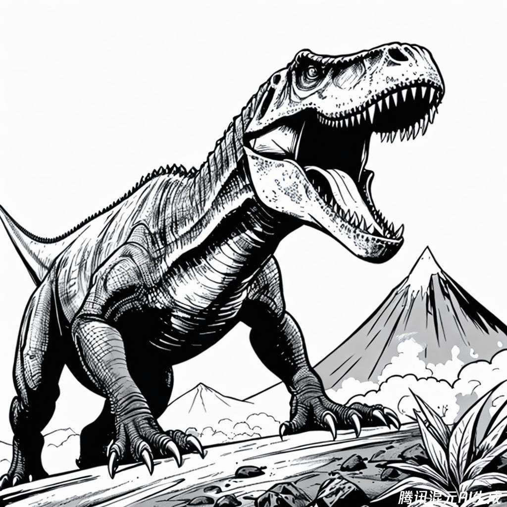

class: middle, center

<!-- AI 伴我行 -->

## AI 绘画 6：我的工作

陈一帅，陈宇晗

<!-- [yschen@bjtu.edu.cn](mailto:yschen@bjtu.edu.cn) -->
<!-- 北京交通大学电子信息工程学院 -->
<!-- .footnote[网络智能实验室] -->

---
## 内容
- 职业
  - 医生、工人、农民、厨师、店员、教师、科学家、警察
  - 消防员、宇航员、运动员、明星、网红、自由职业者
- 工作中的各种设计
  - 美甲、食品、包装
  - 家居、广告、公司徽标
  - 软件界面、演示图、背景图、图标
  - 海报、封面、宣传册
  - 卡片、菜单

???
class: middle, center
寻找想法

你是一位水彩画家。请给出 5 个绘画作品的想法，给出她们的标题和说明文字，请输出表格形式

???
You are a watercolor painter. Create a list of 5 descriptive ideas for paintings. Create titles and captions for social media.

---
class: middle, center
## 各种职业

---
class: middle, center
## 医生

治病救人，帮助人们恢复健康

拥有高超的医术，帮助他人

---
class: middle, center
## 工人

生产出钢铁、汽车、火车等各种产品

让我们的生活更加便利

---
class: middle, center
## 农民

种植粮食、水果、蔬菜、饲养牲畜，捕捉水产

让我们可以生活

---
class: middle, center
## 厨师

做出可口的饭菜

让我们能够生存

---
class: middle, center
## 教师

传授知识，教导学生成长

拥有渊博的知识，成为学生的榜样

---
class: middle, center
## 科学家

探索未知，发明创造

像科学家一样，拥有敏锐的思维，做出伟大的发现

---
class: middle, center
## 警察

维护治安，打击犯罪

像警察一样，勇敢正义，保护人民的安全

---
class: middle, center
## 消防员

英勇灭火，拯救生命

像消防员一样，强壮勇敢，在危难时刻帮助他人

---
class: middle, center
## 宇航员

探索太空，遨游宇宙

像宇航员一样，拥有无畏的精神，去探索宇宙的奥秘

---
class: middle, center
## 运动员

在赛场上展现自己的实力，赢得荣誉

像运动员一样，拥有健壮的体魄，在体育竞技中取得成功

---
class: middle, center
## 明星

站在舞台上，展现自己的才华

像明星一样，拥有耀眼的光芒，成为人们的偶像

---
class: middle, center
## 网红

通过网络平台分享自己的生活，获得粉丝的关注

像网红一样，拥有独特的个性，在网络上拥有自己的影响力

---
class: middle, center
## 工程师

生成和维护各种技术设施，比如道路、桥梁、手机

让我们的生活更加便利，为我们的生活保驾护航

---
class: middle, center
## 自由职业者

自由选择工作时间和地点，拥有更大的自主权

像自由职业者一样，做自己喜欢的事情，拥有更自由的生活方式

---
class: middle, center
## 你向往的职业有哪些？

---
class: middle, center
## 每个小朋友的兴趣爱好都不一样

## 对未来的职业规划也不同

---
class: middle, center
### 尊重自己的兴趣爱好

### 探索不同的职业可能性

### 最终找到适合自己的职业

---
class: middle, center
## 陈老师向往的职业

# 飞行员

---
## 内容
- 职业
  - 医生、工人、农民、厨师、店员、教师、科学家、警察
  - 消防员、宇航员、运动员、明星、网红、自由职业者

- 工作中的各种设计
  - 美甲、食品、包装
  - 家居、广告、公司徽标
  - 软件界面、演示图、背景图、图标
  - 海报、封面、宣传册
  - 卡片、菜单

---
class: middle, center
## 美甲

画一副画，一副美甲，以北京故宫的色彩和图案，绘制这个美甲

.center[.width-50[]]

???
macro shot of nail art featuring colors and design based around Barcelona FC

---
class: middle, center
## 外卖

画一幅画，便当盒艺术、稻米背景，蔬菜制成的小兔子和胡萝卜

.center[.width-50[]]

???
Bento Box Art, race horse and jockey made from veg on a rice background

---
class: middle, center
## 包装
Microsoft Surface 耳机的盒子图片

.center[.width-60[]]

---
class: middle, center
## 室内设计

给出一个设计，照片，一个超现代的厨房，一个时尚的不锈钢咖啡机，细节呈现得非常出色，其风格让人想起现代建筑摄影，在设计博客上流行的风格

.center[.width-50[]]

---
class: middle, center
## 广告

画一张图，一家人在餐厅外出时在餐桌上欢笑的逼真图像。一名服务员拿着来自服务点软件供应商 Toast 的支付处理设备走过来

.center[.width-50[]]

---
class: middle, center
## 公司徽标

创建一个 Logo，为一家名为 Vector 的新软件公司创建一个徽标。徽标应包含的“V”由两个指向同一方向的箭头组成，第一个箭头指向右下方，呈 45 度角，第二个箭头指向右上方，呈 45 度角。采用极简设计，使用黑色和紫色作为主色调，用灰度作为背景和阴影

.center[.width-40[]]

???
Design your own beautiful brand
Use Looka's AI-powered platform to design a logo and brand you love.
https://looka.com/

---
class: middle, center
## 软件界面

画一张图，描述一个项目管理平台的移动界面。该应用程序的徽标显示在搜索栏旁边的左上角。下面有一个开关可以在列表、甘特图和日历之间切换视图。屏幕中间显示一个甘特图，显示项目的进度，每个条形以不同的颜色显示

.center[.width-40[]]

---
class: middle, center
## 演示图

创建一个图像来描述 AIDA 概念（意识、兴趣、欲望、行动）与营销漏斗的关系。图像应显示一个漏斗，平均分为 4 个部分，“意识”位于顶部，“兴趣”位于下一个，然后是“欲望”，“行动”位于漏斗的最底部。使用极简、卡通风格并将漏斗设为二维

.center[.width-40[]]

---
class: middle, center
## 涂涂色

画一幅画，霸王龙咆哮的戏剧性场景，背景是正在喷发的火山。着色页样式，粗线，黑白，无阴影，相互之间隔离

.center[.width-50[]]

???
Dramatic scene with a T-Rex roaring with an erupting volcano in the background. Coloring page style, bold lines, black and white, no shading, isolated

---
## 其他支持的设计
- 漫画、连环画、​​童书插画、涂色书
- 电影、产品、包装、活动海报
- 书籍、杂志、专辑、视频封面
- 时装、食品设计
- 室内设计
- 贺卡、会员卡、菜单、房产中介宣传册
- 网站、头像、图标、App

???

手机海报制作大师 app

https://www.vizcom.ai/
The future of product visualization.
From imagination to reality, render your ideas in seconds.

【让AI帮你做一整套设计！ - 森AI | 小红书 http://xhslink.com/JB88NE

背景图像

1. abstract background asset, soft watercolor blotches on pale background, yellow and green

2. abstract impasto, thick daubs of oil paint, impasto, blue and pink

Once you’ve found the perfect style for you, you can simply run the same prompt multiple times, and download any images you think are particularly suitable. Or, you can add subtle variation to the prompts each time, to get more variety.

For example, we can include different colors in our impasto prompts, to generate a rainbow of different assets for different use cases.

3. abstract color field painting, orange and yellow

4. experimental risograph screenprint, abstract shapes, neon colors

5. abstract experimental photography, long exposure, light trails, open shutter, cool colors

6. abstract background, 3D render, pattern of curvilinear shapes, translucency, light effects, rounded corners, vivid bright and colorful

7. abstract background, design asset, glowing nodes on the 4D network graph, sparkling data grid, dark background

Or, for our digital ‘network graph’ style, we could include different geometry words into our prompts (like ‘helix, diamond, vanishing point, cubes, pyramids’) to create a variety of different images.

images with network graph style from geometry word prompts

8. abstract background, repeating tribal pattern, yellow green and black, 2D vector graphic SVG

9. soft squiggly background shape doodles, repeating patterns, cute, Memphis design style, bright background colors

If you’re planning on setting headlines directly against the background, consider prompting for images that are softer, blurrier, darker, and lower in contrast, rather than highly patterned and vibrant.

产生图标

DALL·E can’t generate images with transparency (yet!), so you’ll need your image generations to have nice clean lines that make it easy to cut-out later. A simply way to do this is to include the words ‘isolated on white background’ in your prompt.

images with white background

---
## 小结

- 职业
  - 医生、工人、农民、厨师、店员、教师、科学家、警察
  - 消防员、宇航员、运动员、明星、网红、自由职业者
- 工作中的各种设计
  - 美甲、食品、包装
  - 家居、广告、公司徽标
  - 软件界面、演示图、背景图、图标
  - 海报、封面、宣传册
  - 卡片、菜单

---
class: middle, center

实验和作品分享 1

## 为谁设计徽标？

我家的店、车
---
class: middle, center

实验和作品分享 2

## 为谁设计产品？

我家的店、产品

---
class: middle, center

实验和作品分享 3

## 设计一本书的封面？

---
class: middle, center

实验和作品分享 4

## 设计一件演出服

服装设计