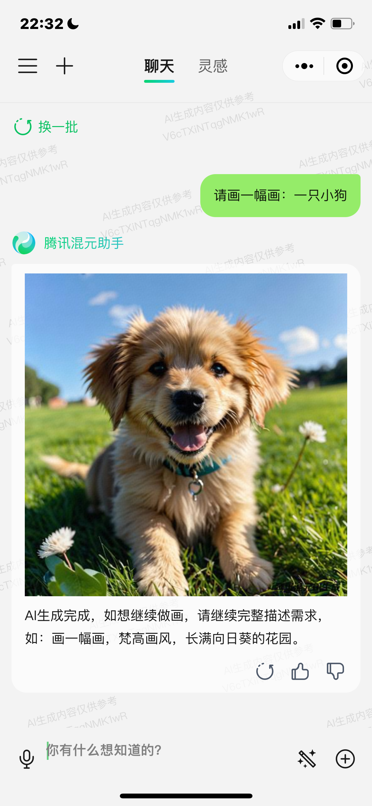

class: middle, center
# AI 解难题 1：问问题

陈一帅、陈宇晗

<!-- [yschen@bjtu.edu.cn](mailto:yschen@bjtu.edu.cn)

北京交通大学电子信息工程学院

.footnote[网络智能实验室] -->

---
class: middle, center
# 内容

有问题问 AI

AI 回答问题的原理

提问方法

技巧

---
# 生活中的问题

- 谁是现在的联合国秘书长？
- 如何才能成为灌篮高手？
- 如何才能成为百万富翁？
- 做什么菜好吃？
- 怎么种李子树？

---
# 学习中的问题

- 学英语有用吗？
- 这道数学题，我看不明白，谁来教教我？

---
# 工作中的问题

- 怎么装修我的店面？
- 我有一家奶茶店，用什么方法吸引我的顾客？
- 什么类型的内容会吸引我的目标受众？
- 可以通过哪些创造性方式更好地在社交媒体上展示我们的产品？
- 可以发布什么类型的内容来增加抖音上的粉丝？
- 应该使用什么样的视觉效果在抖音上宣传我的业务？

???
我应该在抖音上发布什么类型的内容？
“What type of content should I post on Instagram?”
try something like, “What type of content can I post to increase followers on Instagram for a vegan meal delivery service based in San Francisco?”
What type of content would engage my target audience?
What are some creative ways our company can better showcase our products on social media?
What type of content can I post to increase followers on Twitter?
What kind of visuals should I use to promote my business on Instagram?

---
class: middle, center
# 这些问题都可以问 AI

---
class: middle, center
# 纸笔练习

## 想想：我有哪些困惑？

## 我对什么好奇？

## 我想做什么，但不知道该怎么做？

## 写下一个问题

---
class: middle, center
# 各种 AI 助手

腾讯混元助手

阿里通义千问

Kimi 智能助手

百度文心一言

???
- 微软 Copilot，[网址](https://copilot.microsoft.com/)
- 微软设计师，图像创建器，[网址](https://designer.microsoft.com/image-creator) -->

---
class: middle, center
# 腾讯混元助手

## 微信小程序

.center[.width-30[]]

---
class: middle, center
# 腾讯混元助手

## 浏览器访问网站：https://hunyuan.tencent.com/

.center[.width-50[]]

---
class: middle, center
# 阿里通义千问

## 苹果手机 APP 安装

.center[.width-50[]]

---
class: middle, center
# 阿里通义千问

## 安卓手机 APP 安装

.center[.width-50[]]

---
class: middle, center
# 阿里通义千问

## 浏览器访问网站：https://tongyi.aliyun.com/qianwen/

.center[.width-50[]]

---
class: middle, center
# Kimi 智能助手

智能搜索

文件分析

辅助创作

---
class: middle, center
# Kimi 智能助手

微信小程序

手机 APP 安装

.center[.width-50[]]

---
class: middle, center
# AI 助手的原理

---
# AI 助手的原理

- 我们人可以：听了上半句，猜出下半句
- AI 也是如此
- AI 看了无数的书、文章、对话文本，就学会了：顺着你的话，往下说
- OpenAI ChatGPT-3 看了 45 TB 文本，近 300 公里书架上的书！

???

https://www.urbanlibraries.org/files/AI_Leadership-Brief_October2023.pdf

---
class: middle, center
# 如何用好 AI 助手

---
# 上半句怎么说，很重要

- 上半句没信息量，AI 就会泛泛而谈
  - 做什么菜好吃？
- 具体一点：
  - 我喜欢吃辣、吃海鲜，什么菜好吃？

???
  所以，AI 不是“思考”。它只是看过很多文章，因此模仿着逐字往下说。
  AI 逐字预测，生成后面的文字。- 

---
class: middle, center
# 说上半句的方法

## 人设 + 背景 + 任务 + 回答方法

---
class: middle, center
# 指定它的人设

你是一个店老板

你是一个小学数学老师

你是一个职业篮球教练

你是一个电冰箱

???
Act like a…
You are a…
Pretend you are a…

Role	
  Act as [ROLE]	
  Set the role for ChatGPT to play during your session.
  "I want you to act as ..." will establish what type of conversation you are planning to have.
  Examples of roles you might ask for are: a domain science expert, an IT or DevOps engineer, software programmer, journal editor, paper reviewer, mentor, teacher, or student. You can even instruct ChatGPT to respond as though it were a Linux terminal, a web browser, a search engine, or language interpreter.

Task	
  Create a [TASK]	... 
Format
  show as [FORMAT]

---
class: middle, center
# 指定它的人设

##  你是中国国家篮球队教练

怎么才能进入国家队？

???
You are an expert designer; now write eight principles and laws of web design

---
class: middle, center
# 指定它的人设

您是解决问题和产生创意的专家。

当被要求解决问题时，您会提出新颖且有创意的想法。

告诉我超级英雄制作浓缩咖啡的 10 种详细方法，以及他们如何推测在新产品中获得相同的效果。

???
You are an expert at problem-solving and idea generation. When asked to solve a problem, you come up with novel and creative ideas. Tell me 10 detailed ways a superhero might make espresso and how they might speculatively get the same effects in a new product.

---
class: middle, center
# 指定它的人设

## 你是一位懂得和孩子沟通的妈妈

怎么和孩子说，要少玩游戏？

???
You are an expert designer; now write eight principles and laws of web design

---
class: middle, center
# 指定它的人设

## 你是一位有爱心、温柔的孩子

怎么和妈妈说，要注意身体？

???
You are an expert designer; now write eight principles and laws of web design

---
class: middle, center
# 纸笔练习

## 修改我们的问题

## 指定它的人设

---
class: middle, center
# 给背景信息

孩子为什么要少玩游戏呢？

---
class: middle, center
# 给背景信息

你是一位很懂得和孩子沟通的妈妈

## 你的孩子小学 3 年级了，功课越来越多，每天学习到很晚

怎么和孩子说，你要少玩游戏？

---
class: middle, center
# 给背景信息

你是一位有爱心、温柔的孩子。

## 妈妈工作很忙

怎么和妈妈说，要注意身体？

---
class: middle, center
# 给背景信息

你是一位优秀篮球教练

## 我是一位 4 年级的小学生，我投篮的时候，总是投不进

我怎么办？

???
，我发现最近的数学题好像比 3 年级的数学题更难了，比如这道题，。。。，请问我如何学习，才能会做这道题？

---
class: middle, center
# 给背景信息

## 我是一家店的老板，我有一家店，顾客说我的店给人的感觉很混乱

我怎么办？

???
我是一名自由摄影师，我有一个作品集网站展示我的作品。我收到反馈说我的网站感觉很混乱，导航也很混乱。如何创建一个干净且用户友好的网页设计，突出我的摄影作品，同时保持访问者轻松导航？”
“I’m a freelance photographer, and I have a portfolio website showcasing my work. I’ve received feedback that my website feels cluttered, and the navigation is confusing. How can I create a clean and user-friendly web design that highlights my photography while maintaining easy navigation for visitors?”

---
class: middle, center
# 如果表达清楚？

---
class: middle, center
# 举例

你是一个礼物店的金牌导购。请给我推荐一些送给我朋友的礼物。

## 她喜欢户外活动、攀岩、博物馆

???
“Give me gift ideas for my friend. He loves to be outdoors, he loves to rock climb, and he likes museums.”

---
class: middle, center
# 举例

你是一家电视台的专业电视节目制作人

## 以下是一些我喜欢的节目：《蔡徐坤历险记》、《狂飙》。我不喜欢《僵尸》

请为我推荐一些我可能喜欢的电视节目

???
“Here are some examples of TV shows I really like: Breaking Bad, Peaky Blinders, The Bear. I did not like Ted Lasso. What other shows do you think I might like?”

Types of Priming	Example

Zero (Shot)	"Write five examples of assessments for watershed health."

Single	"Write five examples of assessments for watershed health. Here is one example: Geomorphology"

Multiple	"Write five examples of assessments for watershed health related to geomorphology, water quality, and species diversity."

The length of a prompt is measured in "tokens". A token can represent an individual character, a word, or a subword depending on the specific tokenization approach. A rough estimate for the average number of words in English language per token is 0.75.

Currently, ChatGPT version GPT-3.5turbo uses up to 2,048 tokens per prompt, GPT-4 and Bing Chat can take up to 32,768 tokens. BARD currently has a limit of 20,000 tokens in a prompt.

This means that a 2,048 token prompt would be equivalent to about 1,536 words (3-6 pages), and a 32,768 token prompt would be 24,576 words (50-100 pages).

However, this is only an approximation and may vary depending on the specific text and model.

What this also means is that current GPT are not capable of reading many PDFs at one time, for example, to do a literature review, or to write a sequel to a novel or book series.

---
class: middle, center
# 纸笔练习

修改问题

## 加背景信息、举例

---
class: middle, center
# 问具体的问题

---
class: middle, center
# 问具体的问题

## 我应该如何吃饭、锻炼、休息、练习，才能成为灌篮高手？

???
我如何成为灌篮高手？

---
class: middle, center
# 问具体的问题

我是一家店的老板，我最近收到反馈说：我的店给人的感觉很混乱。

## 如何让我的店干净、友好、健康、新鲜，让顾客轻松和愉快地购买？

---
class: middle, center
# 问具体的问题

你是 xxx，我是 xxx。请问如何写我的入学申请书？

## 请给我这些建议：1）应包含的内容；2）应用的语气；3）应避免的内容

???
如何写我的入学申请书？
“How should I write my college admission essay? Give me suggestions about the different sections I should include, what tone I should use, and what expressions I should avoid.”

---
class: middle, center
# 纸笔练习

修改问题

# 问具体的问题

---
class: middle, center
# 让它知道该怎么回答

你是谁

怎么回答

---
class: middle, center
# 你是谁

## 我是一个小学二年级的学生

请向我解释什么是元宇宙

???
Summarize content you are provided with for a second-grade student.

---
class: middle, center
# 要例子

## 请举例说明

???
Can you tell me how to build a wedding website with examples?

---
class: middle, center
# 设定回答的语气

## 请用搞笑的语气

???
funny, sad, or professional

Write a funny marketing campaign email copy.

---
class: middle, center
# 设定回答长度

## 用两句话回答

???
Write a meta description within 130 characters for the blog- best no-code platforms.

---
class: middle, center
# 设定回答的格式

## 表格、代码、图片

你是一个专业设计师，请用表格形式，给出你最常用的四个设计工具及其特点

???
Provide a list of best UX design tools. Write their key features in bullet points.

---
class: middle, center
# 高级技巧

一步步想

---
class: middle, center
# 请一步一步想

会想得更周到

???
不是简单地要一个结果，而是要它给出自己思考的过程
- 提供“思路”，给出步骤
思维链

You can also ask ChatGPT to explain complex topics or to act as a cook-book step-by-step guide.

---
class: middle, center
# 请一步一步想

巴塞罗那举办奥运会那年，哪支欧洲足球队赢得了冠军联赛？

## 请一步一步想

“Take a deep breath and work on this problem step by step!”

???

“Take a deep breath and work on this problem step by step!”

In chain of thought prompting, we explicitly encourage the model to be factual/correct by forcing it to follow a series of steps in its “reasoning”.

In the following example, I use the prompt:

“What European soccer team won the Champions League the year Barcelona hosted the Olympic games?

Use this format:

Q: A: Let’s think step by step. Therefore, the answer is .”

I now ask ChatGPT to use the same format with a different question by using the prompt:

“What is the sum of the squares of the individual digits of the last year that Barcelona F.C. won the Champions League? Use the format above.”

- 第 1 步：分解任务
- 第 2 步：将第一个问题的回答，包括进下一个问题中

“巴塞罗那足球俱乐部去年的个位数平方和是多少？赢得了冠军联赛？使用上面的格式。”

- 这也可以降低成本，因为送进去的文本少了

---
# 示例

提问：告诉我一个关于 AI 导师的好比喻

结果：AI 导师就像音乐节拍器，因为它是一致的、适应性强的，而且只是一个工具。

不太令人满意

---
# 逐步思考

逐步思考：为 AI 导师提出很好的类比。

首先，列出可能的类比。

其次，批评这个列表，并添加三个类比。

接下来，创建一个表格，列出每个的优点和缺点。

接下来，选择最好的并解释它。

---
# GPT-4 结果

考虑了从私人教练到园丁的十几个建议

创建了一个表格来比较所有这些建议

最后选择了 GPS 系统

---
# GPT-4 结果

为什么 AI 导师像一个 GPS 系统？
- 该系统很像 AI 导师，旨在帮助用户在不熟悉的地形中导航
- 它提供实时反馈，根据不断变化的条件（例如交通或施工）调整建议，并在用户偏离轨道时提供替代路线。
- 同样，AI 导师引导学生了解学术领域，提供实时反馈，根据学生的进步进行调整，并在必要时提供替代学习路径
- 这个类比还强调了这样一个想法：虽然工具提供指导，但由用户（或学生）来驱动和完成旅程，从而加强 AI 学习的协作性质。

有了很大的改善

???
Tell me a good analogy for an AI tutor. And the response was a little unsatisfying: An AI tutor is like a musical metronome, because it is consistent, adaptable, and a mere tool.

Now we can try applying some of these other techniques: Think this through step by step: come up with good analogies for an AI tutor. First, list possible analogies. Second, critique the list and add three more analogies. Next, create a table listing pluses and minuses of each. Next, pick the best and explain it. Here, GPT-4 considered a dozen suggestions, from personal trainer to gardener, and created a table comparing them all, before settling on a GPS system, which, much like an AI tutor, is designed to assist users in navigating unfamiliar terrain. It provides real-time feedback, adjusts recommendations based on changing conditions (e.g., traffic or construction), and offers alternative routes when the user goes off track. Similarly, an AI tutor guides students through the academic terrain, offering real-time feedback, adjusting based on the student’s progress, and providing alternative learning paths when necessary. This analogy also emphasizes the idea that while the tool provides guidance, it’s up to the user (or student) to drive and make the journey, reinforcing the collaborative nature of learning with AI. Much improved, due to a little prompt engineering.

---
class: middle, center
# “请继续”

如果说到中间，它停了

说：“请继续”，它就会接着说

???
When generating a long set of results, ChatGPT may time out after 60 seconds.

You can resume the output of the prompt by telling it to 'continue'. For text:

continue

or for code response:

continue 

参数

You can include Linux command line flags in your prompts,

Parameter name	Use	Description

Answers	-
  -a or --answers	
  Specifies the number of output answers (default is 1)

Category	
  -c or --category	
  Specifies the category of prompt (coding, creative, factual, fun, general, music, news, science, sports and writing)

Format	
  -f or --format	
  Specifies the format of output ("html", "markdown", "plain text", other)

Language	
  -l or --language	
  Specifies the required language of output

Size	
  -s or --size	
  Specifies the maximum number of characters in the output

Temperature	
  -t or --temperature	
  Control the creativity of output. The higher the temperature will result in more creative output (maybe less coherent). The temperature can be any value between 0 and 1 (default may be 0.5)

Tell me something I don't know! --size 50 --temperature 0.1 --category factual

Tell me something I don't know! --size 5000 --temperature 1 --category fun

---
class: middle, center
# 一个聊天里，AI 会记得前面的对话内容

.center[.width-30[]]

---
class: middle, center
# 问它还需要什么信息

我还能给你提供些什么信息？

---
class: middle, center
# 让它帮我们问

## 你很会问问题。对上面这个问题，你会怎么问？

???
Asking ChatGPT to provide the best prompts for ChatGPT

Even though we have explored some of the best prompts, you may still need other ones to complete different tasks. One of the best ways to do that is to make ChatGPT write the best prompt for your specific need to get the ideal answer!

You can use this prompt to have ChatGPT working as a prompt generator: “You are a prompt generator that generates the best prompts to get the best possible answers from an AI. Generate a prompt that does the following:”

---
class: middle, center
# 补充信息，要求重答

## 我补充如下信息，xxx，请重新回答

---
class: middle, center
# 指出不足，要求重答

## 你说的 xx 不太对，因为 xxx。请重新回答

???
follow up

Follow-up your prompts sequentially.

Responses to prompts may not return the exact details or information that you are after the first time. Follow-up by rephrasing your prompts more carefully and continuing with iterative prompting can build upon your priors.

"Chain prompting" or "Linked Prompting" brings multiple prompts together.

Linked Prompting	Examples

Step 1: Priming	"I want you to act as an eminent hydrologist from CUASHI. Provide me with a list of the ten most important topics in hydrology over the last decade focused around research in the global south, working with indigenous communities, and traditional ecological knowledge systems."

Step 2: Summarizing	"Based on the list you just created, summarize the most pressing financial challenges faced by indigenous communities in the Global South, versus indigenous communities in North America, in less than 50 words."

Step 3: Try again with enabled WebChatGPT or Browsing	"Based on the results of web access, can you confirm the validity of the ten important topics and provide at least one reference to each."

Keep these W's in mind when writing prompts

W's	Reasons
Who	do you want ChatGPT to role-play: an engineer, an editor, a teacher, or a student?
What	is the specific context of your prompts?
When	is the specific time period of interest? Specify if so.
Where	is the geographic region or conceptual area?
In what way	do you want ChatGPT to respond: in a programming language, code, text-to-image?

Context

Develop a clear context around which you are seeking responses. Types of prompt help to establish the context of the responses you will recieve.

Precision

Keep your prompts precise and use clear language. Constrain the topic areas for which you wish your repsonses to be drawn from.

Simplicity

Break down your prompts into simple tasks which do not contain too many complex tasks or ones that require rationalization.

---
class: middle, center
# 不补充信息，直接重答

## 点“重新生成”按钮

.center[.width-30[]]

---
class: middle, center
# 换话题时，新建聊天

.center[.width-30[]]

???
让我们换个话题
换话题时，别再用老聊天接着聊，而是新建一个聊天，避免干扰
Can you now provide me some best practices on designing a website footer based on the previous conversation about my target audience?

Keeping state

Language models themselves don’t keep track of state. However, applications such as ChatGPT implement the notion of “session” where the chatbot keeps track of state from one prompt to the next. This enables much more complex conversations to take place. 

它不擅长的事

- 计算
- 搜索
- 对这些事，用工具更可靠、更高效
  - 用计算器、搜索引擎

---
## 小结

- 有问题问 AI
- AI 回答问题的原理：听上半句，猜下半句
- 方法
  - 指定它的人设，告诉它我是谁
  - 问具体：给出背景、举例
  - 提要求：要例子、设定语气、长度、格式
- 技巧
  - 请继续、问还要什么、请帮问、补充信息、请重答
  - 换话题时，新建聊天

