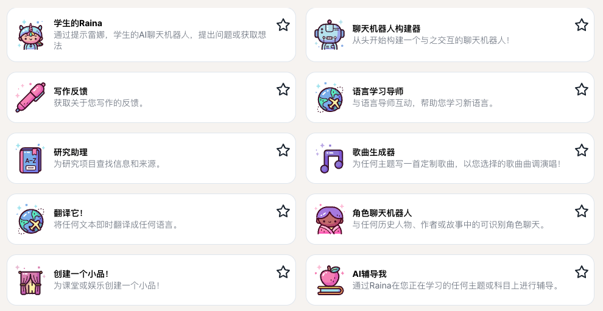
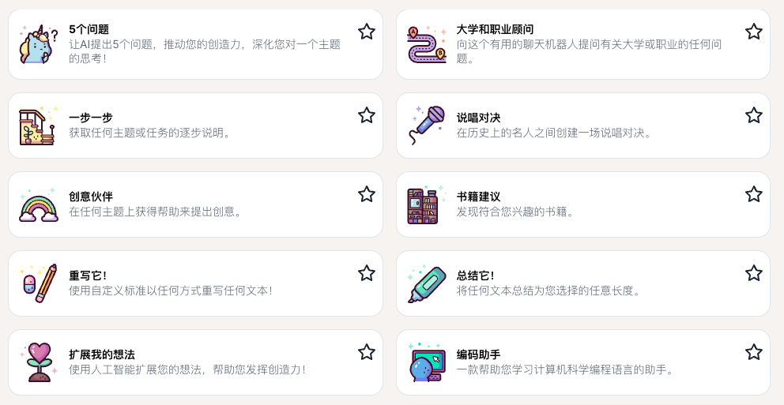
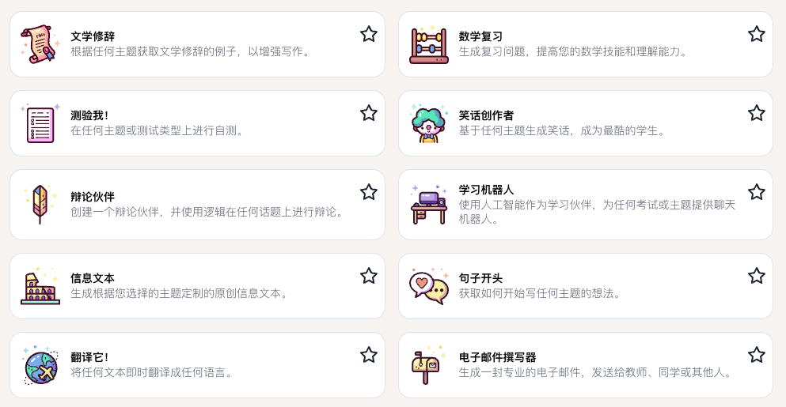
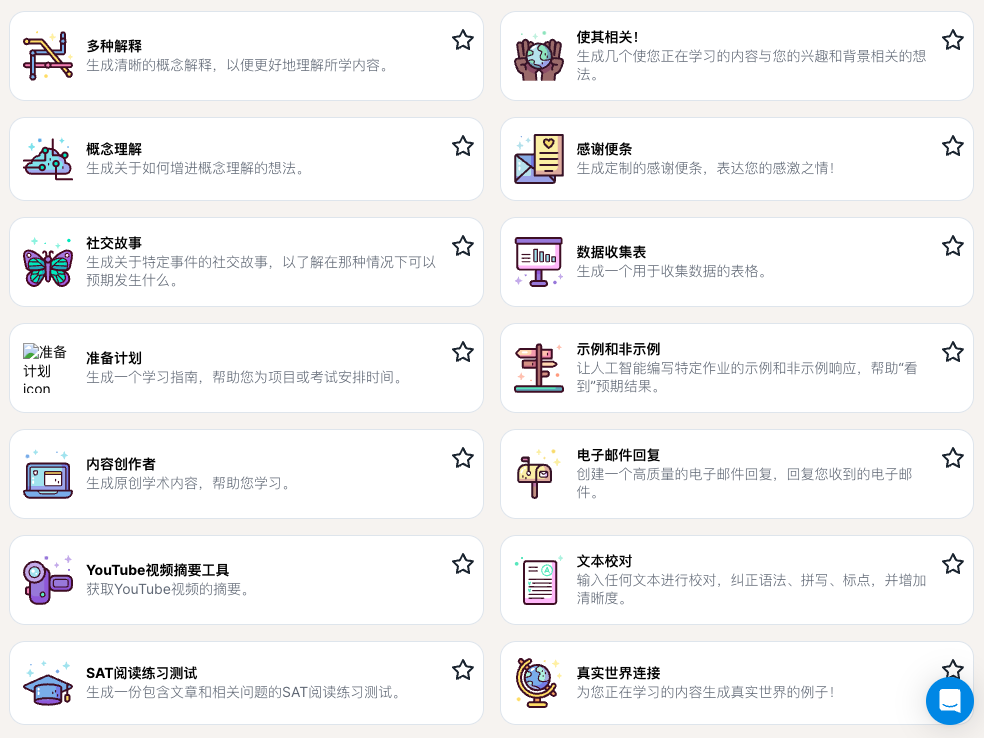

class: middle, center
# AI 帮我学 1：AI 魔法学校

陈一帅、陈宇晗

<!-- [yschen@bjtu.edu.cn](mailto:yschen@bjtu.edu.cn)

北京交通大学电子信息工程学院

.footnote[网络智能实验室] -->

---
class: middle, center
## AI 魔法学校

AI 助学工具

链接：https://app.magicschool.ai/tools

---
class: middle, center
## AI 魔法学校
.center[.width-100[]]

---
class: middle, center
## AI 魔法学校
.center[.width-100[]]

---
class: middle, center
## AI 魔法学校
.center[.width-100[]]

---
class: middle, center
## AI 魔法学校
.center[.width-100[]]

---
## AI 魔法学校

- 对话机器人
    - 学习辅导、大学、职业顾问、辩论伙伴、角色扮演
- 内容
    - 信息文本、学术内容
- 创意
    - 书籍、歌曲、小品、说唱、笑话
- 想法
    - 研究助理、扩展想法、句子开头、示例、真实世界连接

---
## AI 魔法学校

- 学习
    - 计划、测验、语言学习
- 支持
    - 翻译、总结、步骤、解释、概念理解、社交故事
- STEM
    - 编程、数学分析、数据收集
- 写作
    - 反馈、修辞、校对、重写、邮件、便条

---
class: middle, center
## 对话机器人

---
## 对话机器人

- AI 辅导我
    - Raina 在您正在学习的任何主题或科目上进行辅导。
- 学习机器人
    - 使用人工智能作为学习伙伴，为任何考试或主题提供聊天机器人。
- 聊天机器人构建器
    - 从头开始构建一个与之交互的聊天机器人！
- 学生用的 Raina
    - 通过提示 Raina，学生可以提出问题或获取想法。

---
## 对话机器人

- 大学和职业顾问
    - 向这个有用的聊天机器人提问有关大学或职业的任何问题。
- 辩论伙伴
    - 创建一个辩论伙伴，并使用逻辑在任何话题上进行辩论。
- 角色聊天机器人
    - 与任何历史人物、作者或故事中的可识别角色聊天。

---
class: middle, center
## AI 内容 生成

---
## AI 内容生成

- 信息文本
    - 生成根据您选择的主题定制的原创信息文本。
- 内容创作者
    - 生成原创学术内容，帮助您学习。

---
class: middle, center
## 创意生成

---
## 创意

- 创意伙伴
    - 在任何主题上获得帮助来提出创意。
- 书籍建议
    - 发现符合您兴趣的书籍。
- 歌曲生成器
    - 为任何主题写一首定制歌曲，以您选择的歌曲曲调演唱！

---
## 创意

- 创建一个小品！
    - 为课堂或娱乐创建一个小品！
- 说唱对决
    - 在历史上的名人之间创建一场说唱对决。
- 笑话创作者
    - 基于任何主题生成笑话，成为最酷的学生。

---
class: middle, center
## 想法生成

---
## 想法

- 研究助理
    - 为研究项目查找信息和来源。
- 扩展我的想法
    - 使用人工智能扩展您的想法，帮助您发挥创造力！
- 句子开头
    - 获取如何开始写任何主题的想法。
- 示例和非示例
    - 让人工智能编写特定作业的示例和非示例响应，帮助“看到”预期结果。

---
## 想法

- 5 个问题
    - 让 AI 提出 5 个问题，推动您的创造力，深化您对一个主题的思考！
- 使其相关！
    - 生成几个使您正在学习的内容与您的兴趣和背景相关的想法。
- 真实世界连接
    - 为您正在学习的内容生成真实世界的例子！
- 学生用的Raina
    - 通过提示Raina，学生可以提出问题或获取想法。

---
class: middle, center
## 学习助手

---
## 学习

- 准备计划
    - 生成一个学习指南，帮助您为项目或考试安排时间。
- 测验我！
    - 在任何主题或测试类型上进行自测。
- 语言学习导师
    - 与语言导师互动，帮助您学习新语言。
- SAT 阅读练习测试
    - 生成一份包含文章和相关问题的SAT阅读练习测试。

---
class: middle, center
## 支持工具

---
## 支持工具

- 翻译它！
    - 将任何文本即时翻译成任何语言。
- 总结它！
    - 将任何文本总结为您选择的任意长度。
- YouTube视频摘要工具
    - 获取YouTube视频的摘要。

---
## 支持工具

- 一步一步
    - 获取任何主题或任务的逐步说明。
- 多种解释
    - 生成清晰的概念解释，以便更好地理解所学内容。
- 概念理解
    - 生成关于如何增进概念理解的想法。
- 社交故事
    - 生成关于特定事件的社交故事，以了解在那种情况下可以预期发生什么。

---
class: middle, center
## STEM 学习助手

---
## STEM 学习助手

- 编码助手
    - 一款帮助您学习计算机科学编程语言的助手。
- 数学复习
    - 生成复习问题，提高您的数学技能和理解能力。
- 数据收集表
    - 生成一个用于收集数据的表格。

---
class: middle, center
## 写作帮助

---
## 写作

- 写作反馈
    - 获取关于您写作的反馈。
- 文学修辞
    - 根据任何主题获取文学修辞的例子，以增强写作。
- 文本校对
    - 输入任何文本进行校对，纠正语法、拼写、标点，并增加清晰度。
- 重写它！
    - 使用自定义标准以任何方式重写任何文本！

---
## 写作

- 感谢便条
    - 生成定制的感谢便条，表达您的感激之情！
- 电子邮件撰写器
    - 生成一封专业的电子邮件，发送给教师、同学或其他人。
- 电子邮件回复
    - 创建一个高质量的电子邮件回复，回复您收到的电子邮件。

???
https://app.magicschool.ai/tools/tutor-me-s

---
# 练习

反思自己需要深入探索的一个内容，在下面 AI 探索助手的帮助下，进行探索，写作探索报告。

AI 探索助手的两种打开方式：

1. 手机方式：在手机上下载“通用千问”，然后，在浏览器中，打开 “一起探索吧” 的 [链接](https://m.tongyi.aliyun.com/app/tongyi/tongyi-hybrid/share-result?shareId=19913999-ec8f-4e7e-a996-d4921734d61b)，就会打开“通用千问”，进入对话界面。

2. 电脑方式：在电脑的浏览器上，打开 “超级耐心的辅导老师” 的 [链接](https://t.aliyun.com/U/IVBzdb)，，进入对话界面

---
# 要求

1. 批判性地看待 AI 的回复。如果发现 AI 回答不对，那么也清楚地告诉 AI 哪里有问题，要它改善

2. 写作内容
- 报告和 AI 的整个交互过程
- 对 AI 的回复进行评价，说明为什么觉得有效/无效
- 说明自己后面计划如何利用 AI 帮助自己学习

---
## 小结

- 对话机器人：学习辅导、大学、职业顾问、辩论伙伴、角色扮演
- 内容：信息文本、学术内容
- 创意：书籍、歌曲、小品、说唱、笑话
- 想法：研究助理、扩展想法、句子开头、示例
- 学习：计划、测验、语言学习
- 支持：翻译、总结、步骤、解释、概念理解
- STEM：编程、数学分析、数据收集
- 写作：反馈、修辞、校对、重写、邮件、便条

---
class: middle, center
## AI 魔法学校

AI 助学工具

链接：https://app.magicschool.ai/tools

