class: middle, center

<!-- AI 伴我行 -->

## AI 绘画

陈一帅，陈宇晗

<!-- [yschen@bjtu.edu.cn](mailto:yschen@bjtu.edu.cn) -->
<!-- 北京交通大学电å­ä¿¡æ¯å·¥ç¨‹å­¦é™¢ -->
<!-- .footnote[网络智能å®éªŒå®¤] -->

---
class: middle, center
<!-- ## 方法 -->

闭上眼ç›ï¼Œåšä¸€ä¸ªæ¢¦

用简短的è¯ï¼ŒæŠŠæ¢¦å†™ä¸‹æ¥

---
class: middle, center
我的梦

## 一åªå°ç‹—

---
class: middle, center

打开微信，æœç´¢â€œè…¾è®¯æ··å…ƒåŠ©æ‰‹â€å°ç¨‹åºï¼Œæˆ–者打开æµè§ˆå™¨ï¼Œè®¿é—®æ··å…ƒåŠ©æ‰‹ç½‘站：https://hunyuan.tencent.com/

.center[.width-30[]]

输入：画一åªå°ç‹—
---
class: middle, center

输入：画一åªå°ç‹—

.center[.width-70[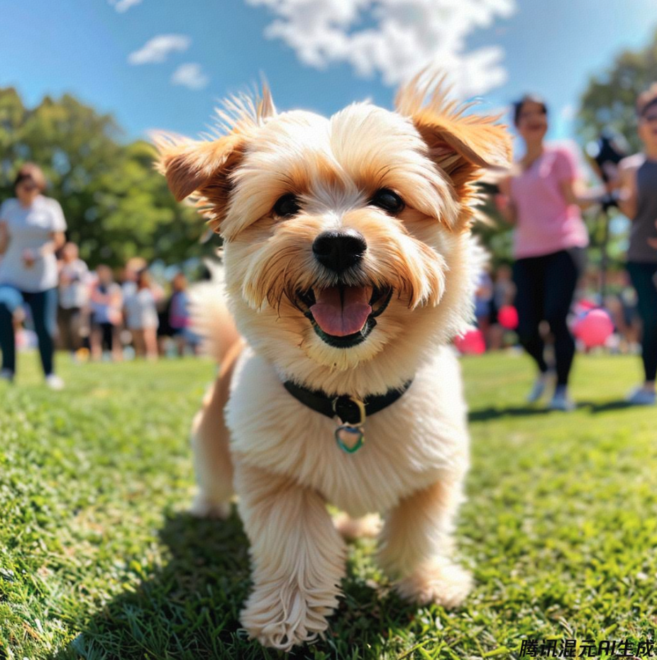]]

---
class: middle, center
## 表ç°æˆ‘们的心情

我们的心情包括两方é¢ï¼šç§¯æ和能é‡

😌：积æ，安é™

😢：ä½è½ã€å®‰é™

🤪：积æ，激动

😱：ä½è½ï¼Œæ¿€åŠ¨

---
class: middle, center
## 积æï¼Œå®‰é™ ğŸ˜Œ

平和ã€å¹³é™ã€å®‰è¯¦ã€èˆ’缓ã€è½»æ¾ã€å¹³å’Œã€èˆ’适ã€å®‰é€¸ã€å¹³é™ã€å®‰é™ã€æŸ”å’Œã€ç²¾è‡´ã€ä¼˜é›…ã€å¾®å¦™ã€æ¸©å’Œã€æ¸©å’Œã€ç©ºçµã€ä¼˜é›…ã€æ¸©æŸ”ã€æŸ”å’Œã€è½»æŸ”

---
class: middle, center
## ä½è½ã€å®‰é™ 😢

柔和的, 黯淡的, 葬礼的, 忧éƒçš„, 哀伤的, 阴沉的, 惨淡的, 悲伤的, è‹ç™½çš„, 褪色的, ç°è‰²çš„, å‹æŠ‘çš„, 沉闷的, 沮丧的, 疲倦的

---
class: middle, center
## 

请画一幅画：忧éƒçš„, 哀伤的, å‹æŠ‘çš„, 沮丧的, 疲倦的一åªå°ç‹—

.center[.width-60[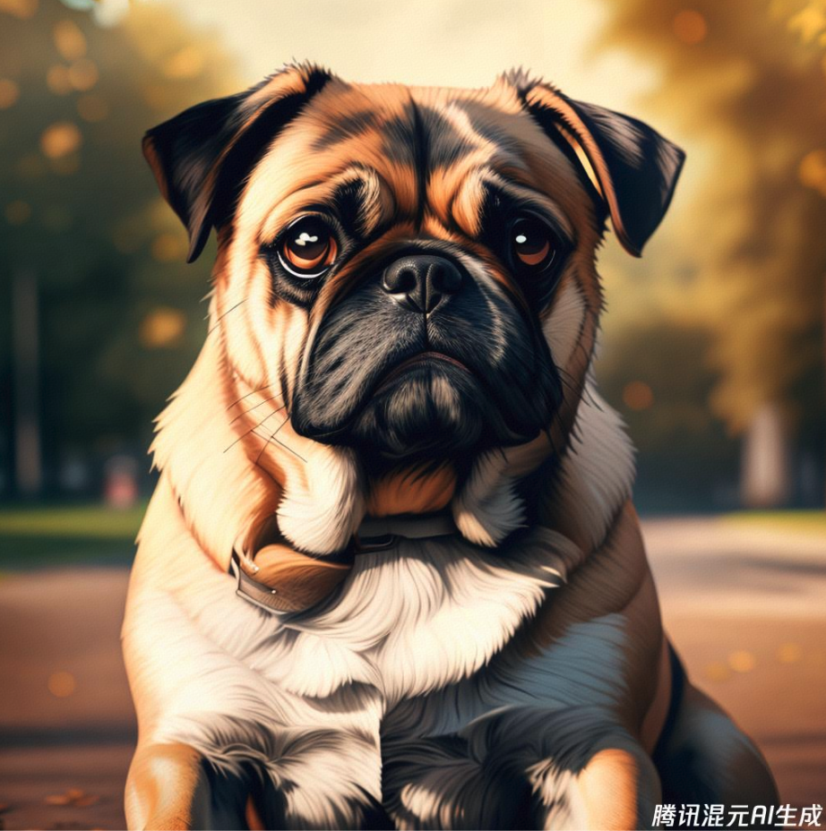]]

---
class: middle, center
## 积æ，激动 🤪

æ˜äº®ã€å……满活力ã€åŠ¨æ„Ÿã€æ´»æ³¼ã€ç”ŸåŠ¨ã€å¤šå½©ã€å¿«ä¹ã€æµªæ¼«ã€è¡¨ç°åŠ›ã€æ˜äº®ã€ä¸°å¯Œã€ä¸‡èŠ±ç­’ã€è¿·å¹»ã€é¥±å’Œã€æ¬£å–œè‹¥ç‹‚ã€å‚²æ…¢ã€ä»¤äººå…´å¥‹ã€çƒ­æƒ…ã€çƒ­è¾£

---
class: middle, center

请画一幅画：æ˜äº®ã€å……满活力ã€åŠ¨æ„Ÿã€æ´»æ³¼ã€çƒ­æƒ…的一åªå°ç‹—

.center[.width-60[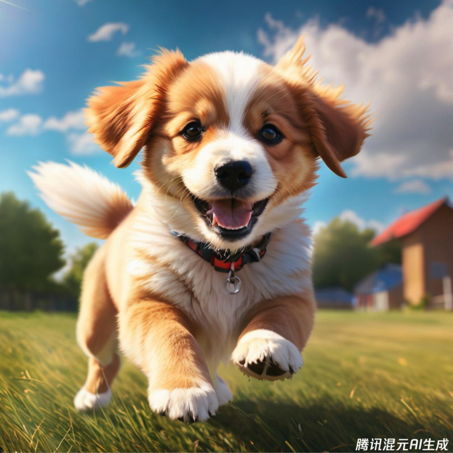]]

---
class: middle, center
## ä½è½ï¼Œæ¿€åŠ¨ 😱

黑暗ã€ä¸ç¥¥ã€å¨èƒã€ä»¤äººéš¾ä»¥å¿˜æ€€ã€ä»¤äººç”Ÿç•ã€é˜´æ²‰ã€æš´é£é›¨ã€å„è¿ã€ä¸–界末日ã€é™©æ¶ã€é˜´æš—ã€é¬¼é­‚ã€ä»¤äººä¸å®‰ã€ä»¤äººç—›å¿ƒã€å¯æ€•ã€ä»¤äººéœ‡æƒŠã€æ怖ã€ä¸‘陋

---
class: middle, center

请画一幅画：å¯æ€•ã€æ怖ã€ä¸‘陋的一åªæ¶ç‹—

.center[.width-60[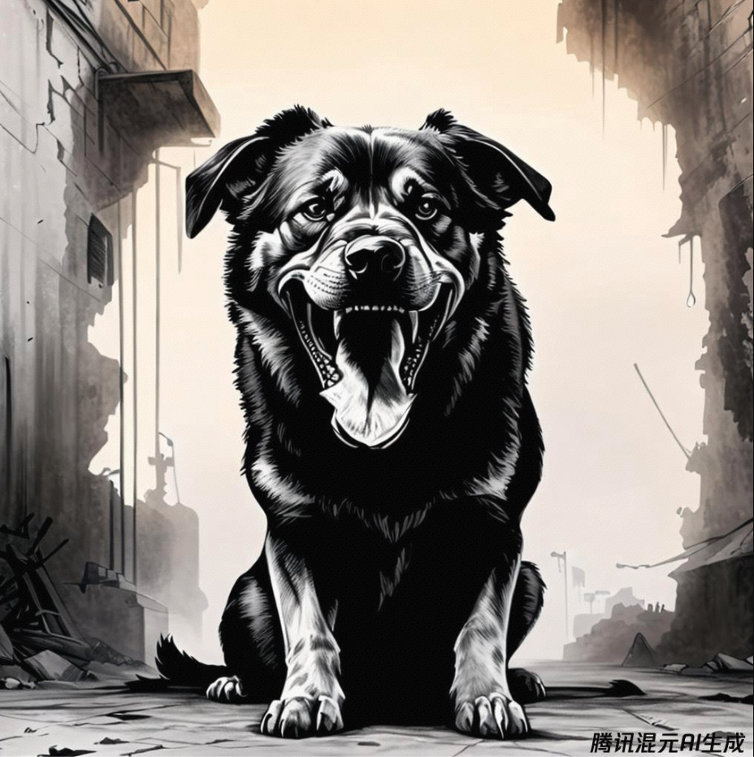]]

???
Positive mood, low energy 😌
light, peaceful, calm, serene, soothing, relaxed, placid, comforting, cosy, tranquil, quiet, pastel, delicate, graceful, subtle, balmy, mild, ethereal, elegant, tender, soft, light

Negative mood, low energy 😢
muted, bleak, funereal, somber, melancholic, mournful, gloomy, dismal, sad, pale, washed-out, desaturated, grey, subdued, dull, dreary, depressing, weary, tired

Positive mood, high energy 🤪
bright, vibrant, dynamic, spirited, vivid, lively, energetic, colorful, joyful, romantic, expressive, bright, rich, kaleidoscopic, psychedelic, saturated, ecstatic, brash, exciting, passionate, hot

Negative mood, high energy 😱
dark, ominous, threatening, haunting, forbidding, gloomy, stormy, doom, apocalyptic, sinister, shadowy, ghostly, unnerving, harrowing, dreadful, frightful, shocking, terror, hideous, ghastly, terrifying

---
## 设定æ‹æ‘„角度

- 俯视图，往下看，高角度，起é‡æœºæ‹æ‘„
- ä½è§’度，往上看，虫眼视图
- 鸟ç°å›¾ã€æ— äººæœºæ‘„å½±
- 倾斜的镜头ã€è·å…°è§’
- 过肩æ‹æ‘„

---
class: middle, center

请画一幅画：一åªå°ç‹—，俯视图

.center[.width-60[]]

---
## æ§åˆ¶è¿œè¿‘

- æ端特写
- 特写
- 中景ã€è…°æ™¯ã€å¤´è‚©éƒ¨æ‹æ‘„
- 远景ã€å¹¿è§’ã€å…¨æ™¯
- æ远景ã€è¶…广角

---
class: middle, center

请画一幅画：一åªå°ç‹—，超广角

.center[.width-60[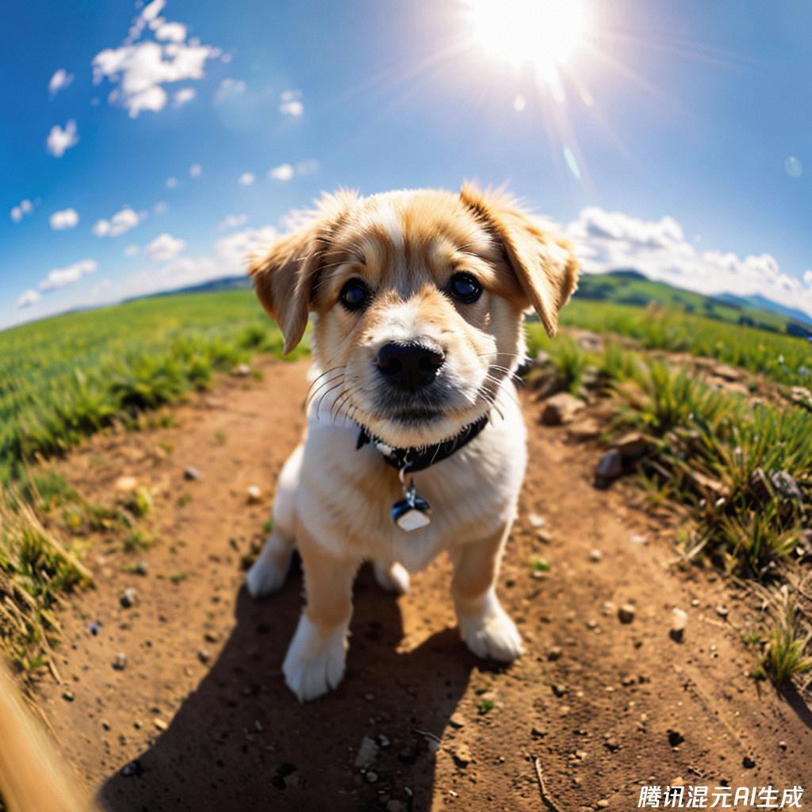]]

---
## 细节

- 动作：奔跑
- ç¯å¢ƒã€èƒŒæ™¯ï¼šè“天
- 颜色：黑色ã€æŸ”和的颜色
- é£æ ¼
  - 水彩ã€æ’ç”»ã€æ²¹ç”»ã€å¤§ç†çŸ³é›•å¡‘ã€ç…§ç‰‡ã€ä¸­å›½æ°´å¢¨ç”»
  - 数字艺术ã€å¹»æƒ³æ¦‚念艺术

---
class: middle, center

请画一幅画：å¯çˆ±çš„å°ç‹—，奔跑，水彩，æ’画，背景是è“天

.center[.width-60[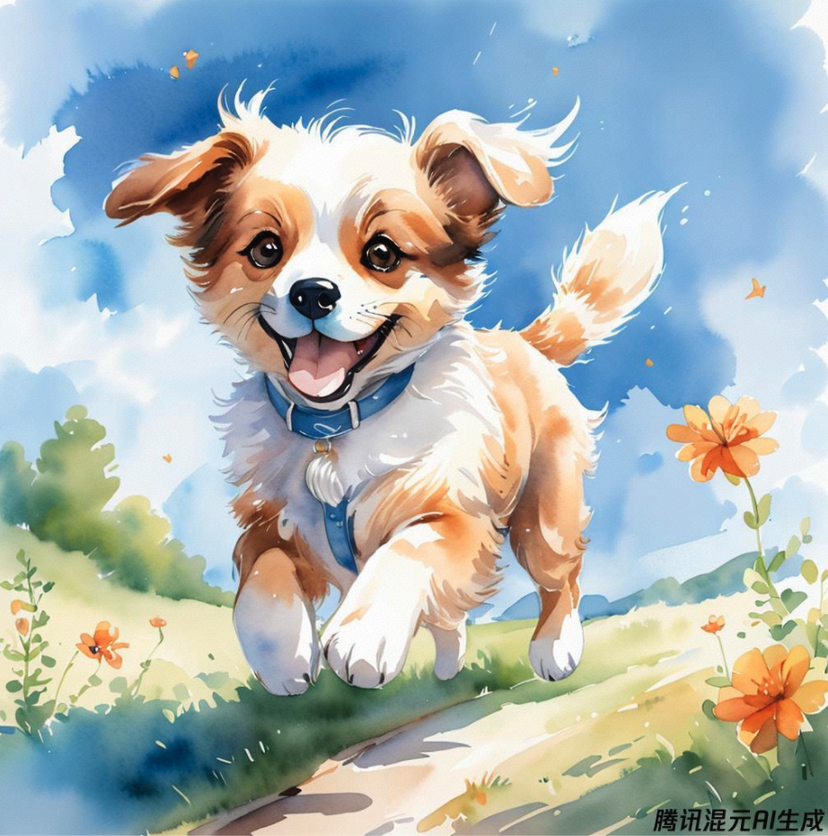]]

---
class: middle, center

一个毛茸茸的ã€å°çº¢è‰²æ€ªç‰©å¾ˆå…´å¥‹åœ°è·³è¿‡è¿·é›¾æ£®æ—中的土丘

.center[.width-60[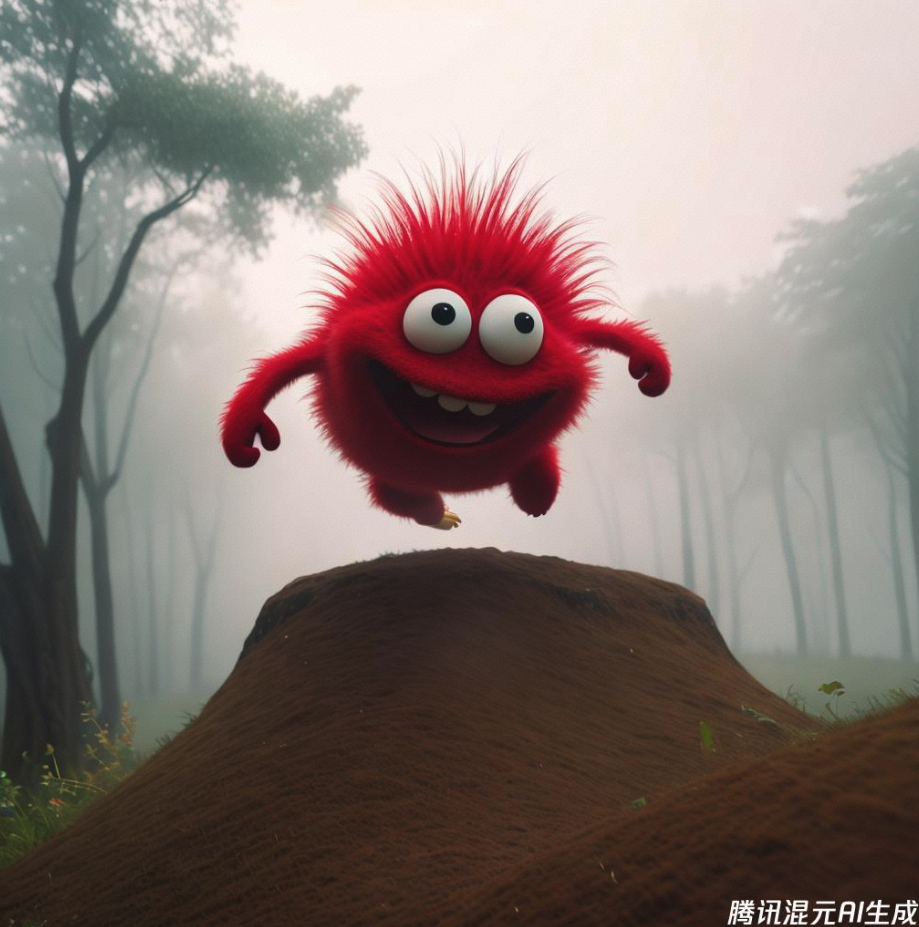]]

---
## å°è¯•

- 一个毛茸茸的ã€è“色大怪物在迷雾森æ—里å°ç¡
- 北京，一个白毛怪物一家人微笑ç€è‡ªæ‹ï¼Œé•œå¤´å‘上看
- 一åªèªæ˜çš„ã€æ¯›èŒ¸èŒ¸çš„è€åŠ¨ç‰©ç”¨ä¸¤è„šç‹¬è‡ªåœ¨æ²™æ¼ ä¸­æ¼«æ­¥
- 在笔记本电脑上工作时，惊慌失æªçš„黄色æ¡çº¹æ€ªç‰©
- 一åªé»‘色ã€æ¯›èŒ¸èŒ¸çš„怪物在北京上空放大，特写，è¿åŠ¨æ¨¡ç³Š

???
Creature feature

a little red furry monster is excited jumping over a
mound in a misty forest
a big blue furry monster takes a nap in the misty forest
A white hairy monster family smiles for a selï¬e, camera looking up, in New York City
a wise old hairy critter wanders alone through the desert on two feet
a yellow striped monster in panic while working on a laptop
A black furry monster zooms high above New York City, close up with motion blur

---
class: middle, center

## é£æ ¼

数字艺术

皮克斯动画片的é£æ ¼

---
class: middle, center

请画一张画：数字艺术，皮克斯动画片é£æ ¼ï¼Œä¸€ä¸ªç”·å­å‘上看，ç大眼ç›ï¼ŒæƒŠå¥‡ï¼Œäººç‰©å¤´åƒï¼Œäº”彩背景

.center[.width-60[]]

---
class: middle, center

中国画；一æ¡å¤§æ±Ÿï¼Œæ—边一座塔，一些天鹅，一ä½è¯—人站在江边，涛涛江水，奔赴å‘å‰ï¼Œè¿œå¤„是大海，河水æµå…¥å¤§æµ·ï¼›åº„严，浑穆，圣æ´ï¼Œå…‰è¾‰

.center[.width-60[]]

???

画一幅画：一æ¡å¤§æ±Ÿï¼Œæ—边一座木塔一ä½è¯—人 站在 æ¥¼ä¸Šçœ‹ç€ é•¿æ±Ÿ 涛涛的江水 奔赴å‘å‰ è¿œå¤„æ˜¯å¤§æµ· 河水æµå…¥å¤§æµ· æ°¸ä¸å›å¤´â€œæ€»ç†èµ°å¥½â€ä¸­å›½ç”» 庄严 æµ‘ç©†åœ£æ´ å…‰è¾‰

---
class: middle, center
## 大å°ã€è§„则

éšæ„的，还是规则的

---
class: middle, center
## 大ã€éšæ„

狂乱的ã€æ±¹æ¶Œçš„ã€æµåŠ¨çš„ã€æ— å®šå½¢çš„ã€æ‰­æ›²çš„ã€ä¸å‡åŒ€çš„ã€éšæœºçš„ã€èŒ‚盛的ã€å¤§èƒ†çš„ã€æ··ä¹±çš„ã€éªšåŠ¨çš„

<!-- ---
##

中国画；一æ¡å¤§æ±Ÿï¼Œæ—边屹立一座木塔，天空中一些天鹅；一ä½è¯—人站在江边，涛涛的江水，奔赴å‘å‰ï¼Œè¿œå¤„是大海，河水æµå…¥å¤§æµ·ï¼Œæ›²çº¿çš„ã€æ¼©æ¶¡ã€ç‹‚乱的ã€æ±¹æ¶Œçš„ã€æµåŠ¨çš„ã€æ— å®šå½¢çš„ -->

.center[.width-60[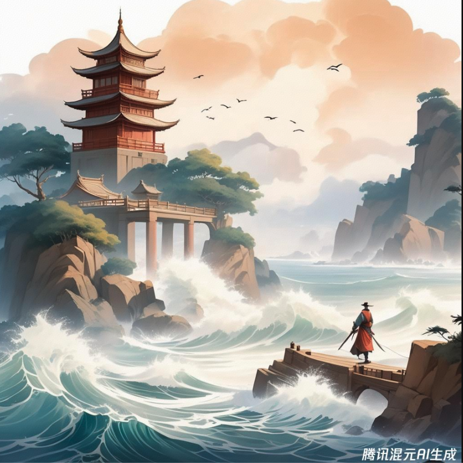]]

---
class: middle, center
## å°ï¼Œéšæ„
无计划的ã€å¤§èƒ†çš„ã€å‚²æ…¢çš„ã€éšæœºçš„ã€éšæ„çš„ã€ç´ æçš„ã€ä¿çš®çš„ã€è‡ªå‘çš„ã€å³å…´çš„ã€å³å…´çš„ã€å³å…´çš„ã€å®éªŒæ€§çš„ã€å®½æ¾çš„ã€æ´»æ³¼çš„ã€è½»æ¾çš„ã€å¯Œæœ‰è¡¨ç°åŠ›çš„

---
class: middle, center
## 大，正规

巨大ã€é›„伟ã€ä¸¥è°¨ã€å‡ ä½•ã€æœ‰åºã€æ£±è§’分æ˜ã€ç¬”ç›´ã€æœ‰èŠ‚å¥çš„ã€æ²‰ç¨³çš„ã€ç»Ÿä¸€çš„ã€åº„é‡çš„ã€åšå›ºçš„

<!-- ---
##

中国画；一æ¡å¤§æ±Ÿï¼Œæ—边屹立一座木塔，天空中一些天鹅；一ä½è¯—人站在江边，涛涛的江水，奔赴å‘å‰ï¼Œè¿œå¤„是大海，河水æµå…¥å¤§æµ·ï¼Œå·¨å¤§çš„ã€é›„伟的，几何的ã€æ£±è§’分æ˜çš„ã€ç¬”ç›´çš„ -->

.center[.width-60[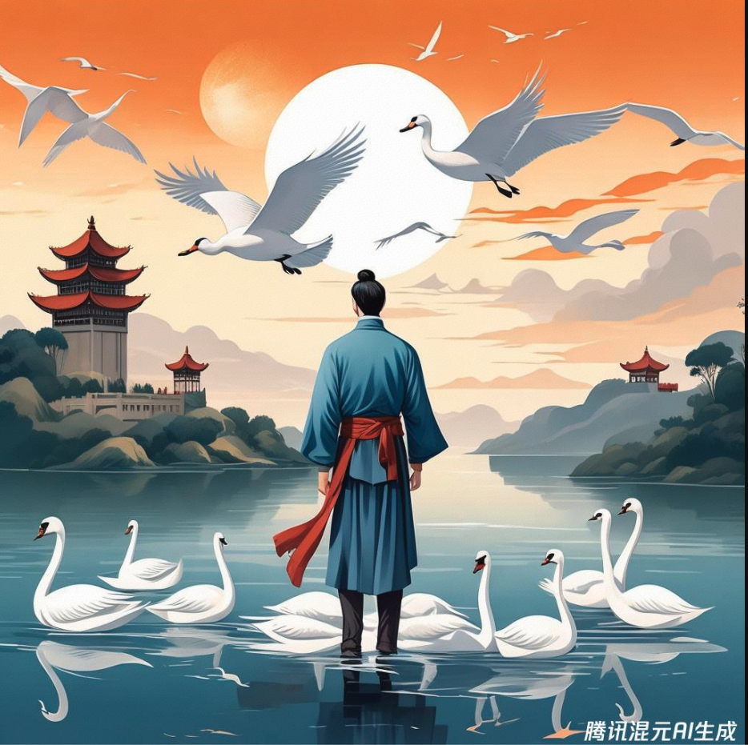]]

---
class: middle, center
## å°ï¼Œæ­£è§„

å丽ã€ç²¾è‡´ã€æ•´æ´ã€ç²¾ç¡®ã€è¯¦ç»†ã€å¥¢åã€ä¼˜é›…ã€è£…饰性的ã€å‡†ç¡®çš„ã€é”™ç»¼å¤æ‚çš„ã€ç»†è‡´çš„ã€è£…饰性的

<!-- ---
##

中国画；一æ¡å¤§æ±Ÿï¼Œæ—边屹立一座木塔，天空中一些天鹅；一ä½è¯—人站在江边，涛涛的江水，奔赴å‘å‰ï¼Œè¿œå¤„是大海，河水æµå…¥å¤§æµ·ï¼Œå丽的ã€å¥¢åçš„ã€ä¼˜é›…çš„ã€è£…饰性的ã€ç²¾è‡´çš„ -->

.center[.width-60[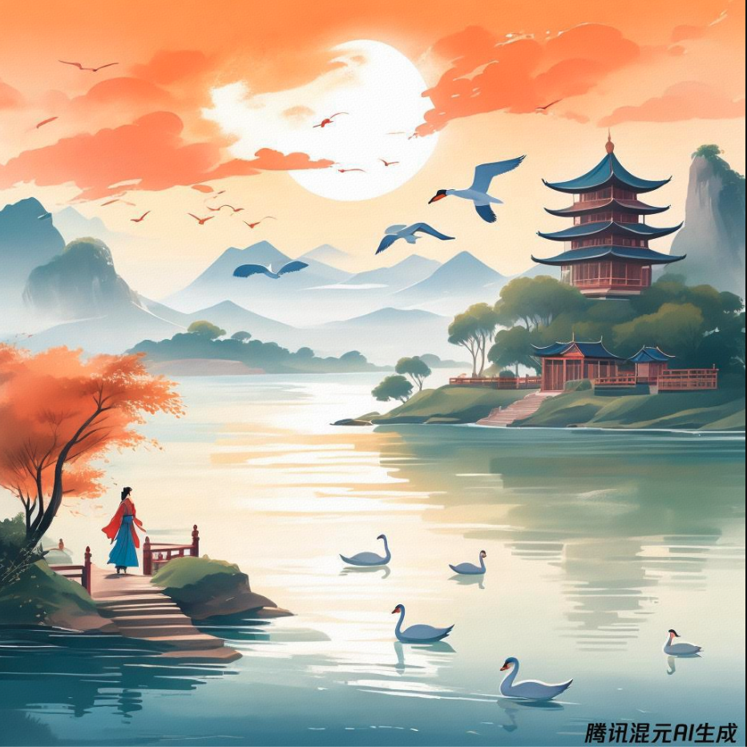]]

???
Big and free
Curvaceous, swirling, organic, riotous, turbulent, flowing, amorphous, natural, distorted, uneven, random, lush, organic, bold, intuitive, emotive, chaotic, tumultuous, earthy, churning

Big and structured
Monumental, imposing, rigorous, geometric, ordered, angular, artiï¬cial, lines, straight, rhythmic, composed, uniï¬ed, manmade, perspective, minimalist, blocks, digniï¬ed, robust, deï¬ned

Small and structured
Ornate, delicate, neat, precise, detailed, opulent, lavish, elegant, ornamented, ï¬ne, elaborate, accurate, intricate, meticulous, decorative, realistic

Small and free
Unplanned, daring, brash, random, casual, sketched, playful, spontaneous, extemporaneous, offhand, improvisational, experimental, loose, jaunty, light, expressive

???
- 网站：Artstation å’Œ Deviant Art（ä¸åŒæµæ´¾çš„集åˆï¼‰
**æ示结æ„**：
- 真å®æ„Ÿå›¾åƒï¼š{主题æè¿°}ã€å›¾åƒç±»å‹ã€è‰ºæœ¯é£æ ¼ã€è‰ºæœ¯çµæ„Ÿã€ç›¸æœºã€é•œå¤´ã€æ¸²æŸ“相关信æ¯
- 艺术图åƒç±»å‹ï¼šå›¾åƒç±»å‹ã€{主题æè¿°}ã€è‰ºæœ¯é£æ ¼ã€è‰ºæœ¯çµæ„Ÿã€ç›¸æœºã€é•œå¤´ã€æ¸²æŸ“相关信æ¯

**指å—**：
- æ示中的è¯åºå’Œæœ‰æ•ˆå½¢å®¹è¯å¾ˆé‡è¦
- å¯ä»¥æŒ‡å®šå›¾åƒçš„确切类å‹
- å¯ä»¥åŒ…å«ä¸è‰ºæœ¯é£æ ¼ç›¸å…³çš„关键è¯
- å¯ä»¥æ·»åŠ é“…笔画相关术语
- æ示中需è¦å¤§æ‹¬å·
- 应该列出艺术çµæ„Ÿ
- 包括有关照æ˜ã€æ‘„åƒæœºè§’度ã€æ¸²æŸ“é£æ ¼ã€åˆ†è¾¨ç‡å’Œç»†èŠ‚çš„ä¿¡æ¯
- 指定相机æ‹æ‘„ç±»å‹ã€é•œå¤´å’Œè§†å›¾
- 包括ä¸åˆ†è¾¨ç‡ã€ç»†èŠ‚和照æ˜ç›¸å…³çš„关键字

---
class: middle, center
## å…‰

烛光

夕阳

电影ç¯å…‰

演播室ç¯å…‰

---
class: middle, center

画一幅画：艾ç›Â·æ²ƒç‰¹æ£®ï¼Œé¥°æ¼”的，强大ç¥ç§˜å¥³å·«ï¼Œæ–½å±•é—ªç”µé­”法，细致æœè£…，数字绘画，超ç°å®ä¸»ä¹‰ï¼Œå¹»æƒ³ï¼Œå…¨èº«ï¼Œé«˜åº¦ç»†è‡´ï¼Œé”利èšç„¦ï¼Œç§‘幻，ç¾å¾—惊人，虹彩金色，电影ç¯å…‰ï¼Œé»‘æš—

.center[.width-60[]]

---
class: middle, center
## 指定你喜欢的漫画作者

---
class: middle, center

作者：Stanley Artgerm Lau 和 Alphonse Mucha，artstation

.center[.width-60[]]

---
class: middle, center

画一幅画：å®é™çš„ç²¾çµæ£®æ—，茂密的森æ—，背景中å¯è§å¤§å‹æ´»æ ‘，作者：alan lee，michal karcz，光滑的细节，指ç¯ç‹ï¼ŒæƒåŠ›çš„游æˆï¼Œå…‰æ»‘，详细的地形，油画，趋势艺术站，概念艺术，幻想哑光绘画

.center[.width-60[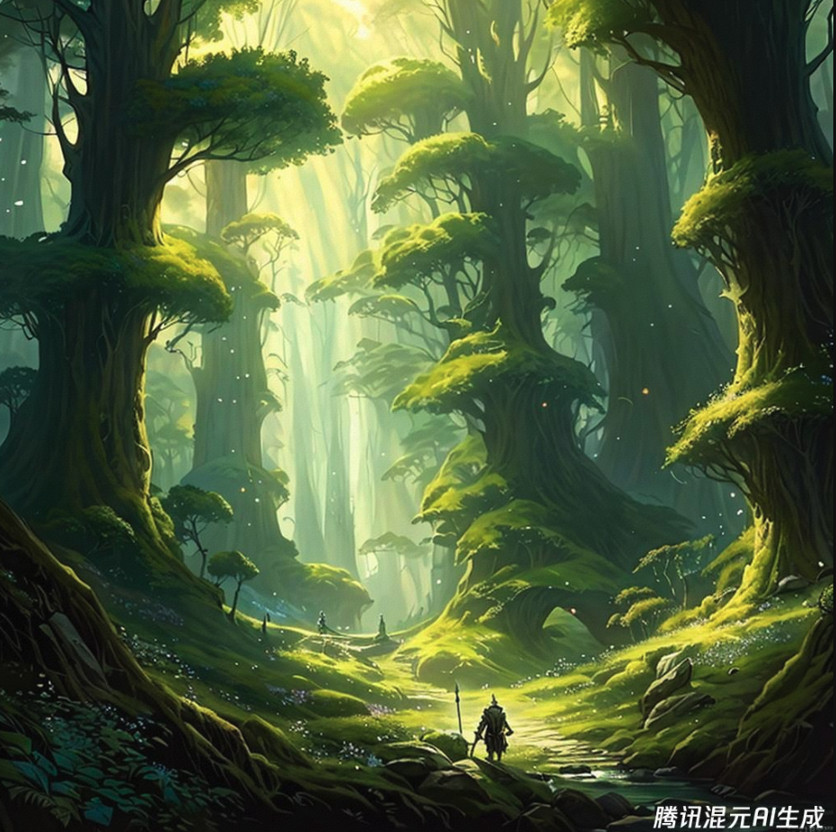]]

---
class: middle, center
## 综åˆ

---
class: middle, center
## é£æ ¼

中国水墨画

---
class: middle, center
## 情感

强烈的愤世嫉俗感

图片唤起痛苦ã€å­¤ç‹¬å’Œé™Œç”Ÿçš„情绪

图片唤起ç¾ä¸½å’Œå¹³é™çš„情感

---
class: middle, center
## 对象

两片è·å¶

一朵è²èŠ±

---
class: middle, center
## ä½ç½®

è·å¶å¾ˆé«˜

è·å¶ä¸‹é¢æœ‰ä¸€å—石头

一åªå­¤ç‹¬çš„鸟栖æ¯åœ¨çŸ³å¤´ä¸Š

---
class: middle, center
## ç¯å¢ƒ

清晨的薄雾

---
class: middle, center

中国水墨画，图片唤起痛苦ã€å­¤ç‹¬å’Œé™Œç”Ÿçš„情绪，两片è·å¶ï¼Œä¸€æœµè²èŠ±ï¼Œæ¸…晨的薄雾，å¶å­å¾ˆé«˜ï¼Œå¶å­ä¸‹é¢æœ‰ä¸€å—石头，一åªå­¤ç‹¬çš„鸟栖æ¯åœ¨çŸ³å¤´ä¸Š

.center[.width-60[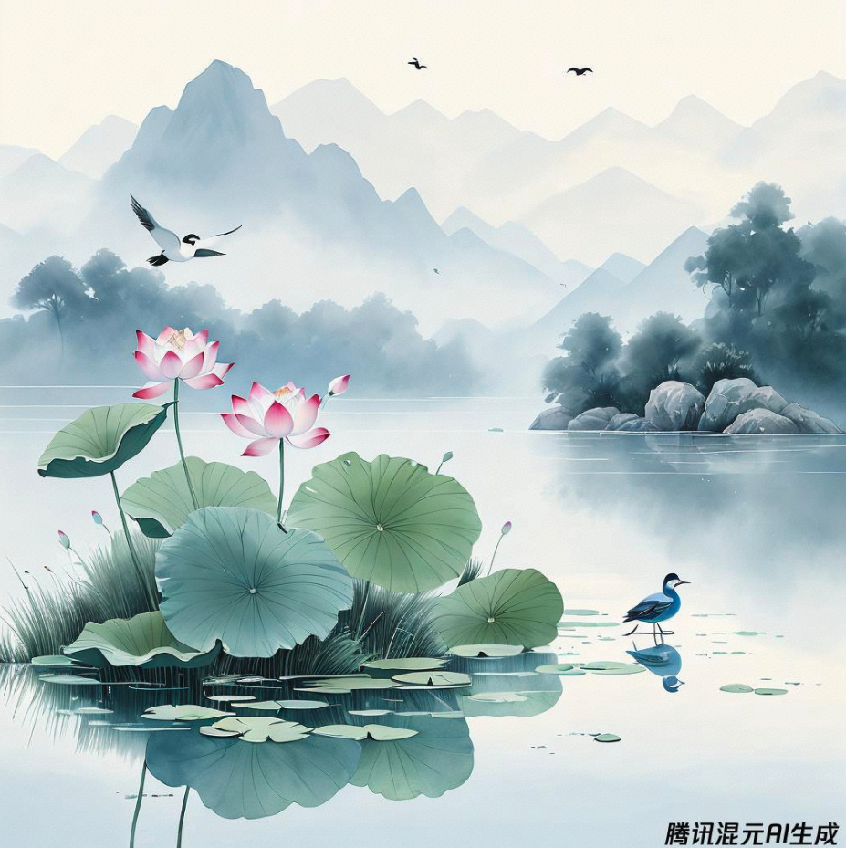]]

---
class: middle, center
## 移走ä¸æƒ³è¦çš„东西

---
class: middle, center

移走上é¢å›¾ä¸­çš„鸟

.center[.width-60[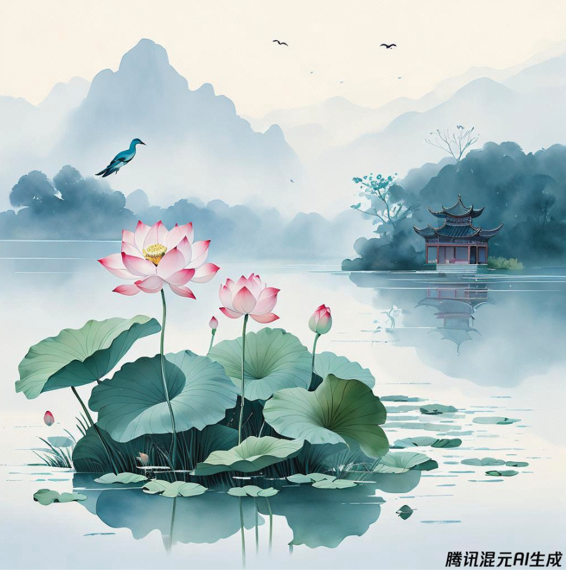]]

---
## é¿å…

- 具有多个主题的å¤æ‚场景
- å¤æ‚的布局（例如，“左侧有一个大的红色对象 X，å³ä¾§æœ‰ä¸€ä¸ªå‹å¥½çš„对象 Y，上é¢æœ‰ä¸€ä¸ªä½©æˆ´é¡¹ç›® A çš„å°å¯¹è±¡ Zâ€ï¼‰
- 具有多个é¢å­”的图åƒï¼ˆè¿™äº›é€šå¸¸ä¼šæ‰­æ›²ï¼‰
- 文本请求（例如，“一个写ç€â€˜ç”Ÿæ—¥å¿«ä¹ï¼â€™çš„标志â€ï¼‰ï¼Œå› ä¸ºå®ƒä¸çŸ¥é“如何拼写ï¼

???

请画一张画：一个男å­å‘上看，惊奇的表情，敬ç•çš„ç¥æƒ…

请画一张画：一个男å­å‘上看，ç大眼ç›ï¼ŒæƒŠå¥‡çš„表情，敬ç•çš„ç¥æƒ…，人物头åƒ

请画一张画：数字艺术，一个男å­å‘上看，ç大眼ç›ï¼ŒæƒŠå¥‡çš„表情，敬ç•çš„ç¥æƒ…，人物头åƒ

请画一张画：数字艺术，一个男å­å‘上看，ç大眼ç›ï¼ŒæƒŠå¥‡çš„表情，敬ç•çš„ç¥æƒ…，人物头åƒï¼Œçš®å…‹æ–¯åŠ¨ç”»ç‰‡çš„é£æ ¼

- a fat crocodile with a gold crown on his head wearing a three piece suit, 4k, professional photography, studio lighting, LinkedIn profile picture, photorealistic

- 请画一张画：一åªè‚¥é³„鱼，头戴金冠，穿ç€ä¸‰ä»¶å¥—，4k，专业摄影，工作室ç¯å…‰ï¼Œæ±‚èŒä¸ªäººèµ„料图片，真å®æ„Ÿ

Digital art of a man looking upwards, eyes wide in wonder, awestruck, in the style of Pixar, Up, character, white background

请画一张画：一ä½èº«ç©¿çº¢è£™çš„女人愤怒地打电è¯ï¼Œæ„¤æ€’地打手势，1960 年代的纽约，50 毫米镜头，电影色彩

请画一张画：颗粒状抽象å®éªŒæ€§è¿‡æœŸèƒ¶ç‰‡ç…§ç‰‡ï¼Œç…§ç‰‡ä¸­ä¸€ä½èº«ç©¿çº¢è£™çš„女人愤怒地打电è¯ï¼Œæ„¤æ€’地打手势，1960 年代的纽约，索尔·è±ç‰¹ (Saul Leiter) æ‹æ‘„，50 毫米镜头，电影色彩，过饱和滤镜，模糊，å射，折射，扭曲，雨滴ã€æ±¡è¿¹ã€æ¨¡ç³Šã€cinestill 800t

grainy abstract experimental expired ï¬lm photo of a woman in red dress, talking angrily on mobile phone, gesticulating angrily, in 1960s New York City by Saul Leiter, 50mm lens, cinematic colors, oversaturated ï¬lter, blur, reflection, refraction, distortion, rain drops, smears, smudges, blur, cinestill 800t

---
class: middle, center

# 作å“分享