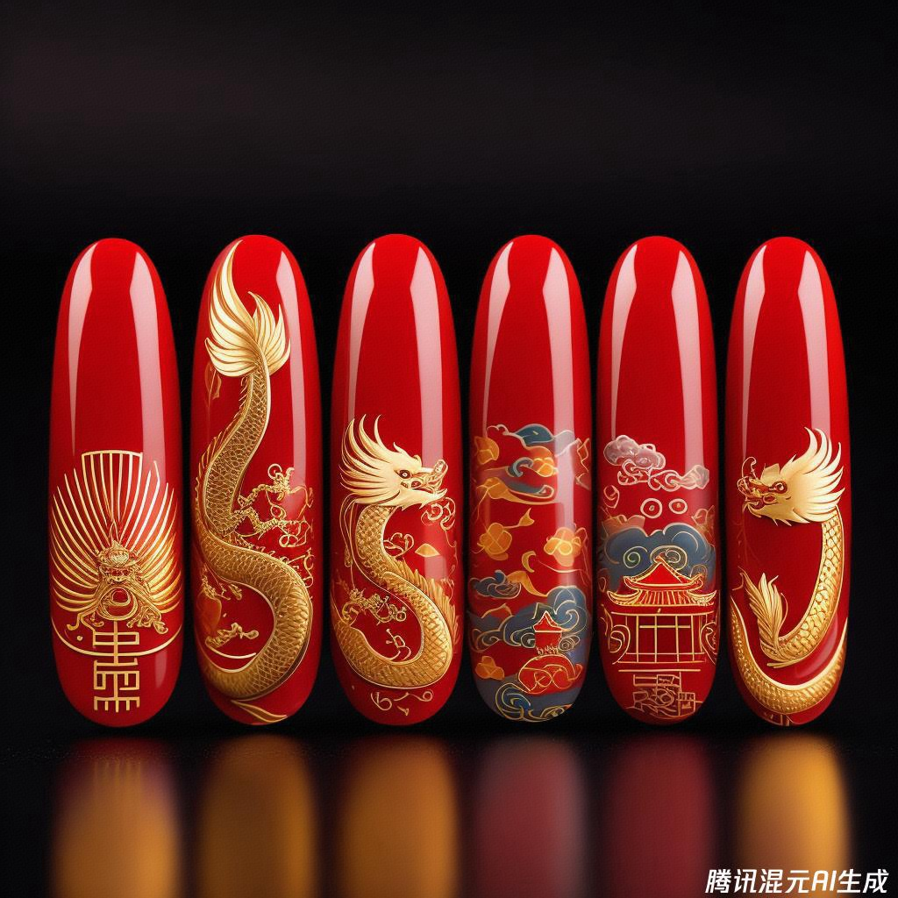
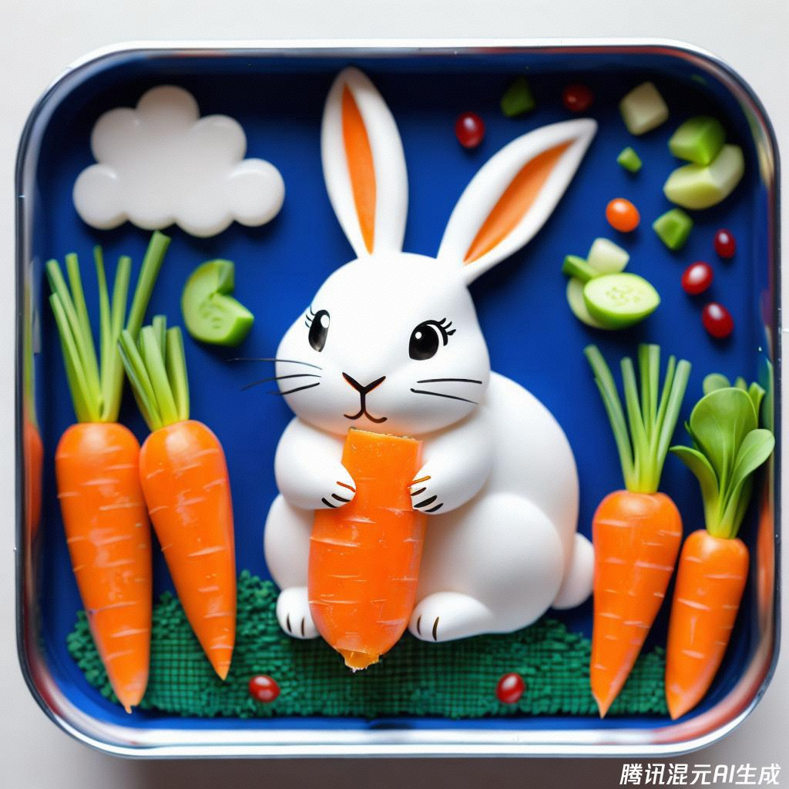
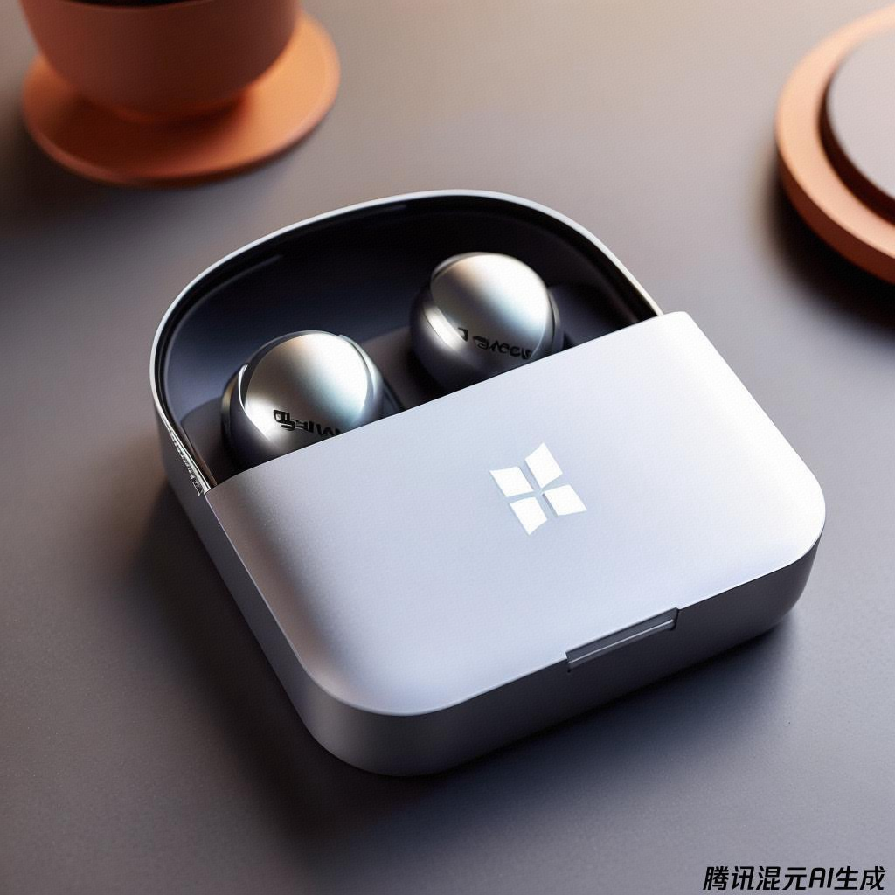
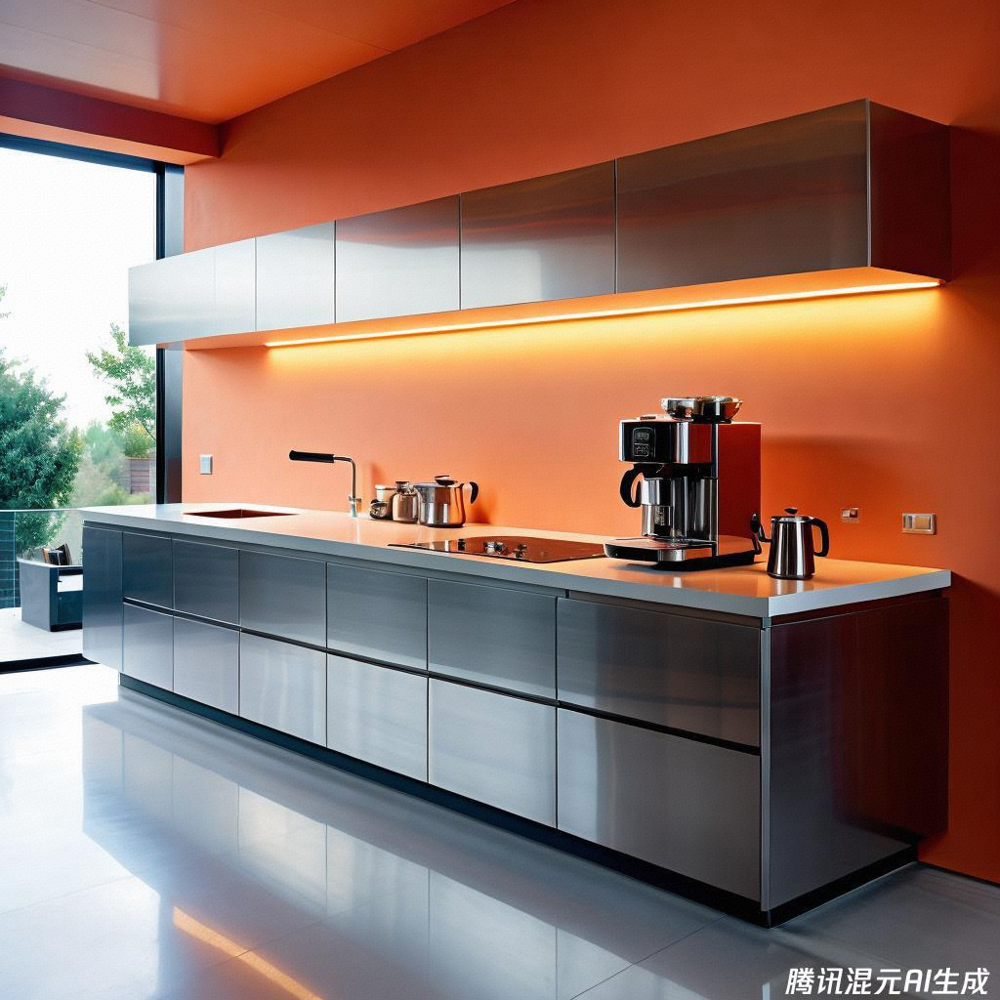
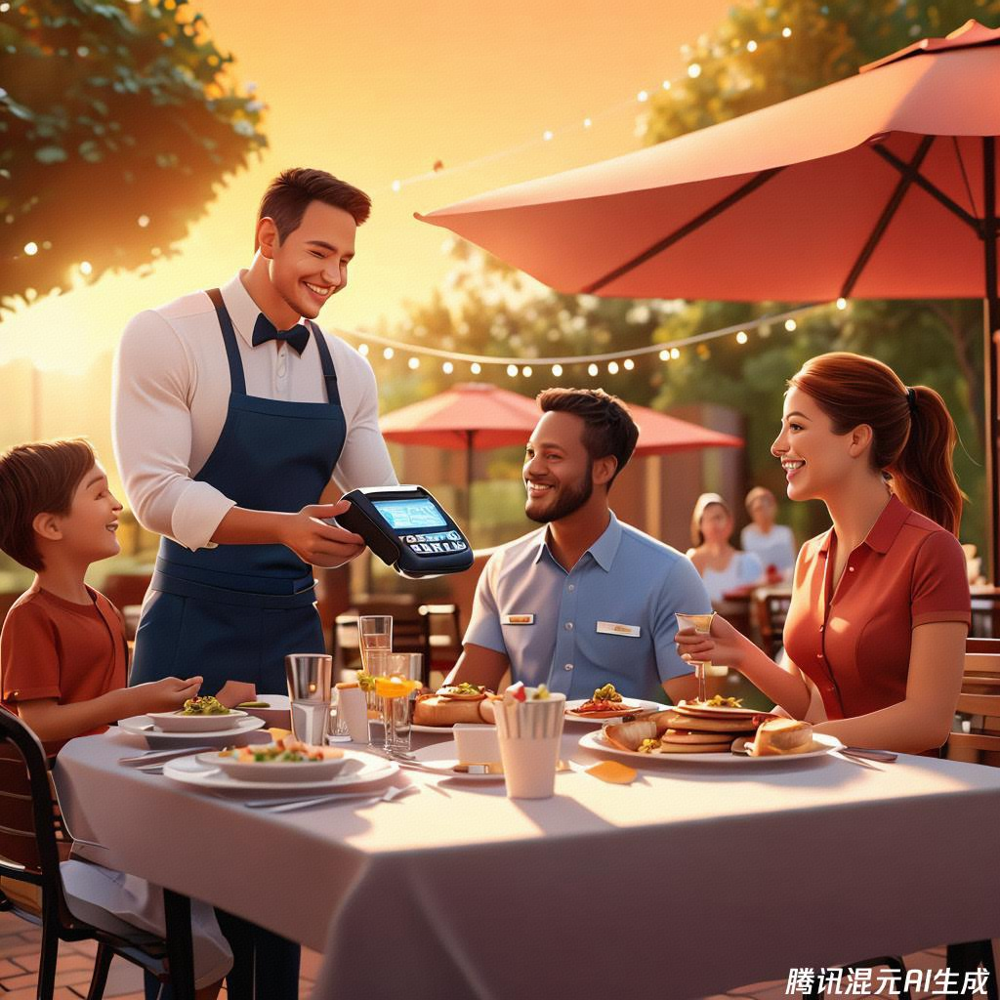
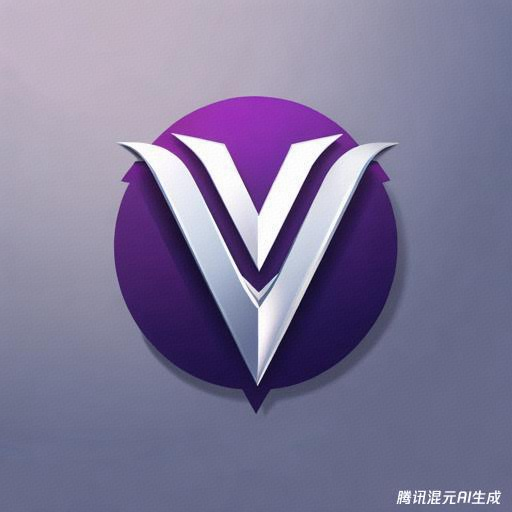
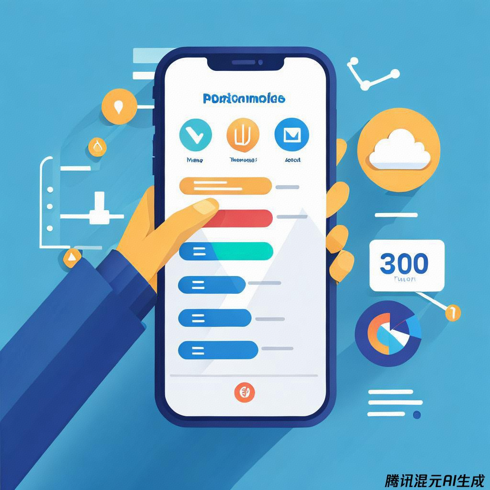
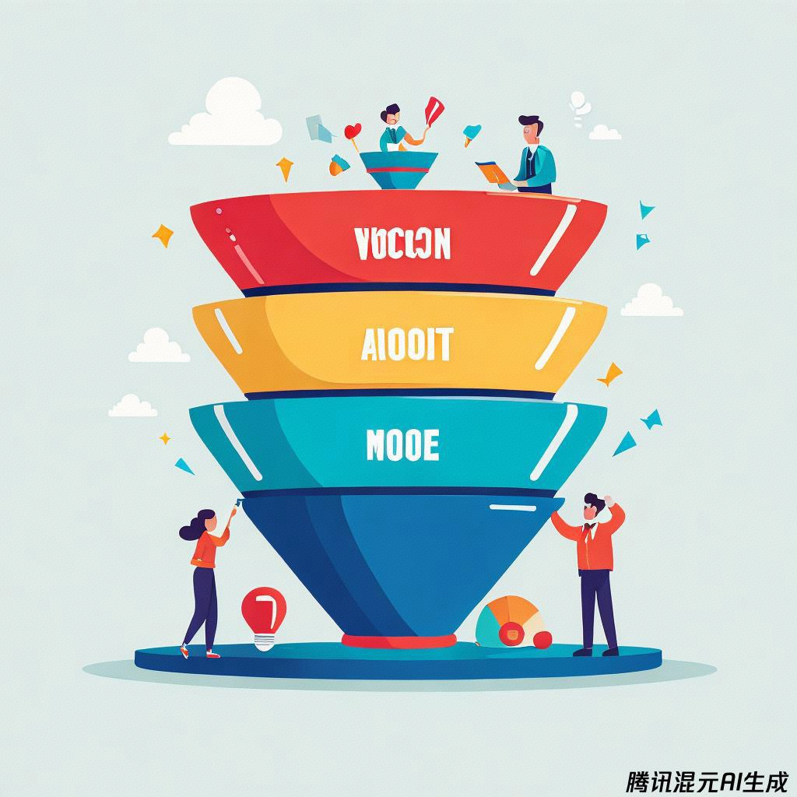
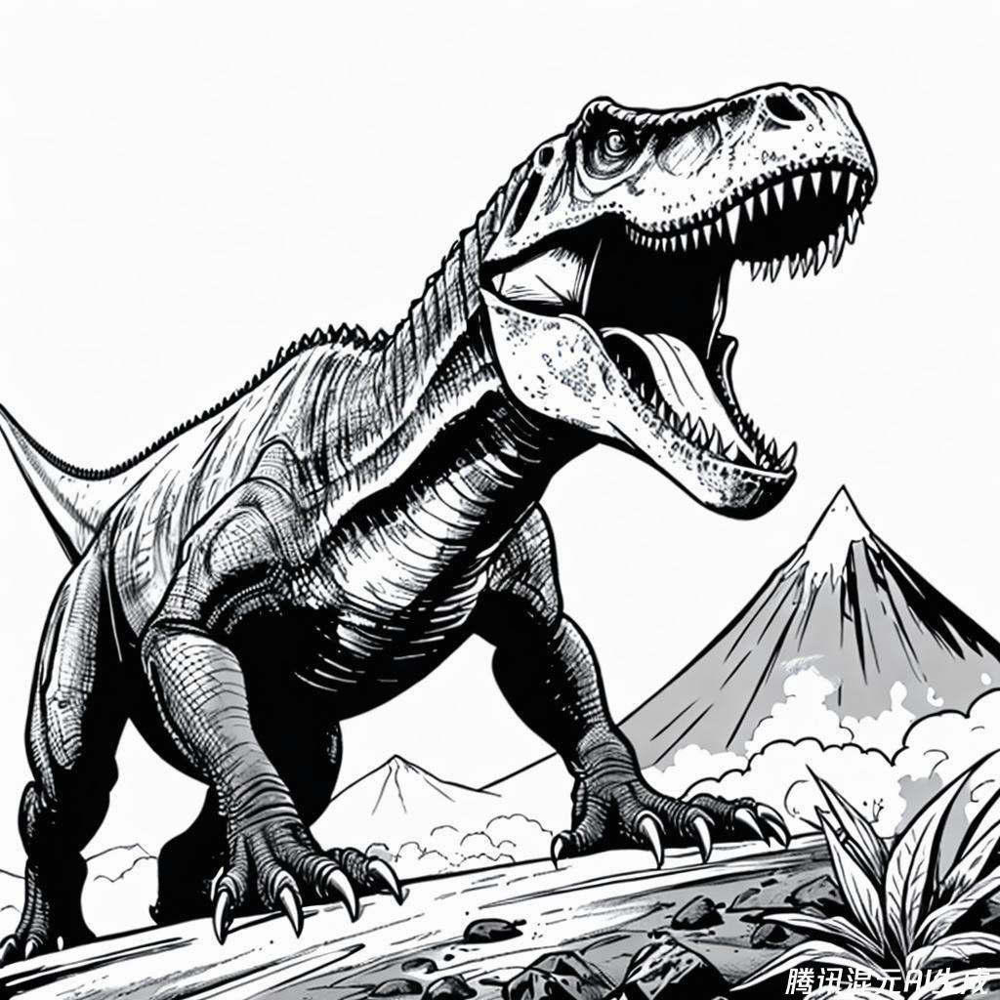

class: middle, center

<!-- AI 伴我行 -->

## AI 绘画 9：职业

陈一帅，陈宇晗

<!-- [yschen@bjtu.edu.cn](mailto:yschen@bjtu.edu.cn) -->
<!-- 北京交通大学电子信息工程学院 -->
<!-- .footnote[网络智能实验室] -->

---
class: middle, center
## 职业

职业相关的各种设计工作

---
class: middle, center
## 美甲

画一副画，一副美甲，以北京故宫的色彩和图案，绘制这个美甲

macro shot of nail art featuring colors and design based around Barcelona FC

.center[.width-50[]]

---
class: middle, center
## 食品设计

画一幅画，便当盒艺术、稻米背景，蔬菜制成的小兔子和胡萝卜

Bento Box Art, race horse and jockey made from veg on a rice background

.center[.width-50[]]

---
class: middle, center
## 包装设计
Microsoft Surface 耳机的盒子图片。

.center[.width-60[]]

---
class: middle, center
## 室内设计

给出一个设计，照片，摄影，一个超现代的厨房里，一个时尚的不锈钢咖啡机，细节呈现得非常出色，其风格让人想起现代建筑摄影，在设计博客上流行的风格

.center[.width-60[]]

---
class: middle, center
## 产品广告

画一张图，一家人在餐厅外出时在餐桌上欢笑的逼真图像。一名服务员拿着来自服务点软件供应商 Toast 的支付处理设备走过来。

.center[.width-60[]]

---
class: middle, center
## 公司徽标

创建一个 Logo，为一家名为 Vector 的新软件公司创建一个徽标，该公司专门从事销售支持。徽标应包含 Futura 字体的完整单词。该词的“V”由两个指向同一方向的箭头组成，第一个箭头指向右下方，呈 45 度角，第二个箭头指向右上方，呈 45 度角。它将采用极简设计，使用黑色和紫色作为主色调，使用灰度作为背景和阴影。

.center[.width-60[]]

---
class: middle, center
## 软件界面

画一张图，描述一个项目管理平台的移动界面。该应用程序的徽标显示在搜索栏旁边的左上角。下面有一个开关可以在列表、甘特图和日历之间切换视图。屏幕中间显示一个甘特图，显示项目的进度，每个条形以不同的颜色显示

.center[.width-60[]]

---
class: middle, center
## 演示图

创建一个图像来描述 AIDA 概念（意识、兴趣、欲望、行动）与营销漏斗的关系。图像应显示一个漏斗，平均分为 4 个部分，“意识”位于顶部，“兴趣”位于下一个，然后是“欲望”，“行动”位于漏斗的最底部。使用极简、卡通风格并将漏斗设为二维。

.center[.width-60[]]

---
class: middle, center
## 涂色卡

画一幅画，霸王龙咆哮的戏剧性场景，背景是正在喷发的火山。着色页样式，粗线，黑白，无阴影，相互之间隔离

Dramatic scene with a T-Rex roaring with an erupting volcano in the background. Coloring page style, bold lines, black and white, no shading, isolated

.center[.width-50[]]

---
class: middle, center
## 其他设计类型 
- 漫画连环画、​​童书插画、涂色书
- 电影、产品、包装、活动海报
- 书籍、杂志、专辑、视频封面
- 时装、食品设计
- 室内设计
- 贺卡、会员卡、菜单、房产中介宣传册
- 网站、头像、图标、App

## 小结

- 包装、家居、广告、软件、演示图设计
- 图书、海报、封面、宣传册
- 时装、食品
- 卡片、菜单

---
class: middle, center

实验和作品分享 1

## 我想为谁设计徽标？

我家的店、我家的车、我的头像
---
class: middle, center

实验和作品分享 2

## 我想为谁设计产品？

我家的店、我奶奶的年夜饭

---
class: middle, center

实验和作品分享 3

## 我想写的书？

封面设计、海报

---
class: middle, center

实验和作品分享 4

## 我想穿的衣服、演出服、万圣节装扮

服装设计