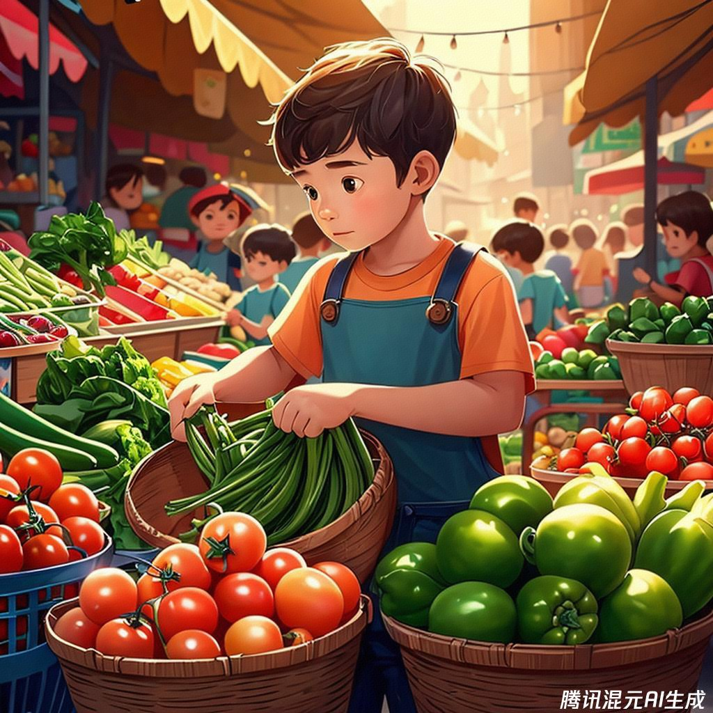

class: middle, center

<!-- AI 伴我行 -->

## AI 绘画 II：我

陈一帅，陈宇晗

<!-- [yschen@bjtu.edu.cn](mailto:yschen@bjtu.edu.cn) -->
<!-- 北京交通大学电子信息工程学院 -->
<!-- .footnote[网络智能实验室] -->

???
## 手工风格

发现有趣的艺术风格的名称
画廊、网站、艺术教科书

---
class: middle, center
## 绘画风格

黑白风格

彩色风格

---
class: middle, center
## 铅笔素描
画一个男孩，快跑，表情快乐，详细的，铅笔素描

.center[.width-60[]]

???
- 一个男孩，跑着，跳过障碍，可爱、详细的，铅笔素描
- 一个男孩，跑过公园，白色背景，迷人、舒适的，水彩，插图
- 一个女孩，坚定的肖像，戏剧性，布面丙烯，杰作
水彩、喷枪、铅笔、丙烯

---
## 黑白风格

- 圆珠笔
- 炭笔素描
- 铅笔素描
- 铅笔画，详细/超详细，逼真
- 蚀刻
- 涂色
- 木刻

???
- 田野日记艺术线条
- 美国报纸的政治漫画
Stencil, street art, Banksy
Ballpoint pen art
Charcoal sketch
Pencil sketch
Pencil drawing, detailed, hyper-detailed, very realistic
Etching
Political cartoon from U.S. newspaper
Colouring-in sheet
Woodcut
Field journal line art

---
class: middle, center
## 蜡笔风格
画一个女孩，快跑，表情快乐，详细的，蜡笔风格

.center[.width-60[]]

---
class: middle, center
## 儿童画风格
画一个男孩，快跑，表情快乐，详细的，儿童画风格

.center[.width-60[]]

---
## 彩色风格

- 蜡笔
- 儿童画
- 中国水彩画
- 彩色铅笔
- 喷枪
- 油画
- 水彩
- 布面丙烯

???
Crayon
Child's drawing / children'
drawing
Oil painting
Ukiyo-e
Chinese watercolor
Coloured pencil, detailed
Airbrush
Pastels
Acrylic on canvas
Watercolor

---
class: middle, center
## 丝网印刷风格
画一个女孩，快跑，表情快乐，丝网印刷风格

.center[.width-60[]]

---
class: middle, center
## 街头艺术
画一个女孩，表情快乐，详细的，街头艺术风格

.center[.width-60[]]

---
## 更多风格

- 粉笔
- 丝网印刷
- 照片拼贴
- 故事书插图
- 报纸卡通
- 十年的复古插图
- 街头艺术（班克斯）
- 粉彩
- 浮世绘

---
## 外形

- 发型
- 角色扮演
- 彩妆

---
class: middle, center
## 野战迷彩
画一个男孩，快乐地向我们走来，特种部队，野战迷彩妆，儿童画风格

.center[.width-60[]]

---
## 服装
- 衣服
- 时装
- 盔甲
- 历史服装
- 未来服装
- 鞋子

---
class: middle, center
## 黑天鹅绒质地

画一个快乐的孩子，慢跑，黑天鹅绒质地

.center[.width-60[]]

---
class: middle, center
## 白色连衣裙
画一个女孩，快乐地向我们走来，高级定制，白色连衣裙，上面有小花，儿童画风格

.center[.width-60[]]

---
class: middle, center
## 古罗马军团盔甲
画一个男孩，骄傲地向我们走来，穿着古罗马军团的盔甲，儿童画风格

.center[.width-60[]]

---
## 配饰
- 珠宝、项链、戒指
- 配饰
- 箱包

---
## 地点和空间
- 建筑
- 景点、设施、主题公园、教育空间、场馆
- 花园、景观、自然、户外空间

---
class: middle, center
## 北京故宫
画一个女孩，在北京故宫门口，快乐地向我们走来，儿童画风格，远景

.center[.width-60[]]

---
## 地点和空间
- 商业室内、酒店、公共建筑、工作场所
- 公共领域、街道、广场、城市景观

---
class: middle, center
## 超市
画一个男孩，在超市里，快乐地挑选蔬菜，儿童画风格，中景

.center[.width-60[]]

---
## 活动
- 充气玩具、花车、热气球
- 活动、节日、活动设计、活动策划、活动装饰

---
## 地点和空间
- 舞台布景、戏剧布景
- 家庭室内装饰、家居设计

???
- 家具、家具、地毯、沙发、床、窗帘等

---
## 作品分享

