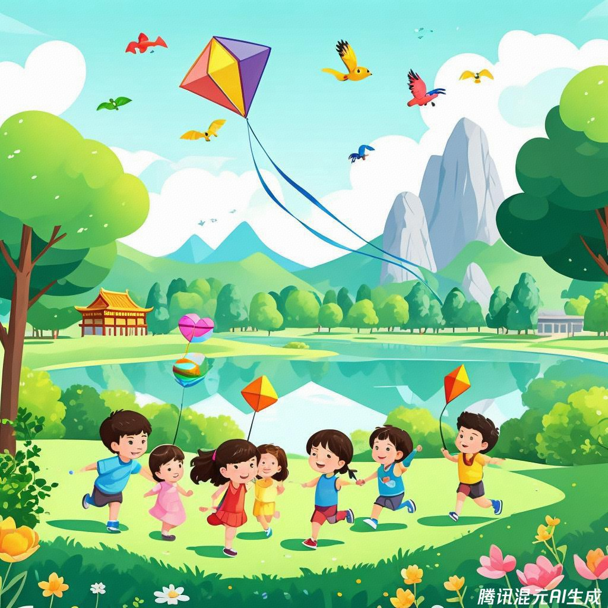
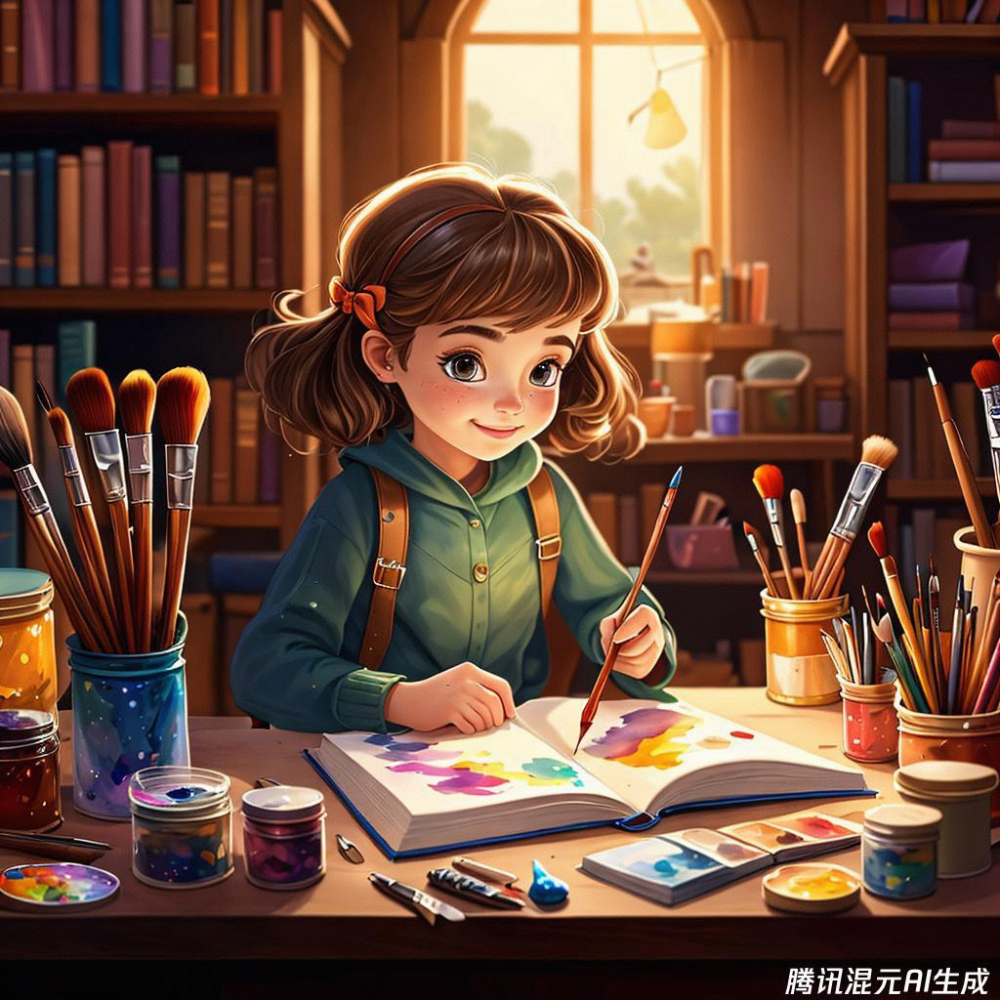
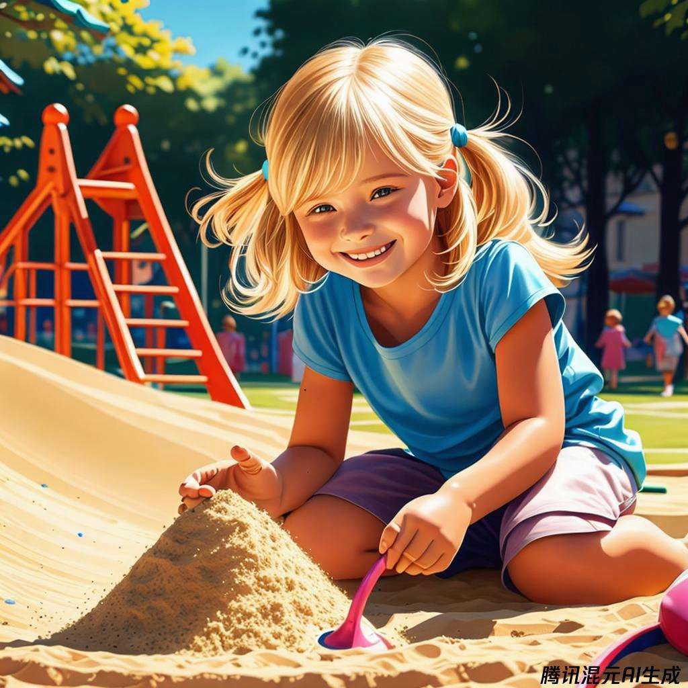
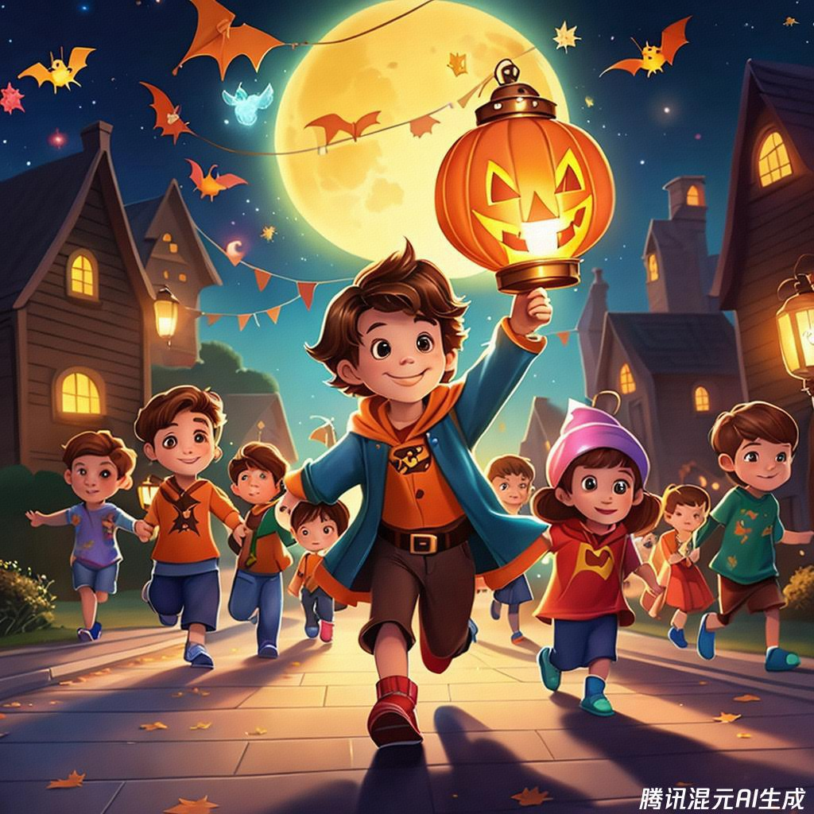
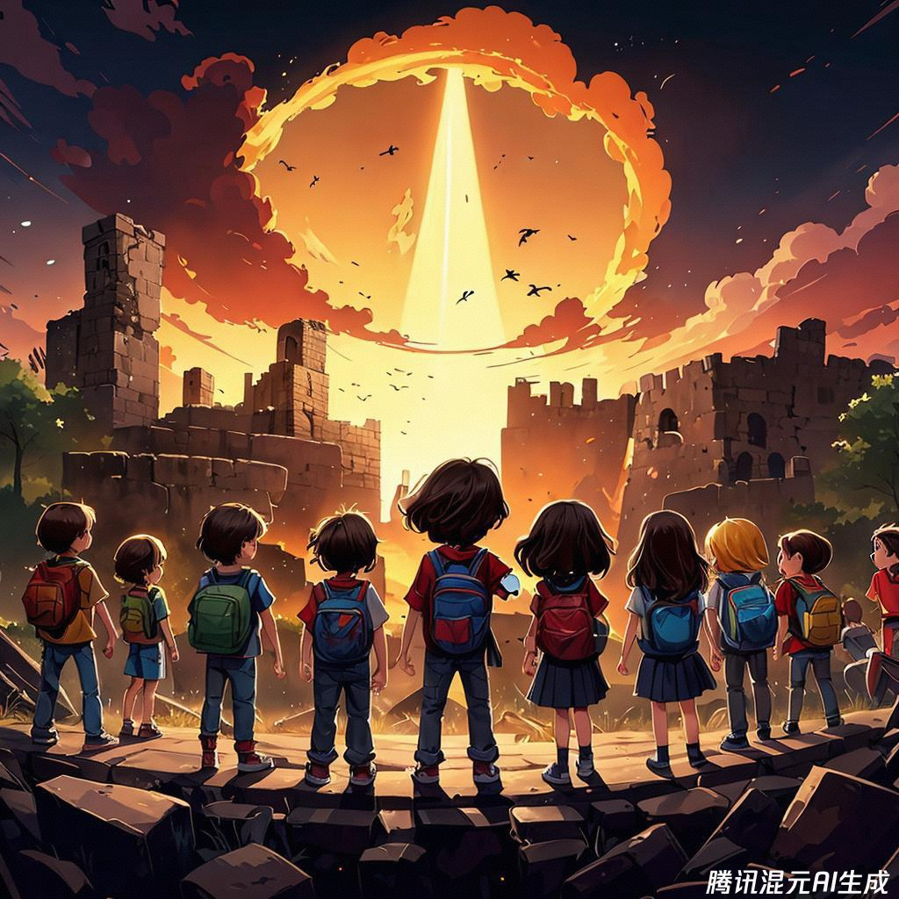
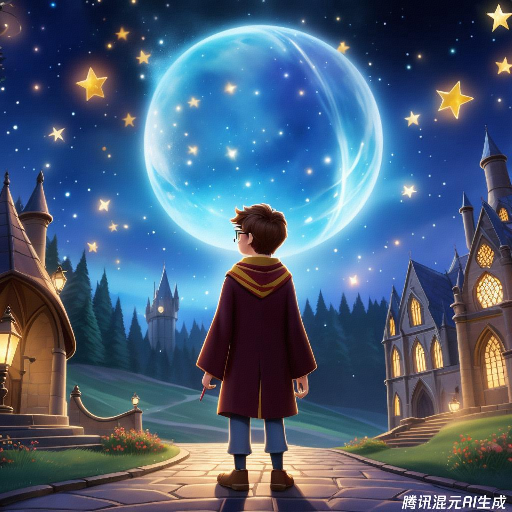
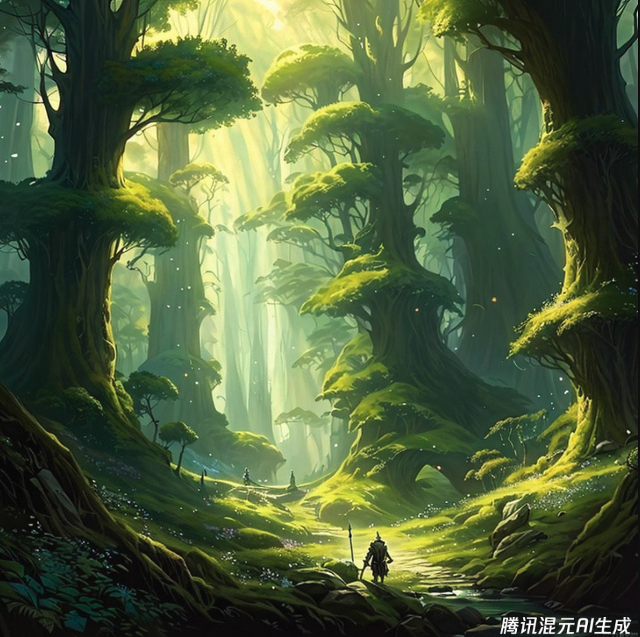

class: middle, center

<!-- AI 伴我行 -->

## AI 绘画 3：我在哪？

陈一帅，陈宇晗

<!-- [yschen@bjtu.edu.cn](mailto:yschen@bjtu.edu.cn) -->
<!-- 北京交通大学电子信息工程学院 -->
<!-- .footnote[网络智能实验室] -->

---
class: middle, center
## 我在哪？

地点和空间

活动

布景和设计

---
class: middle, center
## 地点和空间：户外

景点、公园

自然、户外空间

花园、景观

---
class: middle, center
## 户外：植物园
画一群孩子，在北京植物园的山中，湖边，快乐地玩爽，放风筝，儿童画风格，远景

.center[.width-60[]]

---
class: middle, center
## 户外：北京故宫
画一个女孩，在北京故宫门口，快乐地向我们走来，儿童画风格，远景

.center[.width-60[]]

---
class: middle, center
## 地点和空间：室内

教育空间、场馆

商业室内、酒店、公共建筑、工作场所

公共领域、街道、广场、城市景观

---
class: middle, center
## 室内：菜市场
画一个男孩，在菜市场，认真地买菜，儿童画风格，中景

.center[.width-60[]]

---
class: middle, center
## 室内：图书馆
画一个女孩，在图书馆，认真地读书，儿童画风格，中景

.center[.width-60[]]

---
class: middle, center
## 活动

活动、节日、活动设计、活动策划、活动装饰

玩具、花车、热气球

---
class: middle, center
## 活动：玩沙子
画一个女孩，在一个热闹的沙坑里，玩沙子，旁边有滑梯，儿童画风格，中景

.center[.width-60[]]

---
class: middle, center
## 活动：万圣节
画一个男孩，在万圣节，打着灯笼，和小朋友在游行，儿童画风格，远景

.center[.width-60[]]

---
class: middle, center
## 活动：戏剧
画一群男孩和女孩，在演戏剧，世界末世，儿童画风格，远景

.center[.width-60[]]

???
- 家具、家具、地毯、沙发、床、窗帘等

---
class: middle, center
## 布景和设计

舞台布景、戏剧布景

家庭室内装饰、家居设计

---
class: middle, center
## 设计：哈利波特

画一幅画，描绘可爱的哈利波特，皮克斯动画电影风格，戏剧性的灯光，站在霍格沃茨外面。

Cute Harry Potter, pixar animated movie style, dramatic lighting, standing outside Hogwarts.

.center[.width-50[]]

---
class: middle, center
## 设计：精灵森林
画一幅画：宁静的精灵森林，茂密的森林，背景中可见大型活树，作者：alan lee，michal karcz，光滑的细节，指环王，权力的游戏，光滑，详细的地形，油画，趋势艺术站，概念艺术，幻想哑光绘画

.center[.width-50[]]

???
“peaceful elven forest, thick forest, large living trees are visible in the background, by alan lee, michal karcz, smooth details, lord of the rings, game of thrones, smooth, detailed terrain, oil painting, trending artstation, concept art, fantasy matte painting”; Negative prompt: “moss”

---
## 小结
- 地点和空间：户外、室内
- 活动：玩沙子、万圣节
- 布景和设计：戏剧

---
class: middle, center

实验和作品分享 1

## 我现在在哪？

---
class: middle, center

实验和作品分享 2

## 春节过年，我在哪？

---
class: middle, center

实验和作品分享 3

## 我去过最有意思的地方？

---
class: middle, center

实验和作品分享 4

## 我想去的地方？

天空？

火星？

海底？