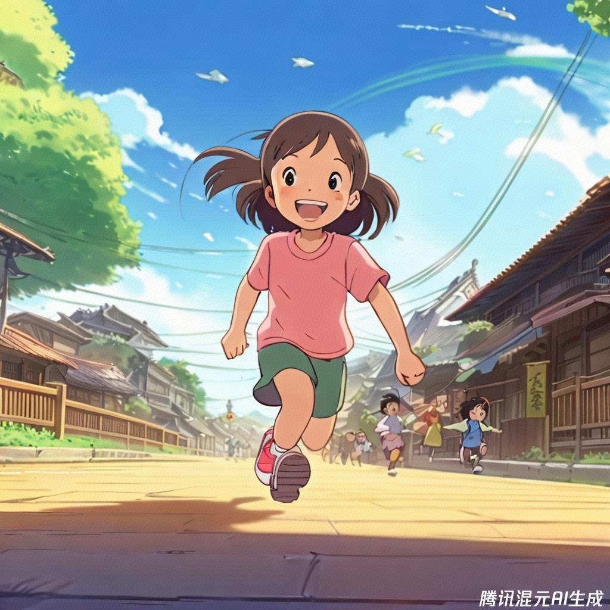
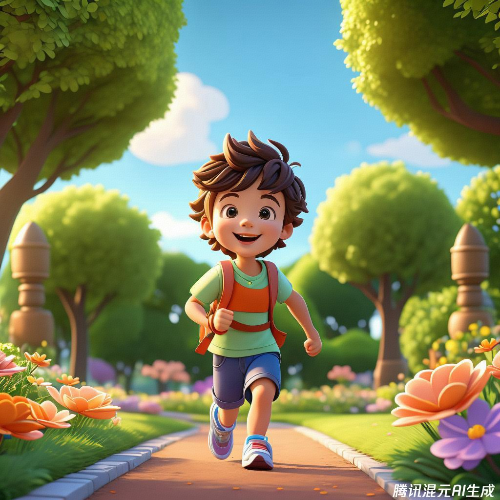

class: middle, center

<!-- AI 伴我行 -->

## AI 绘画 III：数字艺术

陈一帅，陈宇晗

<!-- [yschen@bjtu.edu.cn](mailto:yschen@bjtu.edu.cn) -->
<!-- 北京交通大学电子信息工程学院 -->
<!-- .footnote[网络智能实验室] -->

---
class: middle, center
## 数字艺术风格

更现代，数字化外观的插图
---
class: middle, center
## 游戏风格

画一个男孩，跑过城市，中景，复古电子游戏风格

.center[.width-60[]]
---
class: middle, center
## 游戏风格

画一个跑步的女孩，电脑游戏《星际争霸》屏幕截图

.center[.width-60[]]
---
class: middle, center
## 动画片风格

画一个快乐的孩子慢跑，动画片《千与千寻》截图

.center[.width-60[]]

???
- 一个男孩，跑过城市，复古像素艺术，复古电子游戏艺术风格
- 一个快乐的孩子，慢跑，可爱的 3D 插图，辛烷 3D 渲染，体积照明，绿色背景
- 一个微笑的男孩，慢跑，快乐，脸部，正面视图，矢量插图，贴纸艺术

尝试不同的数字风格：“数字艺术”、“矢量图形”、“极简主义”、“几何”、“等距”、“2.5D”、“哑光粘土”、“数字绘画”、“最喜欢的游戏或动画片的屏幕截图”、“图表”、“说明手册”。

---
## 动画片风格

- 复古迪士尼
- 20 世纪 90 年代迪士尼，卡通渲染
- 皮克斯动画
- 皮克斯的《飞屋环游记》
- 吉卜力工作室
- 千与千寻
- 宫崎骏

???
- 像素艺术
- 20 世纪 70 年代颗粒状复古插画
- 汉娜·巴伯拉、20 世纪 60 年代、史酷比、摩登原始人、杰森一家等
Character reference sheet (via)
Comic book art
Vintage Disney
Anime
Pixel Art 
1990s Disney, cel shading
Pixar
1970s grainy vintage illustration
Studio Ghibli
Hanna Barbera, 1960s, Scooby Doo, Flintstones, Jetsons, etc

你喜欢的动画片风格

???
- 飞天小女警复古乐一通 (1961)
- 恶搞之家
- 马男波杰克
- 远方（印刷漫画）
- 南方公园辛普森一家
- 冒险时间
South Park The Simpsons
Adventure Time
Spirited Away
Powerpuff Girls vintage Looney Tunes (1961)
Family Guy
Pixars Up
Bojack Horseman
The Far Side (print comic)

你喜欢的漫画家风格

???
- 比尔·沃特森（卡尔文与霍布斯）
- 莫里斯·森达克（野兽出没的地方）
- 拉尔夫·斯特德曼（《恐惧与厌恶》等）
- 诺曼·洛克威尔
- 苏斯博士
- 托芙·詹森（姆明家族）
- 万达·加格
- 碧翠丝·波特（彼得兔等）
- 昆汀·布莱克（来自罗尔德·达尔的书籍等）
Ralph Steadman (Fear & Loathing, etc) (via Discord)
Norman Rockwell 
Dr. Seuss 
Tove Jansson (The Moomins)
Wanda Gág
Beatrix Potter (Peter Rabbit etc)
Quentin Blake (from Roald Dahl books, etc)
Hayao Miyazaki (Studio Ghibli)
Bill Watterson (Calvin & Hobbes)
Maurice Sendak (Where the Wild Things Are)

插画，数字媒体

- Alegria，“孟菲斯企业”
- 拼贴、照片拼贴
- 杂志拼贴
- 低聚
- 矢量艺术
- 分层纸
- 贴纸插图
- 故事书
- 数字绘画
- 水彩和钢笔
- 丝网印刷

Alegria, 'corporate memphis'
Collage, photocollage,
magazine collage
Low poly
Vector art
Layered paper 
Sticker illustration 
Storybook 
Digital painting
Watercolor & pen 
Screen printing

插图，教学

- 蓝图
- 专利图
- 植物插图
- 剖面图
- 神话地图
- 伏尼契手稿
- 宜家手册
- 科学图解
- 使用说明书
- 沃罗尼图

???
Blueprint 
Patent drawing
Botanical illustration
Cutaway
Mythological map 
Voynich manuscript
IKEA manual
Scientific diagram
Instruction manual
Voroni diagram

3D + 纹理

- 黑天鹅绒，埃德加·利特格
- 3D 渲染，houdini 3D，辛烷 3D，
- ZBrush、玛雅、Cinema 4D、搅拌机
- 刮画艺术、箔艺术、黑色 Perler 珠（哈马珠）上的金色
- 粘土动画、阿德曼动画
- X 的屏幕截图（游戏，真实或虚构，控制台，年份）
- 毛毡件
- 纹身
- 面料花型

???
- 等距 3D
Isometric 3D
Black velvet, Edgar Leeteg
3D render, houdini 3D, octane 3D,
ZBrush, Maya, Cinema 4D, Blender
Scratch art, foil art, gold on black Perler beads (Hama beads)
Claymation, Aardman Animation,
Screenshot of X from (game, real or imaginary, console, year) (via)
Felt pieces
Tattoo
Fabric pattern

---
class: middle, center
## 3D 渲染

画一个快乐的孩子，慢跑，3D 渲染

.center[.width-60[]]

---
class: middle, center
## 4D 渲染

画一个快乐的孩子，慢跑，Cinema 4D

.center[.width-60[]]

---
class: middle, center
## 粘土动画

画一个快乐的孩子，慢跑，粘土动画

.center[.width-60[]]

---
class: middle, center
## 粘土动画

画一个快乐的孩子，慢跑，粘土动画，特写

.center[.width-60[]]

---
class: middle, center

# 作品分享