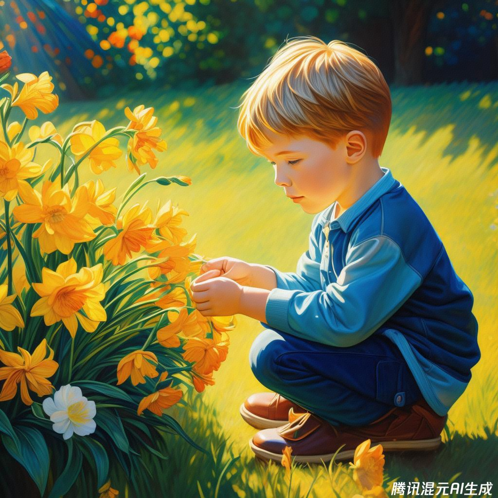

class: middle, center

<!-- AI 伴我行 -->

## AI 绘画 V：艺术家

陈一帅，陈宇晗

<!-- [yschen@bjtu.edu.cn](mailto:yschen@bjtu.edu.cn) -->
<!-- 北京交通大学电子信息工程学院 -->
<!-- .footnote[网络智能实验室] -->

---
class: middle, center
## 艺术家

印象派

梵高

林风眠

---
## 复古又艺术！

- 学习艺术史，了解各种艺术风格
- 从古代洞穴壁画到 20 世纪现代艺术
- 描述：年份、艺术运动、媒体或著名艺术家
- 可以标记 “杰作”、“大师作品” 或 “杰出范例”

---
class: middle, center
## 各种艺术风格

壁画

文艺复兴

印象派

中国画

---
class: middle, center
## 古代壁画

画一位马拉松运动员，装饰性米诺斯壁画，细节充分，公元前 2000 年的文物

.center[.width-60[]]

---
class: middle, center
## 文艺复兴

巴洛克，十七世纪：委拉斯开兹，卡拉瓦乔，维米尔

洛可可，1730 年，巴洛克晚期：安托万·华托

新古典主义，随想曲，十八世纪：安吉丽卡·考夫曼

象征主义，梦幻般，十九世纪

现实主义，十九世纪：古斯塔夫·库尔贝

---
class: middle, center
## 文艺复兴：米开朗基罗

画一位美丽的文艺复兴时期男子，慢跑、布面油画，米开朗基罗，大师作品，戏剧性深色背景

.center[.width-60[]]

---
class: middle, center
## 文艺复兴：巴洛克，维米尔
画一个小姑娘，在花园里，阳光明媚，巴洛克风格，油画，精细，维米尔，大师作品
.center[.width-60[]]

---
class: middle, center
## 文艺复兴：洛可可，华托
画一个小男孩，在花园里，阳光明媚，洛可可，油画，精细，安托万·华托，大师作品
.center[.width-60[]]

---
class: middle, center
## 印象派 

印象派、莫奈、雷诺瓦

后印象派、塞尚、高更、梵高、修拉

---
class: middle, center
## 印象派：莫奈
画一个小姑娘，在花园里，阳光明媚，印象派，油画，精细，莫奈，大师作品
.center[.width-60[]]

---
class: middle, center
## 后印象派：塞尚

画一位女运动员，充满活力，空灵，后印象派，画布上的作品，塞尚，大师作品

.center[.width-50[]]

---
class: middle, center
## 后印象派：梵高
画一个小男孩，在花园里，阳光明媚，后印象派，油画，精细，梵高，大师作品
.center[.width-60[]]

???

- 新艺术风格
- 矫饰主义，矫饰主义（1500-1600）
Renaissance - modern art movements
Renaissance painting (1400-1600)
Realism, realist, 19th century, Gustave Courbet
Mannerism, Mannerist (1500-1600)
Art Nouveau
Impressionism, Monet, Renoit
Baroque, 17th c, Velázquez, Caravaggio, Vermeer
Post-impressionism, Cézanne, Gaugin, van Gogh, Seurat
Rococo, 1730, late Baroque, Antoine Watteau
Symbolist painting, symbolism, dreamlike, 19th century
Neoclassicism, capriccio, 18th c, Angelica Kauffmann

---
class: middle, center
## 中国画

工笔，花鸟

水墨，山水

---
class: middle, center
## 中国画：花鸟

中国水墨画，图片唤起痛苦、孤独和陌生的情绪，两片荷叶，一朵莲花，清晨的薄雾，叶子很高，叶子下面有一块石头，一只孤独的鸟栖息在石头上

.center[.width-50[]]

---
class: middle, center
## 中国画：山水
黑白，水墨画，江南的水乡，几只燕子，飞过，大师作品，薄雾
.center[.width-60[]]

---
class: middle, center
## 中国画：山水
中国画；一条大江，旁边一座塔，一些天鹅，一位诗人站在江边，涛涛江水，奔赴向前，远处是大海，河水流入大海；庄严，浑穆，圣洁，光辉

.center[.width-50[]]

---
class: middle, center
## 艺术家

中国

外国

---
## 艺术家：中国
- 唐：王维、阎立本、周昉
- 宋：董源、李成、韩干、范宽、宋徽宗、米芾、李公麟、郭熙
- 元：高克恭、赵孟頫、吴镇、黄公望、倪瓒、王蒙、王冕
- 明：沈周、文征明、唐伯虎、董其昌、徐渭
- 清：弘仁、龚贤、八大山人、石涛、陈洪绶、郑板桥、金农
- 近代：赵之谦、任伯年、吴昌硕、傅抱石、黄宾虹、李可染、李叔同、张大千、齐白石、陈师曾、潘天寿、林风眠、吴冠中、徐悲鸿

---
## 艺术家：外国
- 米开朗琪罗、拉斐尔
- 塞尚、梵高、莫奈
- 维米尔

---
class: middle, center
## 艺术家：林风眠
画一个仕女，彩色，水墨，手里拿着一朵莲花，坐禅，穿着蓝色的薄纱，林风眠，大师作品
.center[.width-60[]]

---
class: middle, center
## 艺术家：潘天寿
黑白，中国水墨画，墨色很淡，薄雾，一朵牡丹花，潘天寿，大师作品
.center[.width-60[]]

???
- 基思·哈林
- 乔治·苏拉特
- 托马斯·金凯德
- HR 吉格尔
- 丽莎弗兰克
- 罗伯特·克拉姆
- 希罗尼穆斯·博斯《人间乐园》
- 巴斯奎特
- 古斯塔夫·基尔姆特 (Gustav Kilmt)，象征主义者，金箔，1908 年
- 西蒙·斯塔伦哈格
- 罗伊·利钦斯坦，半色调点，漫画细节，波普艺术

Assorted artist tests
Edward Hopper, 1942
Keith Haring 
Salvador Dali 
Georges Surat
Vincent van Gogh
Thomas Kinkade
HR Giger
Lisa Frank
Robert Crumb
Hieronymus Bosch, The Garden of Earthly Delights
Basquiat
Gustav Kilmt, symbolist, gold leaf, 1908
Simon Stålenhag
Roy Lichenstein, half-tone dots, comic detail, pop art

---
## 小结
- 艺术家
- 艺术风格
  - 古代壁画
  - 文艺复兴
  - 印象派
  - 中国画
- 艺术家

---
class: middle, center

实验和作品分享 1

## 画一幅梵高的向日葵

---
class: middle, center

实验和作品分享 2

## 画一幅中国的山水

---
class: middle, center

实验和作品分享 3

## 你最喜欢的艺术家风格是？

用它完成一幅作品