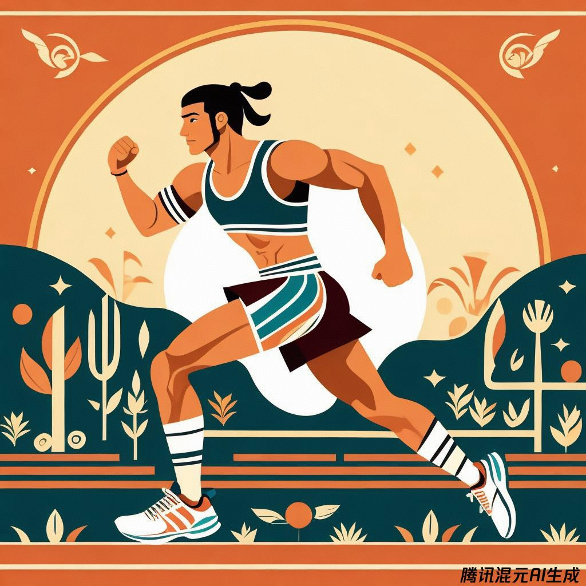
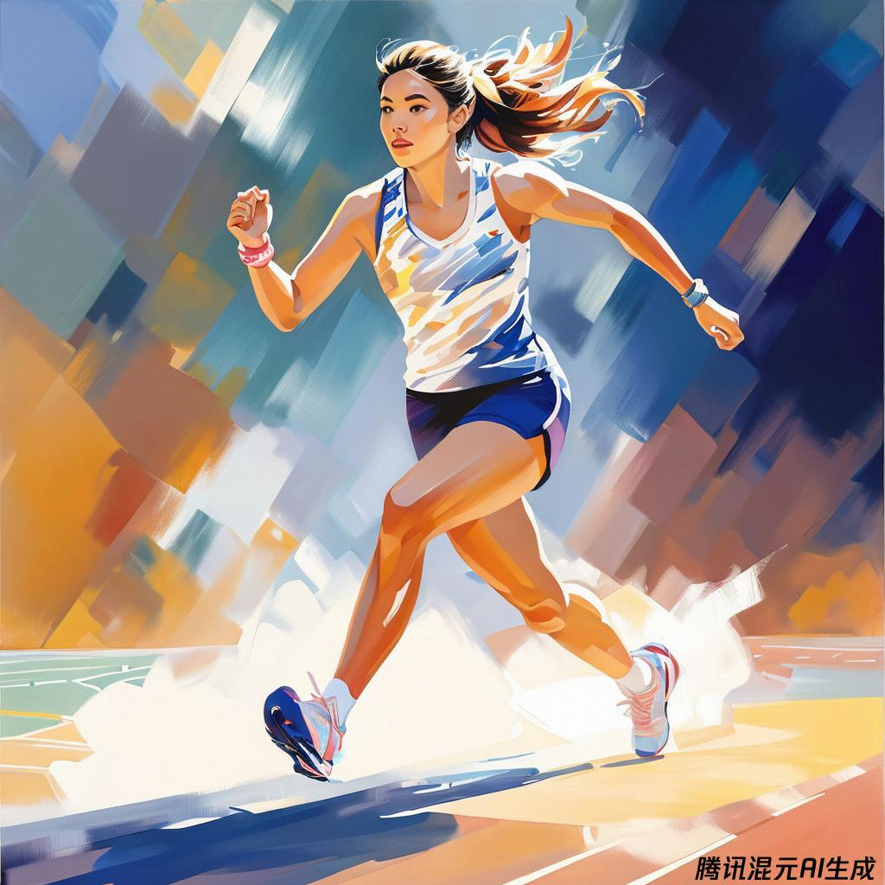

class: middle, center

<!-- AI 伴我行 -->

## AI 绘画 IV：艺术风格

陈一帅，陈宇晗

<!-- [yschen@bjtu.edu.cn](mailto:yschen@bjtu.edu.cn) -->
<!-- 北京交通大学电子信息工程学院 -->
<!-- .footnote[网络智能实验室] -->

---
class: middle, center
## 艺术风格

印象派

超现实主义

波普艺术

梵高

---
## 复古又艺术！

- 学习艺术史，了解各种艺术风格
- 从古代洞穴壁画到 20 世纪现代艺术
- 描述：年份、艺术运动、媒体或著名艺术家
- 可以标记“杰作
- 大师作品”或“杰出范例”

---
class: middle, center
## 古代壁画
画一位马拉松运动员，装饰性米诺斯壁画的细节，公元前 2000 年的文物
.center[.width-60[]]

---
class: middle, center
## 文艺复兴：米开朗基罗
画一位美丽的文艺复兴时期男子，慢跑、田径，米开朗基罗，布面油画，大师作品，戏剧性深色背景
.center[.width-60[]]

---
class: middle, center
## 现代艺术
画一群跑者，在起跑线上，装饰艺术设计，1925 年，复古，流线型，现代艺术
.center[.width-60[]]

---
class: middle, center
## 后印象派：塞尚
画一位女运动员，跑过一座桥，充满活力，空灵，后印象派，画布上的作品，由塞尚创作
.center[.width-60[]]

???
更多艺术风格

- 超现实主义
- 达达主义
- 立体主义
- 未来主义
- 表现主义
- 现实主义
- 包豪斯
- 印象派
- 巴洛克
- 洛可可
- 古埃及纸莎草

???
- 形而上学绘画
- 奥尔弗斯主义
- 至上主义
- 风格派
- 色域画
- 矫饰主义

早期艺术：古代、中世纪、黑暗时代

- 洞穴壁画，史前，拉斯科，原始
- 古埃及，壁画、象形文字
- 古埃及，纸莎草纸，《死亡之书》，保存完好
- 古埃及，法尤姆肖像，木乃伊肖像，卢克索，在木头上
- 古罗马，马赛克
- 古罗马，绘画，庞贝
- 镀金手抄本，奢华，未涂漆，手稿，牛皮纸，保存完好

???
- 纽伦堡纪事报，1493 年，历史书，Michael Wolgemut
- 拜占庭圣像，基督教圣像，光环，绘画，东罗马
- 装饰性米诺斯壁画，公元前 2000 年，人工制品，古代
Early art history: ancient, medieval, Dark Ages

Cave paintings, pre-historic, Lascaux, primitive.
Ancient Egyptian mural, tomb, fresco, register, hieroglyphics.
Roman mosaic, Ancient Rome, opus tesellatum.
Ancient Egypt papyrus, Book of the Dead, well-preserved.
Ancient Roman painting, Fourth Style, Third Style, second Style, Pompeii
Nuremberg Chronicle, 1493, Liber Chronicarum, Michael Wolgemut
Fayum portrait, Mummy portrait, from Egypt, from Luxor, on wood.
Byzantine icon, Christian icon, halo, painting, Eastern Roman.
Decorative Minoan mural, 2000 BCE, artefact, ancient.
Giilded codex, lavish, illiminated, maniscript, vellum, well-preserved

---
## 文艺复兴

- 巴洛克，十七世纪，委拉斯开兹，卡拉瓦乔，维米尔
- 洛可可，1730 年，巴洛克晚期，安托万·华托
- 新古典主义，随想曲，十八世纪，安吉丽卡·考夫曼
- 象征主义，梦幻般，十九世纪
- 现实主义，十九世纪，古斯塔夫·库尔贝

---
class: middle, center
## 巴洛克：维米尔
画一个小姑娘，在花园里，阳光明媚，巴洛克风格，油画，精细，维米尔，大师作品
.center[.width-60[]]

---
class: middle, center
## 洛可可：华托
画一个小男孩，在花园里，阳光明媚，洛可可，油画，精细，安托万·华托，大师作品
.center[.width-60[]]

---
## 印象派 
- 印象派、莫奈、雷诺瓦
- 后印象派、塞尚、高更、梵高、修拉

---
class: middle, center
## 印象派：莫奈
画一个小姑娘，在花园里，阳光明媚，印象派，油画，精细，莫奈，大师作品
.center[.width-60[]]

---
class: middle, center
## 后印象派：梵高
画一个小男孩，在花园里，阳光明媚，后印象派，油画，精细，梵高，大师作品
.center[.width-60[]]

???

- 新艺术风格
- 矫饰主义，矫饰主义（1500-1600）
Renaissance - modern art movements
Renaissance painting (1400-1600)
Realism, realist, 19th century, Gustave Courbet
Mannerism, Mannerist (1500-1600)
Art Nouveau
Impressionism, Monet, Renoit
Baroque, 17th c, Velázquez, Caravaggio, Vermeer
Post-impressionism, Cézanne, Gaugin, van Gogh, Seurat
Rococo, 1730, late Baroque, Antoine Watteau
Symbolist painting, symbolism, dreamlike, 19th century
Neoclassicism, capriccio, 18th c, Angelica Kauffmann

---
## 现代艺术
- 装饰艺术，1925 年，复古，流线型现代，豪华，海报
- 建构主义，俄罗斯，设计，1915 年，苏联时代
- 抽象表现主义、油漆泼溅、杰克逊·波洛克
- 达达主义, 1920, 荒谬, 胡说八道, 拼贴, 组合, 剪切, 蒙太奇

---
class: middle, center
## 建构主义
画一个小姑娘，在花园里，阳光明媚，建构主义，1915 年，苏联时代，油画，精细，大师作品
.center[.width-60[]]

---
class: middle, center
## 达达主义
画一个小男孩，在花园里，阳光明媚，达达主义, 拼贴, 组合, 剪切, 蒙太奇，油画，精细，大师作品
.center[.width-60[]]

---
## 现代艺术
- 风格派，新造型主义，皮特·蒙德里安，席恩·坎·杜斯堡，1920 年，荷兰语
- 包豪斯，1930 年代，几何，保罗·克利，瓦西里·康定斯基
- 表现主义，1912年，德国
- 野兽派，1905年，安德烈·德兰，亨利·马蒂斯
- 立体主义, 1910, 毕加索，乔治·布拉克

---
class: middle, center
## 野兽派
画一个小姑娘，在花园里，野兽派，油画，亨利·马蒂斯，大师作品
.center[.width-60[]]

---
class: middle, center
## 立体主义
画一个小男孩，在花园里，阳光明媚，立体主义，油画，精细，毕加索，大师作品
.center[.width-60[]]

???
- 色域绘画，抽象，罗斯科，60 年代，克莱福德·斯蒂尔
---
## 现代艺术
- 街头艺术、涂鸦、城市公共艺术、独立
- 未来主义, 1913, 意大利, 活力
- 至上主义，抽象，几何，卡齐米尔·马列维奇，1913，
- 形而上绘画，de Chirico，意大利人，Carlo Carrà
- 墨西哥壁画，迭戈·里维拉，何塞·克莱门特·奥罗斯科，大卫·阿尔法罗·西凯罗斯

---
class: middle, center
## 墨西哥壁画
画一个小姑娘，在花园里，墨西哥壁画，精细，迭戈·里维拉，大师作品
.center[.width-60[]]

---
class: middle, center
## 抽象几何
画一个小男孩，在花园里，阳光明媚，油画，精细，至上主义，抽象，几何，卡齐米尔·马列维奇，1913，，大师作品
.center[.width-60[]]

---
## 现代艺术

- 新表现主义，20世纪80年代
- 超现实主义、马格利特、达利、安德烈·布勒东、马克斯·恩斯特
- 奥菲斯主义、奥菲斯特、弗朗齐塞克·库普卡、罗伯特·德劳内、索尼娅·德劳内
- 波普艺术，沃霍尔，1960 年代
- 街头摄影，城市，坦率，闲逛，不摆姿势

---
class: middle, center
## 超现实主义
画一个小姑娘，在花园里，超现实主义，油画，达利，大师作品
.center[.width-60[]]

---
class: middle, center
## 波普艺术
画一个小男孩，在花园里，波普艺术，油画，沃霍尔，大师作品
.center[.width-60[]]

???

Modern art movements
Art deco, 1925, vintage, streamline moderne, luxury, poster
Constructivist, constructivism, Russian, design, 1915, Soviet-era (via discord?)
Abstract expressionism, paint splatters, Jackson Pollock
Dada, Dadaism, Dadaist, 1920, absurd, nonsense , collage, assemblage, cut-up, photomontage
De Stijl, neoplasticism, Piet Mondrian, Theon can Doesburg, 1920, Dutch
Bauhaus, 1930s, geometric, Paul Klee, Wassily Kandinsky 
Expressionism, expressionist, 1912, German Expressionism
Colour field painting, abstract, Rothko, 60s, Clyfford Still
Fauvism, fauvist, 1905, Andre Derain, Henri Matisse
Cubism, cubist, 1910, Picasso Georges Braque

Street art, graffiti, urban public art, independent
Futurism, Futurist, 1913, Italian, aeropittura, dynamism
Suprematism, abstract, geometric, Kazimir Malevich, 1913,
Metaphysical painting, de Chirico, Italian, Carlo Carrà
Mexican muralism, Diego Rivera, José Clemente Orozco, David Alfaro Siqueiros
Neo-Expressionism, 1980s
Surrealism, surrealist, Magritte, Dali, Andre Breton, Max Ernst
Orphism, Orphist, František Kupka, Robert Delaunay, Sonia Delaunay
Pop Art, Warhol, 1960s
Street photography, urban, candid, flaneur, unposed

---
## 艺术家
- 爱德华·霍珀
- 萨尔瓦多·达利
- 文森特·梵高

---
class: middle, center
## 爱德华·霍珀
画一个小姑娘，在家里，夜，油画，爱德华·霍珀，大师作品
.center[.width-60[]]

???
- 基思·哈林
- 乔治·苏拉特
- 托马斯·金凯德
- HR 吉格尔
- 丽莎弗兰克
- 罗伯特·克拉姆
- 希罗尼穆斯·博斯《人间乐园》
- 巴斯奎特
- 古斯塔夫·基尔姆特 (Gustav Kilmt)，象征主义者，金箔，1908 年
- 西蒙·斯塔伦哈格
- 罗伊·利钦斯坦，半色调点，漫画细节，波普艺术

Assorted artist tests
Edward Hopper, 1942
Keith Haring 
Salvador Dali 
Georges Surat
Vincent van Gogh
Thomas Kinkade
HR Giger
Lisa Frank
Robert Crumb
Hieronymus Bosch, The Garden of Earthly Delights
Basquiat
Gustav Kilmt, symbolist, gold leaf, 1908
Simon Stålenhag
Roy Lichenstein, half-tone dots, comic detail, pop art

---
## 更多艺术风格

- 蒸汽波：霓虹灯、粉色、蓝色、几何、未来派、80 年代
- 后世界末日：灰色、荒凉、暴风雨、火灾、腐烂
- Memphis，20 世纪 80 年代，大胆，庸俗，色彩缤纷，形状
- 哥特式、奇幻：石头、黑暗、郁郁葱葱、自然、薄雾、神秘、棱角分明
- 非洲未来主义：未来主义，非洲！

---
class: middle, center
## 后世界末日
画一个小姑娘，在花园里，后世界末日，油画，精细，荒凉、暴风雨，大师作品
.center[.width-60[]]

---
class: middle, center
## 哥特奇幻
画一个小男孩，在花园里，油画，精细，哥特式、奇幻，石头、黑暗、郁郁葱葱、自然、薄雾，大师作品
.center[.width-60[]]

---
## 更多艺术风格

- 柴油朋克：肮脏、钢铁、石油、50 年代、机械化、蒸汽朋克的朋克表亲
- 控制论、科幻：发光、绿色、金属、装甲、铬
- 赛博朋克，20 世纪 90 年代，染发，尖刺，图形元素
- 蒸汽朋克：金、铜、黄铜、维多利亚、
- 生物朋克，有机：绿色、史莱姆、植物、未来、怪异

---
class: middle, center
## 赛博朋克
画一个小姑娘，在四维网络空间里，赛博朋克，染发，尖刺，图形元素，油画，精细，大师作品
.center[.width-60[]]

---
class: middle, center
## 科幻
画一个小男孩，在工厂里，科幻，发光、绿色、金属、装甲、铬，油画，精细，大师作品
.center[.width-60[]]

???

例

画一张画，一只狗，在沙发上，Memphis 艺术风格，20 世纪 80 年代，大胆，庸俗，色彩缤纷，形状

Looks, vibes, -punks, -waves

Vaporwave: neon, pink, blue, geometric, futuristic, '80s.
Post-apocalyptic: grey, desolate, stormy, fire, decay
Memphis, Memphis Group, 1980s, bold, kitch, colourful, shapes
Gothic, fantasy: stone, dark, lush, nature, mist, mystery, angular
Dieselpunk, grimy, steel, oil, '50s, mechanised, punk cousin of steampnk
Afrofuturism: futuristic, and African!
Cybernetic, sci-fi: glows, greens, metals, armor, chrome
Cyberpunk, 1990s, dyed hair, spiky, graphic elements .
Steampunk: gold, copper, brass, Victoriana,
Biopunk, organic: greens, slimes, plants, futuristic, weird

🤩 Check out this huge list!

https://aesthetics.fandom.com/wiki/List_of_Aesthetics

---
class: middle, center

## 作品分享

