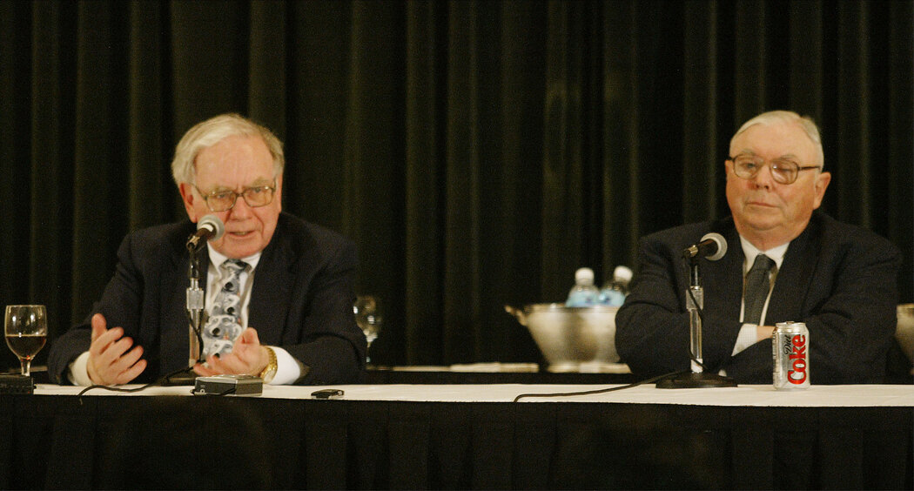

class: middle, center
# 永远也不要停下来
### 实务学堂白露营寄语赠言
#### 陈一帅
2023 年 12 月

###### 全部内容来自查理芒格，在南加州大学毕业典礼上的演讲
---
class: middle, center

.center[.width-90[]]

巴菲特和芒格2003年的合影

---
# 内容
- 与世界建立连接
  - 理解人性弱点，克制自己，包容对方
  - 赢得信任和尊敬
  - 识别变态
- 锤炼自己的思维
  - 成为学习机器
  - 客观公正，反向思考
  - 敢认输，敢下注

???
# 与世界建立连接
- 理解人性弱点，克制自己，包容对方
- 赢得信任和尊敬
- 识别变态

class: middle, center

# 理解人性的弱点

## 克制自己，包容对方
???
---
# 懒惰

- 一定要非常勤奋
- 这样勤奋的人才会觉得你配得上他们
- 芒格早期合伙人是这么约定的：如果没有完成对客户的承诺，要每天工作14个小时，每星期工作7天，直到完成为止

???
- 我非常喜欢勤奋的人。我这辈子遇到的合伙人都极其勤奋。我想我之所以能够和他们合伙，部分原因在于我努力做到配得起他们，部分原因在于我很精明地选择了他们，还有部分原因是我运气好。

- 不用说你们也知道啦，这家公司做得很成功。我那两位合伙人广受尊敬。他们这种简单的老派观念几乎肯定能够提供一个很好的结果。

???
---
# 透支

- “自我服务偏好”的心理因素经常导致我们做傻事。它往往是潜意识的，所有人都难免受其影响
  - 从前有一个人，他是全世界最著名的作曲家，可是他大部分时间过得非常悲惨，原因之一就是他总是透支他的收入。那位作曲家叫做莫扎特
  - 连莫扎特都无法摆脱这种愚蠢行为的毒害，我们更不应该去尝试它
- 节俭是责任的仆人
    - 芒格叔叔的小银行倒闭了，爷爷用他的优质资产的三分之一去交换那家银行的劣质资产，从而拯救了它

???
- 我们认为自己有资格去做自己想做的事情，例如，透支收入来满足现在的需求，那有什么不好呢？

- 芒格爷爷担任联邦法官的时候，联邦法官的遗孀是得不到抚恤金的。所以如果他赚了钱不存起来，我奶奶将会变成一个凄凉的寡妇。除此之外，家有余资也能让他更好地服务别人。由于他是这样的人，所以他终生量入为出，给他的遗孀留下了一个舒适的生活环境。

---
# 未雨绸缪

- 别人每天想：和恋人幽会、走大运、出大名
- 我总想着麻烦，因此，麻烦来临时，我已准备好
- “谁整天期待麻烦的到来？” 我就是这样的
- 在这漫长的一生中，我一直都在期待麻烦的到来，准备好麻烦来临时如何对付它
- 这并没有让我感到不快乐。这对我没有任何害处，而是对我有很大帮助

???
- 这件事情让我想起豪斯曼（注：A.E.Housman,1859-1936,英国古典文学学者，诗人）的一首短诗，那首诗好像是这样的：

利益和信义

- 问题
  - 只顾自己：人不为己、天诛地灭
- 必须克服“只顾自己”的观念，养成言出必行的习惯
- 你们想成为智者而不是傻瓜，想做好人而不是坏蛋

???
---
# 诉诸利益，而非理性

- 人都会顾自己的利益
- 本杰明·富兰克林：“如果想要说服别人，诉诸利益，而非理性”
- “喂，如果这种情况再持续下去，会毁掉你的，会让你身败名裂，家破人亡。我的建议能够让你免于陷入万劫不复之地。”这种方法会生效的

???
- 诉诸利益，而不是理性，即使是当你们的动机很高尚的时候
- 容忍、接受别人的人性的弱点
人类自我服务的偏好是极其强大的，应该被用来获得正确的结果。所以总顾问应该说：
- 所罗门兄弟公司的法律顾问曾经做过《哈佛法学评论》的学生编辑，是个聪明而高尚的人，但我亲眼看到他毁掉了自己的前途。当时那位能干的CEO说有位下属做错了事，总顾问说：“哦，我们在法律上没有责任汇报这件事，但我认为那是我们应该做的，那是我们的道德责任。”从法律和道德上来讲，总顾问是正确的，但他的方法却是错误的。他建议日理万机的CEO去做一件令人不愉快的事情，而CEO总是把这件事一推再推，因为他很忙嘛，完全可以理解，他并不是故意要犯错。后来呢，主管部门责怪他们没有及时通报情况，所以CEO和总顾问都完蛋了。
- ，在行动中表现出自我服务的偏好。在自己的认知行动中允许别人拥有自我服务的偏好，因为大多数人无法非常成功地清除这种心理，人性就是这样

---
# 赢得别人的信任和尊敬

- 言而无信，就算有再多的优点，也无法避免悲惨的下场

- 赢得信任和尊敬后，会带来许多东西

- 不止是金钱和名誉，还有快乐

- 赢得别人的信任和尊敬是非常快乐的事情

- 芒格的招聘方针是：“信任第一，能力第二”

???
---
# 找到你信任和尊敬的人

- 找到一群可靠的人，彼此之间有正确的信任
- 尽可能培养一张无缝的信任之网
- 工作中遵守程序，但不总是被程序牵着鼻子走
- 如果拟定的婚前协议书长达47页，那么这婚还是不结为妙

???
- 复杂的官僚程序不是文明社会的最好制度。更好的制度是一张无缝的、非官僚的信任之网。没有太多稀奇古怪的程序。

- 只有一群可靠的人，他们彼此之间有正确的信任。那是玛约医疗中心手术室的运作方式。如果那里的医生像律师那样设立许多像法律程序那么繁琐的规矩，更多的病人会死于非命。

---
# 嫉妒、怨憎、仇恨

- 如果你的正确让有身份地位的人觉得没面子，可能会引发极大的报复心理
- 我们的工作和职责是让客户认为他是房间里最聪明的人。如果你完成了这项任务，就接着让你的高级合伙人显得像是房间里第二聪明的人。只有履行了这两条义务之后，你才可以表现你自己

???
- 知道老板是谁
- 不要锋芒毕露
- 当老板束手无策时，你却知道正确答案，这非常危险
- 我还没有找到避免受这个严重问题伤害的完美方法
- 在我认为我知道的比上级多的时候，我不太擅长掩饰自己的想法，没有很谨慎地去努力掩饰自己的想法，所以我总是得罪人
---
# 自怜

- 不要陷入自怜的情绪中

- 不要和别人说“自怜”的话

- 每当你们发现自己产生了自怜的情绪，不管是什么原因，哪怕由于自己的孩子患上癌症即将死去，也要清楚地知道，自怜是于事无补的

- 自怜总是会产生负面影响，它是一种错误的思维方式。如果你们能够避开它，你们的优势就远远大于其他人，或者几乎所有的人，因为自怜是一种标准的反应。你们可以通过训练来摆脱它。

???
---
# 挺过去

- 我们在生活中一定会遭到沉重的打击，不公平的打击。有些人能挺过去，有些人不能
- 生活中的每一次不幸，无论多么倒霉，都是一个锻炼的机会，一个吸取教训的良机
- 人们不应该在自怜中沉沦，而是应该利用每次打击来提高自我
- 爱比克泰德（Epictetus）自拟的墓志铭：“此处埋着爱比克泰德，一个奴隶，身体残疾，极端穷困，蒙受诸神的恩宠。”他变成智者，变成顶天立地的男子汉，而且教育了许多人

???
---
# 避免变态的激励机制

- 避免受到变态的激励机制的驱动

- 不要处在一个你们表现得越愚蠢或者越糟糕，它就提供越多回报的变态激励系统之中。变态的激励机制具有控制人类行为的强大力量，人们应该避免受它影响。

- 有些公司规定工作时间特别长，那会给我带来许多问题，我不会接受这种条件

- 你们将不得不自行摸索如何处理这些重要的问题

???
---
# 避免变态的工作关系

- 避免在不崇敬或者不想像他一样的人手下干活，那是很危险的

- 找出你尊敬的人，想办法调到那边去

- 但要做得得体，别批评任何人，就在好领导手下继续工作

- 在仰慕的人手下工作，成就将更令人满意

???
- 许多律所是允许这么做的，只要你们足够聪明，能做得很得体。
- 要正确地应对这种危险，必须同时拥有才华和决心。
- 所有人在某种程度上都受到权威人物的控制，尤其是那些为我们提供回报的权威人物。

---
# 避免变态的人

- 知道谁能轻而易举地伤害自己
- 得罪一千个君子，也不要得罪一个小人

---
# 避免变态的爱情

- 爱应该以信任和仰慕为基础
- 只爱你信任和尊敬的人
- 毛姆《人性的枷锁》中，主人公因为情欲，爱上一个不值得他爱的人，纠葛一生，万劫不复

???

---
# 小结：连接
- 理解人性弱点
  - 懒惰、透支、今朝有酒今朝醉、嫉妒、自怜
- 赢得信任和尊敬
  - 建立关系
- 识别变态
  - 激励机制、工作关系、爱情

---
# 内容
- 与世界建立连接
  - 理解人性弱点，克制自己，包容对方
  - 赢得信任和尊敬
  - 识别变态
- .red[锤炼自己的思维]
  - 成为学习机器
  - 客观公正，反向思考
  - 敢认输，敢下注
---
# 锤炼自己的思维

- 成为学习机器
- 客观公正，反向思考
- 敢认输，敢下注

---
# 成为一部学习的机器

- 离开学堂后，继续学习，才能在生活中走得更远

- 每天夜里睡觉时都比早晨聪明一点点

- 这种习惯对你们很有帮助，特别是在你们还有很长的路要走的时候

???
- 光靠已有的知识，在生活中走不了多远
---
# 一半学书，一半学人
- 学习 “学习的方法”
- 巴菲特
  - 一半时间看书
  - 一半时间跟有才干的人进行一对一交谈（电话、当面），和那些你信任且信任你的人
- 对你信任和尊敬的人
  - 特别想和她/他分享
  - 特别想征求她/他的意见

---
# 学术

- 提出问题
  - 有意义的、新颖的
- 研究历史、现状、不足
  - 西塞罗：如果一个人不知道他出生之前发生过什么事情，在生活中就会像一个无知的孩童
- 思考、写作、创新
  - 死记硬背，为了考试好成绩的知识，对我们不会有太大的帮助

???
---
# 形成思维框架和习惯

- 学习各个学科的知识中的道理
- 有意识地基于学习到的知识和道理，在头脑中形成思维框架
- 实践，将它们变成自己思维习惯的一部分，能自动地运用它们
- 思维习惯只要得到正确的实践，真的很有帮助

???
- 改变思维习惯帮了我很多忙，它让生活更有乐趣，让我能做更多的事情，让我变得更有建设性，让我变得非常富有，而这无法用天分来解释
- 相反，如果不努力实践，许多最聪明的人只会取得中等成就，甚至生活在阴影中
- 如果你们能够做到这一点，我郑重地向你们保证，总有一天你们会在不知不觉中意识到：“我已经成为我的同龄人中最有效率的人之一”

---
# 偏执
- 偏执是最难逆转的东西之一
  - 一根筋
  - 如果有两件事交织在一起，相互之间有影响，你努力只考虑其中一件，而完全不顾另一件
- “认为自己无知要好得多”

???
---
# 极端意识形态

- 要非常小心地提防强烈的意识形态，它对你们的宝贵头脑是极大的危险
- 年轻人特别容易陷入强烈的意识形态中，而且永远走不出来
  - 当你们宣布自己是某个团体的忠实成员，并开始倡导该团体的正统意识形态时，你们所做的就是将这种意识形态不断地往自己的头脑里塞
  - 这样你们的头脑就会坏掉，而且有时候是以惊人的速度坏掉

---
# 极端意识形态

- 一旦强烈服从一个东西，就会顽固地忽视环境的变化。这会带来死亡
  - 征服了斯堪的纳维亚所有的激流，就认为他们也能驾驶独木舟顺利地征服北美洲的大漩涡，结果死亡率百分之百
- 大漩涡是你们应避开的东西，强烈的意识形态也是，尤其是你们的同伴全都是虔诚的信徒时

???
- 每当我感到自己有陷入某种强烈的意识形态的危险时，我就会拿下面这个例子来提醒自己：
---
# 客观公正的思维习惯

- 达尔文特别留意相反的证据，尤其是他证伪的是某种他信奉和热爱的理论时

- 如果想要在思考的时候尽量少犯错误，就需要这样的习惯。

---
# 反向思考

- 反向思考，能想得更清楚，问题更容易解决
- 什么会让我们在生活中失败？
  - “知道自己会死在哪里，才会永远不去那个地方”
- 如果不能比对手更好地反驳我的观点，就没资格拥有这种观点
  - 只有在达到这个境界时才有资格发表意见
- 这就是“学术精神”

???
???
- 养成一些让你能保持客观公正的习惯当然对认知非常有帮助。
- 乔布斯：如果这是我生命中的最后一天，我会干什么

class: middle, center

???
- 它帮助我在偏向于支持某种强烈的意识形态时保持清醒

---
# 核对检查清单 Checklist

- 养成核对检查清单的习惯，能避免很多错误，不仅仅对飞行员来说是如此

- 不光掌握广泛的基础知识，而是把它们在头脑中列成一张清单，然后再加以使用

- 没有其他方法能取得相同的效果

---
# 敢于认输

- “希望”的副作用，是让我们忽略现实
- 客观公正才是最重要的
- “未必要有希望才能坚持”
- “必须学会的是在形势不利的情况下及早认输”
- “在脸皮厚这方面是黑带高手”

???
- 这种别陷入极端意识形态的方法在生活中是非常非常重要的，如果你们想要成为明智的人，严重的意识形态很有可能会导致事与愿违

---
# 敢于下注

- “学会的是在形势不利的情况下及早认输，而如果有大牌在手，就要下重注，因为你不常拿到大牌。机会出现，但不是经常的事，所以一旦它降临就要紧紧抓住。”
- 如果有强烈兴趣的事情，就找机会，主动去做
  - 如果想要在某个领域出色，必须对它有强烈的兴趣
  - 我可以强迫自己把许多事情做得相当好，但我无法将我没有强烈兴趣的事情做得非常出色
- 要做一个锥子，能刺破

???
- 管理团队、做任何事，都可以最大化”不平等“能够获得最高的收益

### 查理芒格

## 知道自己会死在哪里，才会永远不去那个地方

???
---
## 小结

- 与世界建立连接
  - 理解人性弱点，克制自己，包容对方
  - 赢得信任和尊敬
  - 识别变态
- 锤炼自己的思维
  - 成为学习机器
  - 客观公正，反向思考
  - 敢认输，敢下注

---
class: middle, center

# 开心

巴菲特：他会被自己的笑话逗得乐不可支，我心想，这跟我合得来。我也是这样的

一半一半

---
# 参考链接

- 查理芒格，在南加州大学毕业典礼上的演讲，May 13，2007
  - [视频](https://www.youtube.com/watch?v=jY1eNlL6NKs)
  - [英文版](https://jamesclear.com/great-speeches/2007-usc-law-school-commencement-address-by-charlie-munger)
  - [中文版](https://mp.weixin.qq.com/s/ssbih6_uEfx5M3xdhSSy5Q)
- Andrew Ross Sorkin, Robert D. Hershey Jr. 查理·芒格去世：巴菲特的好搭档，金句频出的亿万富翁，纽约时报，2023年11月29日，[网页链接](https://www.nytimes.com/2023/11/28/business/charles-t-munger-dead.html)

---
class: middle, center

.center[.width-50[]]

扫码访问幻灯片
